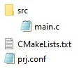
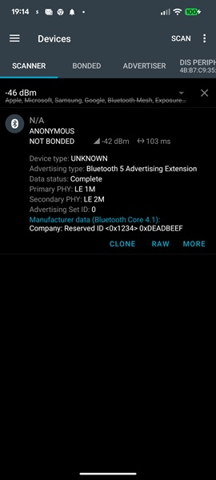

# Bluetooth Low Energy: Anonymous Advertising

## Introduction

In Bluetooth LE, "anonymous advertising" means that a device sends advertising packets without specifying a fixed device identity or address that could be used to easily identify or track it. 

Bluetooth LE devices typically send small "advertisement packets" so that nearby devices can detect them. These packets often contain a Bluetooth device address, a device name, service UUIDs and manufacturer data. 

The aim of anonymous advertising is to reduce tracking by avoiding persistent identifiers. 

## Required Hardware/Software
- Development kit 
[nRF54LM20DK](https://www.nordicsemi.com/Products/Development-hardware/nRF54LM20-DK),
[nRF54L15DK](https://www.nordicsemi.com/Products/Development-hardware/nRF54L15-DK), 
[nRF52840DK](https://www.nordicsemi.com/Products/Development-hardware/nRF52840-DK), 
[nRF52833DK](https://www.nordicsemi.com/Products/Development-hardware/nRF52833-DK), or 
[nRF52DK](https://www.nordicsemi.com/Products/Development-hardware/nrf52-dk)
- Micro USB Cable (Note that the cable is not included in the previous mentioned development kits.)
- install the _nRF Connect SDK_ v3.3.0 and _Visual Studio Code_. The installation process is described [here](https://academy.nordicsemi.com/courses/nrf-connect-sdk-fundamentals/lessons/lesson-1-nrf-connect-sdk-introduction/topic/exercise-1-1/).
- a smartphone ([Android](https://play.google.com/store/apps/details?id=no.nordicsemi.android.mcp&hl=de&gl=US&pli=1), which runs the __nRF Connect__ app)
  

## Hands-on step-by-step description 

### Create a project from scratch

1) Create the project folder in your own Workspace directory. 

2) Create the needed files for a minimal project setup:
	
   

3) And here is the content of these files:

3.1) __CMakeLists.txt__: Here we use a minimal CMakeLists.txt file that only defines the needed definitions:

   _CMakeLists.txt_
	  
    # SPDX-License-Identifier: Apache-2.0

    cmake_minimum_required(VERSION 3.21.0)

    find_package(Zephyr REQUIRED HINTS $ENV{ZEPHYR_BASE})
    project(MyAnonymAdv)

    target_sources(app PRIVATE src/main.c)

3.2) __prj.conf__: We add the Bluetooth software module to our project by setting __CONFIG_BT=y__.
  
   _prj.conf_ 
	   
    # Enable Bluetooth support
    CONFIG_BT=y
    CONFIG_BT_EXT_ADV=y
    CONFIG_BT_BROADCASTER=y # note that Broadcaster role is by default enabled!

> __Note:__ The _nRF Connect SDK_ Bluetooth Stack supports legacy Advertisement. Anything that goes beyond legacy advertising requires extended advertising (<code>CONFIG_BT_EXT_ADV=y</code>).
       
3.3) __main.c__: In the next steps we will enable the Bluetooth stack, define the information that should be broadcasted, and start the advertising of the broadcast message. For this we need some of the Bluetooth stack API functions. These functions are defined in the header file __bluetooth.h__, which we have included already in above code. 

  _src/main.c_ 
		        
    #include <zephyr/kernel.h>
    #include <zephyr/bluetooth/bluetooth.h>
    #include <zephyr/bluetooth/hci.h>
    
    int main (void) 
    {
        printk("Starting Anonymous Advertising application!\n");
       
        return 0;
    }

### Enable Bluetooth Stack

4) Enable the Bluetooth Stack in the main function:

	_src/main.c_ => main() function

           int err;

           /* Initialize the Bluetooth Subsystem */
           err = bt_enable(bt_ready);
           if (err) {
               printk("Bluetooth init failed (err %d)\n", err);
           }
           printk("Bluetooth Stack initialized\n");

### When Bluetooth Stack is enabled, start Advertising

5) First, prepare the advertising data.

	_src/main.c_ => main() function   

       static struct bt_le_ext_adv *adv;

       /* Example manufacturer payload */
       static const uint8_t mfg_data[] = {
            0x34, 0x12,             /* Company ID: 0x1234 */
            0xDE, 0xAD, 0xBE, 0xEF  /* Data: 0x DE AD BE EF */
       };

       static const struct bt_data ad[] = {
           BT_DATA(BT_DATA_MANUFACTURER_DATA,
                   mfg_data,
                   sizeof(mfg_data)),
           };

6) In the next step we prepare the <code>struct bt_le_adv_param</code>. It is the configuration structure that defines how Bluetooth advertising should behave. It describes things like advertising type, intervals, connectability, PHY mode, anonymity, address behavior, and channel usage. 

	_src/main.c_ => main() funtion   

    struct bt_le_adv_param param = {
        .id = BT_ID_DEFAULT,

        /* IMPORTANT:
         * EXT_ADV is required for ANONYMOUS
         */
        .options =
            BT_LE_ADV_OPT_EXT_ADV |   /* use Extended Advertising */
            BT_LE_ADV_OPT_ANONYMOUS,  /* make it anonymous */

        /* 100 ms */
        .interval_min = BT_GAP_ADV_FAST_INT_MIN_2,
        .interval_max = BT_GAP_ADV_FAST_INT_MAX_2,
    };

7) Next, we prepare the actual payload. <code>bt_le_ext_adv_set_data()</code> sets the actual payload bytes that will be transmitted in an Extended Advertising packet.

	_src/main.c_ => main() funtion   

      err = bt_le_ext_adv_set_data(
          adv,
          ad,
          ARRAY_SIZE(ad),
          NULL,
          0
      );
      if (err) {
          printk("Failed to set advertising data (err %d)\n", err);
          return 0;
      }

8) After Advertising data was prepared, we start now the advertising by calling <code>bt_le_ext_adv_start()</code>. After calling this function the controller schedules advertising events and the radio begins transmitting advertisements periodically.

	_src/main.c_ => main() funtion

       err = bt_le_ext_adv_start(
           adv,
           BT_LE_EXT_ADV_START_DEFAULT
       );
       if (err) {
          printk("Failed to start advertising (err %d)\n", err);
          return 0;
       }
       printk("Anonymous advertising started\n");

## Testing

8) Build the project and download to the development kit.
9) Use on the smartphone the _nRF Connect for Mobile_ app and check the Bluetooth address. Note that this will only work on an Anroid phone (iPhone does not show Bluetooth address).

   
