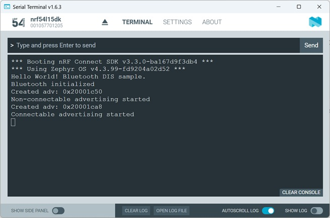

# ---- WORK IN PROGRESS !!! ---
-----
# Bluetooth Low Energy: Multiple Advertising

## Introduction

Multiple advertisements are often required. For example, if an OTA firmware upgrade is to be carried out alongside normal Bluetooth activity, it may quickly become necessary to initiate multiple advertisements. Here, we will look at how we can implement a non-connectable advertisement in addition to a connectable advertisement. 

## Required Hardware/Software
- Development kit 
[nRF54LM20DK](https://www.nordicsemi.com/Products/Development-hardware/nRF54LM20-DK),
[nRF54L15DK](https://www.nordicsemi.com/Products/Development-hardware/nRF54L15-DK), 
[nRF52840DK](https://www.nordicsemi.com/Products/Development-hardware/nRF52840-DK), 
[nRF52833DK](https://www.nordicsemi.com/Products/Development-hardware/nRF52833-DK), or 
[nRF52DK](https://www.nordicsemi.com/Products/Development-hardware/nrf52-dk) 
- a smartphone ([Android](https://play.google.com/store/apps/details?id=no.nordicsemi.android.mcp&hl=de&gl=US&pli=1) or [iOS](https://apps.apple.com/de/app/nrf-connect-for-mobile/id1054362403)), which runs the __nRF Connect__ app 
- install the _nRF Connect SDK_ v3.3.0 and _Visual Studio Code_. The installation process is described [here](https://academy.nordicsemi.com/courses/nrf-connect-sdk-fundamentals/lessons/lesson-1-nrf-connect-sdk-introduction/topic/exercise-1-1/).

## Hands-on step-by-step description

### Copy the DIS Project

1) Make a copy of the [DIS Service sample](../peripheral_service_DIS)

### Adding a beacon (2nd Advertising)

The DIS sample is already starting a single advertising. Here we will update the code so that a beacon advertising is also done.

3) Multiple adversting requires to enable extended Advertising. This is done by adding following KCONFIG to prj.conf.

   _prj.conf_

       # Enable extended advertising, e.g. required for advertising with mulitple advertising sets.
       # maximum 2 simultaneous advertising sets
       CONFIG_BT_EXT_ADV=y
       CONFIG_BT_EXT_ADV_MAX_ADV_SET=2

4) Let's prepare the advertising data:

   _main.c_

       #define NON_CONNECTABLE_DEVICE_NAME "My Beacon"

       static struct bt_le_ext_adv *ext_adv[CONFIG_BT_EXT_ADV_MAX_ADV_SET];
       static const struct bt_le_adv_param *non_connectable_adv_param =
           BT_LE_ADV_PARAM(BT_LE_ADV_OPT_SCANNABLE,
                           0x140, /* 200 ms */
                           0x190, /* 250 ms */
                           NULL);

       static const struct bt_le_adv_param *connectable_adv_param =
           BT_LE_ADV_PARAM(BT_LE_ADV_OPT_CONN,
                           BT_GAP_ADV_FAST_INT_MIN_2, /* 100 ms */
                           BT_GAP_ADV_FAST_INT_MAX_2, /* 150 ms */
                           NULL);

       static const struct bt_data non_connectable_ad_data[] = {
           BT_DATA_BYTES(BT_DATA_FLAGS, BT_LE_AD_NO_BREDR),
           BT_DATA_BYTES(BT_DATA_URI, /* The URI of the https://www.nordicsemi.com website */
                         0x17, /* UTF-8 code point for “https:” */
                         '/', '/', 'w', 'w', 'w', '.',
                         'n', 'o', 'r', 'd', 'i', 'c', 's', 'e', 'm', 'i', '.',
                         'c', 'o', 'm'),
       };

       static const struct bt_data non_connectable_sd_data[] = {
           BT_DATA(BT_DATA_NAME_COMPLETE, NON_CONNECTABLE_DEVICE_NAME,
                   sizeof(NON_CONNECTABLE_DEVICE_NAME) - 1),
       };

       static const struct bt_data connectable_data[] = {
           BT_DATA_BYTES(BT_DATA_FLAGS, BT_LE_AD_GENERAL | BT_LE_AD_NO_BREDR),
           BT_DATA_BYTES(BT_DATA_UUID16_ALL, BT_UUID_16_ENCODE(BT_UUID_DIS_VAL)),
           BT_DATA(BT_DATA_NAME_COMPLETE, CONFIG_BT_DEVICE_NAME, sizeof(CONFIG_BT_DEVICE_NAME) - 1),
       };

5) Let's add a generic function that handles start of advertising.
   
   _main.c_

       static const struct bt_le_ext_adv_cb adv_cb = {
           .connected = connected
       };

       static int advertising_set_create(struct bt_le_ext_adv **adv,
            const struct bt_le_adv_param *param,
            const struct bt_data *ad, size_t ad_len,
            const struct bt_data *sd, size_t sd_len)
       {
           int err;
           struct bt_le_ext_adv *adv_set;

           err = bt_le_ext_adv_create(param, &adv_cb, adv);
	         if (err) {
               printk("Error while creating new advertising (err=%i)\n", err);
               return err;
           }
           adv_set = *adv;
           printk("Created adv: %p\n", adv_set);

           err = bt_le_ext_adv_set_data(adv_set, ad, ad_len, sd, sd_len);
           if (err) {
               printk("Failed to set advertising data (err %d)\n", err);
               return err;
           }

           return bt_le_ext_adv_start(adv_set, BT_LE_EXT_ADV_START_DEFAULT);
       }

7) And we use the above function to start connectable and non-connectable advertising.

   _main.c_   

       static int non_connectable_adv_create(void)
       {
           int err;

           err = advertising_set_create(&ext_adv[NON_CONNECTABLE_ADV_IDX], non_connectable_adv_param,
                                        non_connectable_ad_data, ARRAY_SIZE(non_connectable_ad_data),
                                        non_connectable_sd_data, ARRAY_SIZE(non_connectable_sd_data));
           if (err) {
               printk("Failed to create a non-connectable advertising set (err %d)\n", err);
           }

           return err;
       }

       static int connectable_adv_create(void)
       {
           int err;

           err = advertising_set_create(&ext_adv[CONNECTABLE_ADV_IDX], connectable_adv_param,
                                        connectable_data, ARRAY_SIZE(connectable_data),
                                        NULL, 0);
	         if (err) {
		           printk("Failed to create a connectable advertising set (err %d)\n", err);
	         }

	         return err;
       }

8) Following defines are used by above function.

   _main.c_   

       #define NON_CONNECTABLE_ADV_IDX 0
       #define CONNECTABLE_ADV_IDX     1

9) And finally we start the advertising by calling the functions <code>non_connectable_adv_create()</code> and <code>connectable_adv_create()</code>.

   _main.c_ => add these lines after Bluetooth Stack was successfully initiallized
   
            err = non_connectable_adv_create();
            if (err) {
                return 0;
            }
            printk("Non-connectable advertising started\n");

            err = connectable_adv_create();
            if (err) {
                return 0;
            }
            printk("Connectable advertising started\n");

10) Replace the line <code>start_advertising()</code> in the __disconnected__ callback funtion by following lines:

   _main.c_ => repleace <code>start_advertising()</code> in disconnected callback function
   
        int err = connectable_adv_create();
        if (err) {
            return 0;
        }
        printk("Connectable advertising started\n");

11) We need the following function declaration at the top of the main.c file:

   _main.c_   

        static int connectable_adv_create(void);

### Changes required in original DIS sample

12) Remove <code>start_advertising()</code> from main function.
13) the function <code>void start_advertising(void)</code> is not needed anylonger. So remove it.

## Testing
a) Build the project and download to a development kit.
b) Check the output in the Serial Terminal.

   You should see following output:
   
   

c) Use a smartphone and the __nRF Connect__ app and look for "DIS peripheral" and "My Beacon" device.
