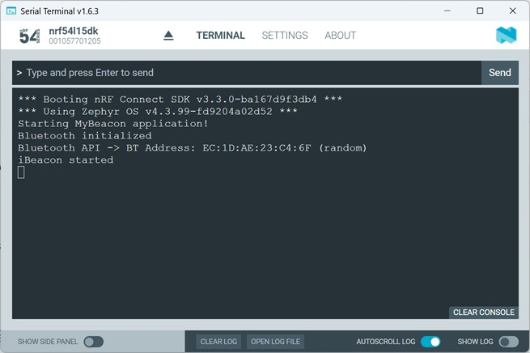
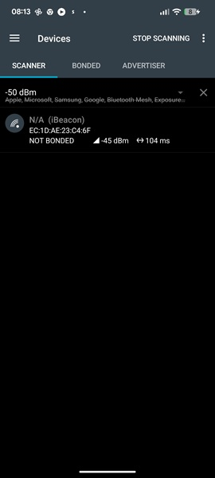

# Bluetooth Low Energy: Get the Device Bluetooth Address at runtime

## Introduction

In an _nRF Connect SDK_ Bluetooth project, the Bluetooth device address (MAC address) can be read in different ways. Let's take a look at the most common way. 

## Required Hardware/Software

- Development kit 
[nRF54LM20DK](https://www.nordicsemi.com/Products/Development-hardware/nRF54LM20-DK),
[nRF54L15DK](https://www.nordicsemi.com/Products/Development-hardware/nRF54L15-DK), 
[nRF52840DK](https://www.nordicsemi.com/Products/Development-hardware/nRF52840-DK), 
[nRF52833DK](https://www.nordicsemi.com/Products/Development-hardware/nRF52833-DK), or 
[nRF52DK](https://www.nordicsemi.com/Products/Development-hardware/nrf52-dk) 
- install the _nRF Connect SDK_ v3.3.0 and _Visual Studio Code_.

## Hands-on step-by-step description

### Let's start with the existing Beacon example

1) Make a copy of the project [Beacon](basics/beacon). 

### Use Identity Address

2) Change the start advertising code line <code>err = bt_le_adv_start(BT_LE_ADV_NCONN, ad, ARRAY_SIZE(ad), NULL, 0);</code> to the following:

	_main.c_ => in <code>bt_ready()</code> function

       err = bt_le_adv_start(BT_LE_ADV_NCONN_IDENTITY, ad, ARRAY_SIZE(ad), NULL, 0);

 > __Note:__ The key difference between <code>BT_LE_ADV_NCONN</code> and <code>BT_LE_ADV_NCONN_IDENTITY</code> lies in the Bluetooth address used during advertising. While <code>BT_LE_ADV_NCONN</code> uses a private (random) address, <code>BT_LE_ADV_NCONN_IDENTIY</code> uses the static identity address that is stored in the device FICR control registers.

> __Warning:__ Using <code>BT_LE_ADV_NCONN_IDENTITY</code> will compromise the privacy of the device. 

### Get the Address with Zephyr Bluetooth API

3) In the beacon application, use the Zephyr Bluetooth API to read the Bluetooth address.

	_main.c_
   
       #include <zephyr/bluetooth/bluetooth.h>
       #include <zephyr/bluetooth/hci.h>

       void print_bt_addr(void)
       {
           bt_addr_le_t addr;
           size_t count = 1;

           bt_id_get(&addr, &count);

           char addr_str[BT_ADDR_LE_STR_LEN];

           bt_addr_le_to_str(&addr, addr_str, sizeof(addr_str));

           printk("Public Bluetooth Address: %s\n", addr_str);
       }

4) Call the <code>print_bt_addr()</code> function after the Bluetooth Stack was successfully enabled.

	_main.c_ => after successful <code>bt_enable()</code> call
   
           print_bt_addr();

   
## Testing

5) Build the project and download it to your development kit.

6) Check the output in the Serial Terminal.

   

7) Check on Smartphone (note that only the Anrdoid app shows the Bluetooth address when scanning).

   
