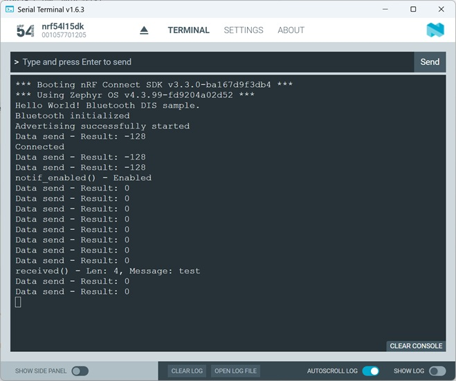

# Bluetooth Low Energy: Peripheral with Nordic UART Service (NUS)

## Introduction

## Required Hardware/Software
- Development kit 
[nRF54LM20DK](https://www.nordicsemi.com/Products/Development-hardware/nRF54LM20-DK),
[nRF54L15DK](https://www.nordicsemi.com/Products/Development-hardware/nRF54L15-DK), 
[nRF52840DK](https://www.nordicsemi.com/Products/Development-hardware/nRF52840-DK), 
[nRF52833DK](https://www.nordicsemi.com/Products/Development-hardware/nRF52833-DK), or 
[nRF52DK](https://www.nordicsemi.com/Products/Development-hardware/nrf52-dk) 
- a smartphone ([Android](https://play.google.com/store/apps/details?id=no.nordicsemi.android.mcp&hl=de&gl=US&pli=1) or [iOS](https://apps.apple.com/de/app/nrf-connect-for-mobile/id1054362403)), which runs the __nRF Connect__ app 
- install the _nRF Connect SDK_ v3.3.0 and _Visual Studio Code_. The installation process is described [here](https://academy.nordicsemi.com/courses/nrf-connect-sdk-fundamentals/lessons/lesson-1-nrf-connect-sdk-introduction/topic/exercise-1-1/).

## Hands-on step-by-step description

### Let's start with a previously used hands-on sample

1) Make a copy of the [DIS sample](../periperal_service_DIS/). 

### Add the NUS Service 
 
2) We add the NUS Service software module to our project by adding folloiwng line in _prj.conf_ file.

	_prj.conf_
	   
       #------ Nordic's UART Service (NUS)
       CONFIG_BT_ZEPHYR_NUS=y

3) We have to include the NUS header file, so that we can access the appropriate NUS API functions.

    _src/main.c_
	
       #include <zephyr/bluetooth/services/nus.h>

4) The NUS library uses callback functions to notify the application about NUS-related events. Following callback functions exist:

- data RX (mandatory)
- data TX done (optional)
- notifications enabled/disabled (optional)

Let's use the data RX and notification enabled/disabled callback functions in our project. First, we register the used callbacks.

  _src/main.c_

       struct bt_nus_cb nus_listener = {
           .notif_enabled = notif_enabled,
           .received = received,
       };

5) Then we add the two functions <code>notif_enabled()</code> and <code>received</code>.

    _src/main.c_ add this before the previously <code>nus_listener</code> definition
 
       static void notif_enabled(bool enabled, void *ctx)
       {
           ARG_UNUSED(ctx);

           printk("%s() - %s\n", __func__, (enabled ? "Enabled" : "Disabled"));
       }

       static void received(struct bt_conn *conn, const void *data, uint16_t len, void *ctx)
       {
           ARG_UNUSED(conn);
           ARG_UNUSED(ctx);

           printk("%s() - Len: %d, Message: %.*s\n", __func__, len, len, (char *)data);
       }

6) In step 4, we defined the <code>bt_nus_cb</code> structure, which specifies which callback function should be executed for each event. We have to pass this structure to the NUS software library using <code>bt_nus_cb_register</code> API function.

    _src/main.c_ => main() function

            err = bt_nus_cb_register(&nus_listener, NULL);
            if (err) {
                printk("Failed to register NUS callback: %d\n", err);
                return err;
            }

7) And finally, we send

                const char *hello_world = "Hello World!\n";

                err = bt_nus_send(NULL, hello_world, strlen(hello_world));
                printk("Data send - Result: %d\n", err);

                if (err < 0 && (err != -EAGAIN) && (err != -ENOTCONN)) {
                    return err;
                }

## Testing
8) Build the project and download to a development kit.
9) Check the output in the Serial Terminal. 

   You should see following output:
   
   

