# WORK IN PROGRESS

-----

# Bluetooth Low Energy: Peripheral with a user-defined Service (Custom Service) - _Indication_

## Introduction

The Bluetooth Standard mentions different data transfer operations. An overview is shown in this picture:

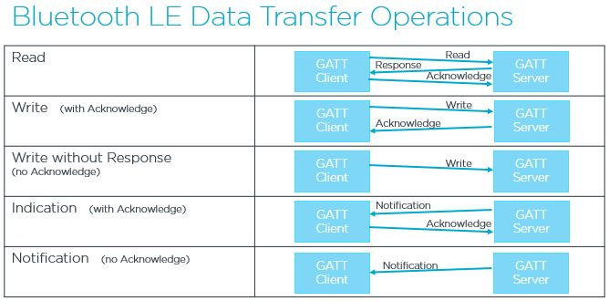

In this hands-on, we use the "Indication" transmission function. A Bluetooth Low Energy _Indication_ is a mechanism that allows a GATT server (typically a peripheral device based on an nRF54L series SoC) to send data to a GATT client (typically a central device such as a smartphone) without the client having to constantly poll for updates. An Indication is a confirmed data transmission.  Here is a comparison of _Notification_ and _Indication_:

| Notification                         | Indication                          |
|--------------------------------------|-------------------------------------|
|  faster                              | slightly slower                     |
| No confirmation required             | Requires acknowledgment (ACK)       |
| Data might be lost without detection | Guarantees delivery (more reliable) |

## Required Hardware/Software
- Development kit 
[nRF54LM20DK](https://www.nordicsemi.com/Products/Development-hardware/nRF54LM20-DK),
[nRF54L15DK](https://www.nordicsemi.com/Products/Development-hardware/nRF54L15-DK), 
[nRF52840DK](https://www.nordicsemi.com/Products/Development-hardware/nRF52840-DK), 
[nRF52833DK](https://www.nordicsemi.com/Products/Development-hardware/nRF52833-DK), or 
[nRF52DK](https://www.nordicsemi.com/Products/Development-hardware/nrf52-dk) 
- a smartphone ([Android](https://play.google.com/store/apps/details?id=no.nordicsemi.android.mcp&hl=de&gl=US&pli=1) or [iOS](https://apps.apple.com/de/app/nrf-connect-for-mobile/id1054362403)), which runs the __nRF Connect__ app 
- install the _nRF Connect SDK_ v3.3.0 and _Visual Studio Code_. The installation process is described [here](https://academy.nordicsemi.com/courses/nrf-connect-sdk-fundamentals/lessons/lesson-1-nrf-connect-sdk-introduction/topic/exercise-1-1/).

## Hands-on step-by-step description

### Prepare the project

1) Make a copy of the project [Peripheral with Device Information Service](../peripheral_service_DIS/README.md). We will add a custom service and characteristic to this project.

2) Add new folder "services" to the project. Create the files CustomService_indicate.c and CustomService_indicate.h in this new folder.

   So, the file/folder structure in your project folder should look like this:

   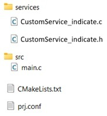

3) Add CustomSerice_indicate.c file to your project by changing the CMakeLists.txt file. The whole file should then look like this:
	
	  _CMakeLists.txt_
	  
       # SPDX-License-Identifier: Apache-2.0

       cmake_minimum_required(VERSION 3.21.0)

       # Find external Zephyr project, and load its settings
       find_package(Zephyr REQUIRED HINTS $ENV{ZEPHYR_BASE})

       # Set project name
       project(MyPeripheralCusSer)

       # Add sources
       target_sources(app PRIVATE src/main.c
                                  services/CustomService_indicate.c)

       # Add include directories
       target_include_directories(app PRIVATE services)
			
			
### Adding Custom Service
Before we add the code to our project, we should think about what our GATT database should look like. We created our project based on the Device Information Service (DIS) example, which means that the DIS service is already included here. We will now add an additional service, namely the _CustomService_indicate_. This service will contain a characteristic used for sending indications. With a indication, it is also necessary for the client to be able to subscribe to the indication. To do this, we need to add a Client Characteristic Configuration (CCC). After adding the “CustomService_indicate” service, our GATT database should look like this:

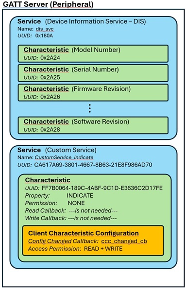

Follow these steps to add the _CustomService_indicate_ service:

#### Adding _CustomService_indicate_ Service and Characteristic

4) We need a UUID for the custom service and also for the custom TX characteristic. Create two UUIDs at https://www.uuidgenerator.net. And add them to CusomtService_indicate.c:
  
	_services/CustomService_indicate.c_

       /*Note that UUIDs have Least Significant Byte ordering */
       #define CUSTOM_SERVICE_NOTIFY_UUID   0x70, 0xAD, 0x86, 0xF9, 0xE8, 0x21, 0x63, 0x8B, 0x67, 0x46, 0x01, 0x38, 0x69, 0x7A, 0x61, 0xCA                       
       #define CUSTOM_CHARACTERISTIC_TX_UUID 0xFE, 0x17, 0x2D, 0x6C, 0x63, 0xE3, 0x1D, 0x9C, 0xBF, 0x4A, 0x9C, 0x18, 0x64, 0x00, 0x7B, 0xFF

   __Note:__ Sometimes a random UUID is generated for the Service only and the Characteristic only uses an incremented Service UUID (_Service UUID_ + 1). 

5) The custom UUIDs must be declared. We’ll do that in the next two steps. Prepare the UUIDs by inserting the following lines into the “CustomService_indicate.c” file:

	_services/CustomService_indicate.c_

       #define BT_UUID_CUSTOM_SERIVCE_INDICATE  BT_UUID_DECLARE_128(CUSTOM_SERVICE_NOTIFY_UUID)
       #define BT_UUID_CUSTOM_CHAR_INDICATE     BT_UUID_DECLARE_128(CUSTOM_CHARACTERISTIC_TX_UUID)
 
   This also requires to add the bluetooth uuid.h header file to the CustomService_indicate.c file:

	_services/CustomService_indicate.c_
	
       #include <zephyr/bluetooth/uuid.h>

6) And the next step for declaration is to define and register our service and its characteristics. By using the following helper macro we statically register our Service in our BLE host stack.

   Add the following lines __after the lines we added in step 7__ in CustomService_indicate.c:

_services/CustomService_indicate.c_

    /* Custom Service Declaration and Registration */
    BT_GATT_SERVICE_DEFINE(CustomService_indicate,
                    BT_GATT_PRIMARY_SERVICE(BT_UUID_CUSTOM_SERIVCE_INDICATE),
                    BT_GATT_CHARACTERISTIC(BT_UUID_CUSTOM_CHAR_INDICATE,
                                           BT_GATT_CHRC_INDICATE,
                                           BT_GATT_PERM_NONE, 
                                           NULL, NULL, NULL),
    );

7) And this also requires the gatt.h header file. Include it in the CustomServices_indicate.c file:
   
   _services/CustomService_indicate.c_
   
       #include <zephyr/bluetooth/gatt.h>

#### Adding _Client Characteristic Configuration Descriptor_
A _Client Characteristic Configuration Descriptor_ (CCCD) is required for Bluetooth LE indications. The CCCD is a writable descriptor that allows the GATT client to enable or disable indications (or notifications) for a specific characteristic. Without this descriptor, the client cannot receive indications. That is why we are now adding it to our project.

> __Note:__ Notification and Indication are initiated by the server (for example _nRF54L15DK_), but the GATT client (for example smartphone) must subscribe to the desired data in order to receive the messages.

8) We need to complete the definition of <code>BT_GATT_SERVICE_DEFINE(CustomService_indicate,</code> by adding the following section at the end of this macro:

   _services/CustomService_indicate.c_

       BT_GATT_CCC(ccc_changed_cb,
                   BT_GATT_PERM_READ | BT_GATT_PERM_WRITE),

  > __Note:__ The <code>BT_GATT_CCC</code> macro has two parameters. The first parameter is a callback function that is called when a client changes the CCCD value (e.g. enables or disables indications). The second parameter allows you to specify the access rights for the attribute (a bitmap of bt_gatt_perm values) – typically <code>BT_GATT_PERM_READ | BT_GATT_PERM_WRITE</code>.

9) Now we just need the callback function.

   _services/CustomService_indicate.c_

       bool indicate_enabled = false;

       static void ccc_changed_cb(const struct bt_gatt_attr *attr, uint16_t value)
       {
           indicate_enabled = (value == BT_GATT_CCC_INDICATE);
           printk("\nIndications %s\n", indicate_enabled ? "enabled" : "disabled");
       }

  > __Note:__ The following overview shows the possible values that can be sent by the client. Since we want to implement a notification in our project, we select BT_GATT_CCC_INDICATE.
  >  | Value written into CCCD       | Description                  |
  >  |-------------------------------|------------------------------|
  >  | 0x0000                        | Notification/Indication is turned off |
  >  | 0x0001 (BT_GATT_CCC_NOTIFY)   | Notification is enabled    |
  >  | 0x0002 (BT_GATT_CCC_INDICATE) | Indication is enabled      |

	
### Add data transfer to the Custom Service

10) Let's add a function which sends a indication containing the specified data to a client.

    _services/CustomService_indicate.c_

        void CustomService_indicate_send(struct bt_conn *conn, uint8_t *data)
        {
            if (indicate_enabled) 
            {
                ind_params.attr = &CustomService_indicate.attrs[2]; // Assuming the characteristic is the second attribute in the service
                ind_params.data = data;
                ind_params.len = sizeof(*data);
                ind_params.destroy = NULL;     // Optional: Set a callback function to be called when the indication is complete (optional)
                ind_params.func = indicate_cb; // Optional: Set a callback function to be called when the indication is acknowledged by the client

				bt_gatt_indicate(NULL, &CustomService_indicate.attrs[1]);
                printk("Indication sent with data: 0x%02x\r", *data);
            }
        }

11) In this example, we want to display the feedback from the smartphone by outputting a corresponding message in the terminal. To do this, we define the function <code>indicate_cb</code>. Add the following callback function before <code>CustomService_indicate_send()</code>.

    _services/CustomService_indicate.c_

        void indicate_cb(struct bt_conn *conn, struct bt_gatt_indicate_params *params, uint8_t err)
        {
            if (err) {
                printk("Indication failed with error: 0x%02x\n", err);
            } else {
                printk("Indication acknowledged by client\n");
            }
        }

12) Add the following function declaration to _CustomService_indicate.h_, it is the function we call from main whenever we want to send a indication.

    _services/CustomService_indicate.h_

        #ifndef INCLUDE_CUSTOM_SERVICE_INDICATE_H_
        #define INCLUDE_CUSTOM_SERVICE_INDICATE_H_

        #include <zephyr/kernel.h>
        #include <zephyr/bluetooth/conn.h>

        void CustomService_indicate_send(struct bt_conn *conn, uint8_t *data, uint16_t len);

        #endif /* INCLUDE_CUSTOM_SERVICE_NOTIFY_H_ */

 
### Using the _Indication_ functions

13) The declaration of the function <code>CustomService_indicate_send()</code> is done by including the header file _CostumSerice_indicate.h_ in _main.c_. 

    _src/main.c_ 

        #include <CustomService_indicate.h>

14) In our example, we use a variable that is incremented every second.

    _src/main.c_ => add in main() function 

            uint8_t count = 0;
	
15) Now add an infinite loop that sends the notification with the counter value every second.

    _src/main.c_ => add in main() function 

             while(1)
             {
                 k_sleep(K_SECONDS(1));
           
                 CustomService_indicate_send(NULL, &count, 1);
                 count++;
             }

### Testing

16) Finally, build the project ("Pristine Build"!!!). 
 
17) Use the _Serial Terminal_ to check the debug output. First connect Terminal, then perform a reset by pressing the reset button on the development kit. Following output should be seen on the terminal:
    
    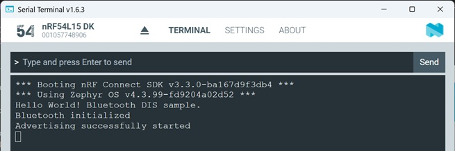
    
18) Use the _nRF Connect_ Smartphone app and start scanning. The app should find our device (device name: "DIS peripheral")
    
    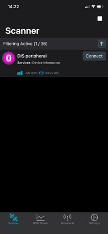
    
19) Click in the smartphone app the "Connect" button. Now a connection between the smartphone and the development kit is established. In the Terminal you should see that the device went into "Connected" mode. 
    
    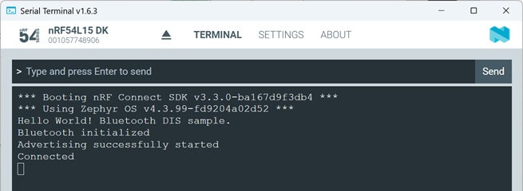
    
20) And the smartphone should list the GATT database content in the "Client" tab:
    
    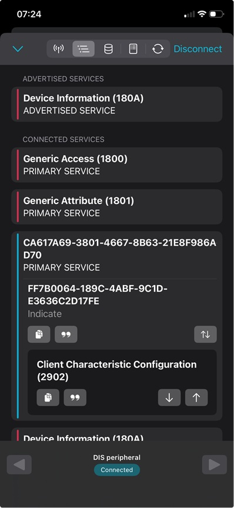

	and if you scroll down, you'll also see the DIS service:

    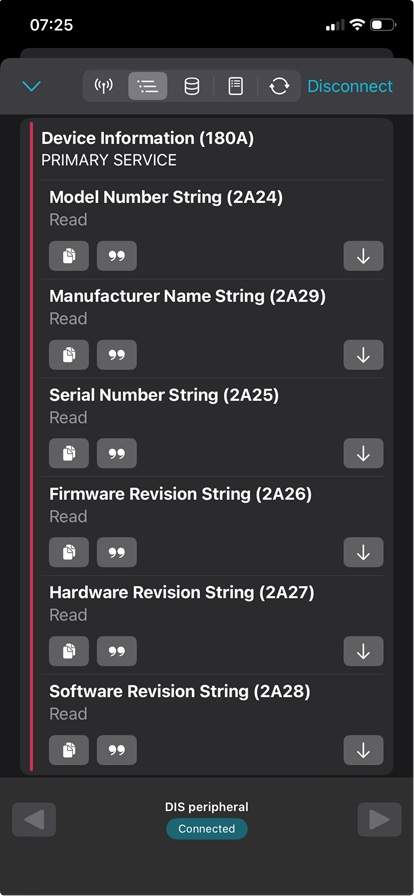

21) Let's take a look at CustomerService_notify. Here, we can view the current settings for the smartphone's subscription to the notification service. In the Client Characteristic Configuration (2902) box, click the button with the down arrow.

    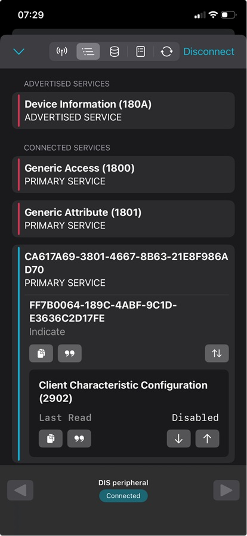
	
22) We can see that the notification is disabled. By clicking the button with the up arrow and entering the Boolean value “true,” we can enable the notification.

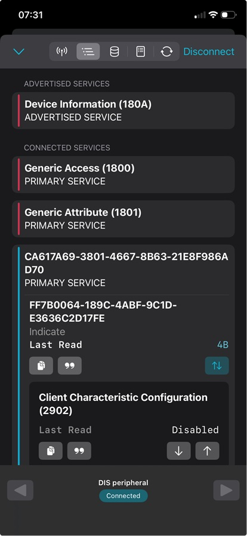

  > __Note:__ We can also toggle the notification status (enabled or disabled) by clicking the button with the arrow pointing to the underscore.

23) If notifications have been enabled, a message regarding the notification status should appear in the serial terminal, and if notifications are active, the counter reading in the serial terminal should increase every second.

   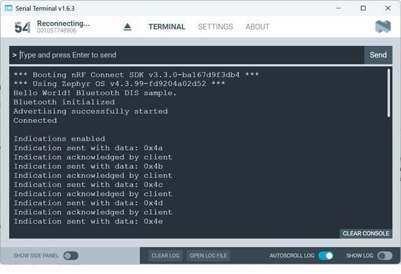
 

