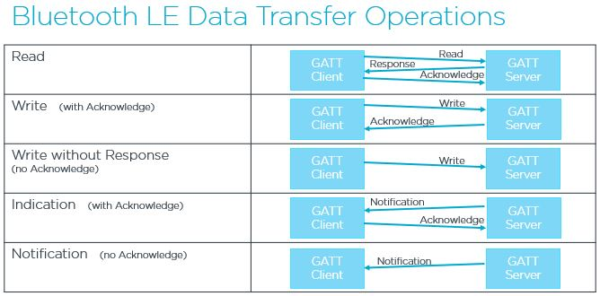
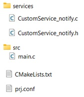
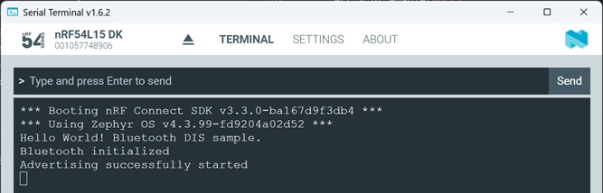
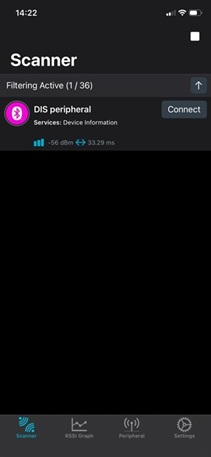
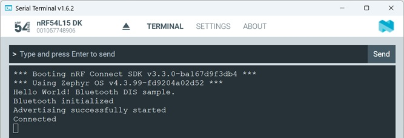
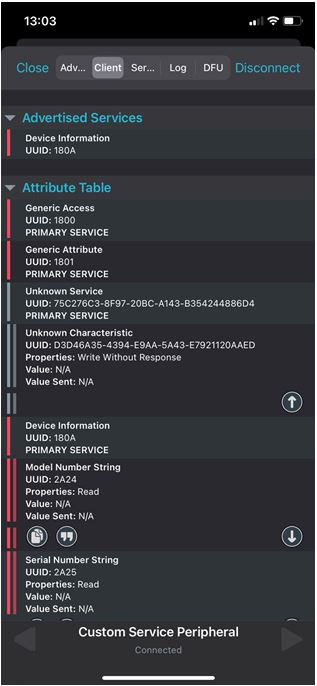
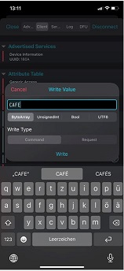
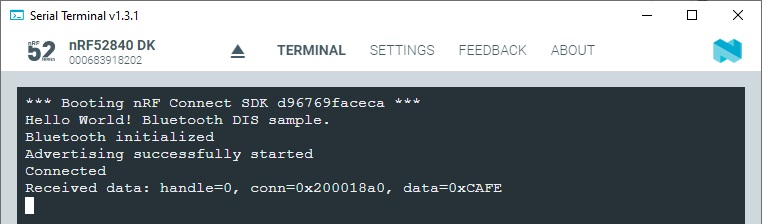

# --- WORK IN PROGRESS ---
-----

# Bluetooth Low Energy: Peripheral with a user-defined Service (Custom Service) - _Notification_

## Introduction

The Bluetooth Standard mentions different data transfer operations. An overview is shown in this picture:

In this hands-on we use the "Notification" transfer operation. A Bluetooth Low Energy _Notification_ is a mechanism that allows a GATT Server (typically a peripheral device based on an nRF54L Series SoC) to push data to a GATT Client (typically a central device like a smartphone) without the client needing to continuously poll for updates

## Required Hardware/Software
- Development kit 
[nRF54LM20DK](https://www.nordicsemi.com/Products/Development-hardware/nRF54LM20-DK),
[nRF54L15DK](https://www.nordicsemi.com/Products/Development-hardware/nRF54L15-DK), 
[nRF52840DK](https://www.nordicsemi.com/Products/Development-hardware/nRF52840-DK), 
[nRF52833DK](https://www.nordicsemi.com/Products/Development-hardware/nRF52833-DK), or 
[nRF52DK](https://www.nordicsemi.com/Products/Development-hardware/nrf52-dk) 
- a smartphone ([Android](https://play.google.com/store/apps/details?id=no.nordicsemi.android.mcp&hl=de&gl=US&pli=1) or [iOS](https://apps.apple.com/de/app/nrf-connect-for-mobile/id1054362403)), which runs the __nRF Connect__ app 
- install the _nRF Connect SDK_ v3.3.0 and _Visual Studio Code_. The installation process is described [here](https://academy.nordicsemi.com/courses/nrf-connect-sdk-fundamentals/lessons/lesson-1-nrf-connect-sdk-introduction/topic/exercise-1-1/).

## Hands-on step-by-step description

### Prepare the project

1) Make a copy of the project [Peripheral with Device Information Service](../peripheral_service_DIS/README.md). We will add a custom service and characteristic to this project.

2) Add new folder "services" to the project. Create the files CustomService_notify.c and CustomService_notify.h in this new folder.

   So, the file/folder structure in your project folder should look like this:

   

3) Add CustomSerice_notify.c file to your project by changing the CMakeLists.txt file. The whole file should then look like this:
	
	  _CMakeLists.txt_
	  
       # SPDX-License-Identifier: Apache-2.0

       cmake_minimum_required(VERSION 3.21.0)

       # Find external Zephyr project, and load its settings
       find_package(Zephyr REQUIRED HINTS $ENV{ZEPHYR_BASE})

       # Set project name
       project(MyPeripheralCusSer)

       # Add sources
       target_sources(app PRIVATE src/main.c
                                  services/CustomService_notify.c)

       # Add include directories
       target_include_directories(app PRIVATE services)
			
			
### Adding Custom Service
Before we add the code to our project, we should think about what our GATT database should look like. We created our project based on the Device Information Service (DIS) example, which means that the DIS service is already included here. We will now add an additional service, namely the _CustomService_notify_. This service will contain a characteristic used for sending notifications. With a notification, it is also necessary for the client to be able to subscribe to the notification. To do this, we need to add a Client Characteristic Configuration (CCC). After adding the “CustomService_notify” service, our GATT database should look like this:

Follow these steps to add the CustomService_notify service:

4) We need two transmission buffers for transmitting and receiving data. Add following lines to CustomService_notify.c:

	_services/CustomService_notify.c_
	
       #include "CustomService_notify.h"

       #define MAX_TRANSMIT_SIZE 240
       uint8_t data_buffer_rx[MAX_TRANSMIT_SIZE];
       uint8_t data_buffer_tx[MAX_TRANSMIT_SIZE];

       int CustomService_notify_init(void)
       {   int err = 0;
   
           memset(&data_buffer_tx, 0, MAX_TRANSMIT_SIZE);

           return err;
       }

5) Add the declaration of CustomService_notify_init() function to header file __CustomService_notify.h__:

	_services/CustomService_notify.h_

       #ifndef INCLUDE_CUSTOM_SERVICE_NOTIFY_H_
       #define INCLUDE_CUSTOM_SERVICE_NOTIFY_H_

       #include <zephyr/kernel.h>
       #include <zephyr/bluetooth/conn.h>

       int CustomService_notify_init(void); 

       #endif /* INCLUDE_CUSTOM_SERVICE_NOTIFY_H_ */

7) We need a UUID for the custom service and also for the custom TX and RX characteristics. Create two UUIDs at https://www.uuidgenerator.net. And add them to CusomtService.c:
  
	_services/CustomService_notify.c_

       /*Note that UUIDs have Least Significant Byte ordering */
       #define CUSTOM_SERVICE_NOTIFY_UUID   0x6f, 0xAD, 0x86, 0xF9, 0xE8, 0x21, 0x63, 0x8B, 0x67, 0x46, 0x01, 0x38, 0x69, 0x7A, 0x61, 0xCA                       
       #define CUSTOM_CHARACTERISTIC_TX_UUID 0xFD, 0x17, 0x2D, 0x6C, 0x63, 0xE3, 0x1D, 0x9C, 0xBF, 0x4A, 0x9C, 0x18, 0x64, 0x00, 0x7B, 0xFF
       #define CUSTOM_CHARACTERISTIC_RX_UUID 0xFE, 0x17, 0x2D, 0x6C, 0x63, 0xE3, 0x1D, 0x9C, 0xBF, 0x4A, 0x9C, 0x18, 0x64, 0x00, 0x7B, 0xFF

   __Note:__ Sometimes a random UUID is generated for the Service only and the Characteristic only uses an incremented Service UUID (_Service UUID_ + 1). 

8) The custom UUIDs must be declared. We’ll do that in the next two steps. Prepare the UUIDs by inserting the following lines into the “CustomService_notify.c” file:

	_services/CustomService_notify.c_

       #define BT_UUID_CUSTOM_SERIVCE_NOTIFY   BT_UUID_DECLARE_128(CUSTOM_SERVICE_NOTIFY_UUID)
       #define BT_UUID_CUSTOM_CHAR_NOTIFY_TX   BT_UUID_DECLARE_128(CUSTOM_CHARACTERISTIC_TX_UUID)
       #define BT_UUID_CUSTOM_CHAR_NOTIFY_RX   BT_UUID_DECLARE_128(CUSTOM_CHARACTERISTIC_RX_UUID)   

   This also requires to add the bluetooth uuid.h header file to the CustomService_notify.c file:

	_services/CustomService_notify.c_
	
       #include <zephyr/bluetooth/uuid.h>

9) And the next step for declaration is to define and register our service and its characteristics. By using the following helper macro we statically register our Service in our BLE host stack.

   Add the following lines __after the lines we added in step 7__ in CustomService_notify.c:

_services/CustomService_notify.c_

    /* Custom Service Declaration and Registration */
    BT_GATT_SERVICE_DEFINE(CustomService_notify,
                    BT_GATT_PRIMARY_SERVICE(BT_UUID_CUSTOM_SERIVCE_NOTIFY),
                    BT_GATT_CHARACTERISTIC(BT_UUID_CUSTOM_CHAR_NOTIFY_TX,
                                           BT_GATT_CHRC_NOTIFY,
                                           BT_GATT_PERM_NONE, 
                                           NULL, NULL, NULL),
    );

  > __Note:__ For a Bluetooth LE notification-only characteristic, you should use <code>BT_GATT_PERM_NONE</code> as the permission. This is because the characteristic value itself is not directly read or written by the client — data is pushed to the client via notifications.

9) And this also requires the gatt.h header file. Include it in the CustomServices.c file:
   
   _services/CustomService.c_
   
       #include <zephyr/bluetooth/gatt.h>

### Adding _Client Characteristic Configuration Descriptor_
A _Client Characteristic Configuration Descriptor_ (CCCD) is required for Bluetooth LE notifications. The CCCD is a writable descriptor that allows the GATT client to enable or disable notifications (or indications) for a specific characteristic. Without this descriptor, the client cannot receive notifications. That is why we are now adding it to our project.

> __Note:__ Notification and Indication are initiated by the server (for example _nRF54L15DK_), but the GATT client (for example smartphone) must subscribe to the desired data in order to receive the messages.

10) We need to complete the definition of <code>BT_GATT_SERVICE_DEFINE(CustomService_notify,</code> by adding the following section at the end of this macro:

   _services/CustomService.c_

    BT_GATT_CCC(CustomService_notify_ccc_cfg_changed,
                BT_GATT_PERM_READ | BT_GATT_PERM_WRITE),

  > __Note:__ The <code>BT_GATT_CCC</code> macro has two parameters. The first parameter is a callback function that is called when a client changes the CCCD value (e.g. enables or disables notifications). The second parameter allows you to specify the access rights for the attribute (a bitmap of bt_gatt_perm values) – typically <code>BT_GATT_PERM_READ | BT_GATT_PERM_WRITE</code>.

11) Now we just need the callback function.

   _services/CustomService.c_

    bool notify_enabled = false;

    static void CustomService_notify_ccc_cfg_changed(const struct bt_gatt_attr *attr, uint16_t value)
    {
        notify_enabled = (value == BT_GATT_CCC_NOTIFY);
    }

  > __Note:__ The following overview shows the possible values that can be sent by the client:
  >  | Value written into CCCD       | Description                  |
  >  |-------------------------------|------------------------------|
  >  | 0x0000                        | Notification/Indication is turned off |
  >  | 0x0001 (BT_GATT_CCC_NOTIFY)   | Notification is enabled    |
  >  | 0x0002 (BT_GATT_CCC_INDICATE) | Indication is enabled      |
	
12) 

### Add data transfer to the project

10) Let's add a function which sends a notification containing the specified data to a client. If successful, the “on_sent()” callback is also called.

    _services/CustomService_notify.c_

        void my_service_send(struct bt_conn *conn, const uint8_t *data, uint16_t len)
        {
            struct bt_gatt_notify_params params = 
            {
                .uuid = BT_UUID_CUSTOM_CHAR_NOTIFY_TX,
                .attr = attr,
                .data = data,
                .len  = len,
                .func = on_sent
            };
        }

12) And we also need the _on_sent()_ callback function. Add it before the _my_service_send()_ function.

    _services/CustomService_notify.c_

        /* This function is called whenever a Notification has been sent via the TX Characteristic */
        static void on_sent(struct bt_conn *conn, void *user_data)
        {
            ARG_UNUSED(user_data);

            const bt_addr_le_t * addr = bt_conn_get_dst(conn);
        
            printk("Data sent to Address 0x %02X %02X %02X %02X %02X %02X \n", addr->a.val[0]
                                                                             , addr->a.val[1]
                                                                             , addr->a.val[2]
                                                                             , addr->a.val[3]
                                                                             , addr->a.val[4]
                                                                             , addr->a.val[5]);
        }

13) Add the following function declaration to _CustomService_notify.h_, it is the function we call from main whenever we want to send a notification.

    _services/CustomService_notify.h_

        void my_service_send(struct bt_conn *conn, const uint8_t *data, uint16_t len);
 
### Using the _Notification_ functions

13) We initialize our _Notification_ service bay adding the following line after the <code>bt_enable()</code> function.

    _src/main.c_ => after bt_enable was called

            /* Initalize Notification services */
            err = CustomService_notify_init();
            if (err) {
                printk("Custom Service initialization failed (err %d)\n", err);
                return 0;
            }    

15) The declaration of the function <code>my_service_init()</code> is done by including the header file _CostumSerice.h_. 

    _src/main.c_ 

        #include <CustomService_notify.h>

### Testing

15) Finally, build the project ("Pristine Build"!!!). 
 
16) Use the _Serial Terminal_ to check the debug output. First connect Terminal, then perform a reset by pressing the reset button on the development kit. Following output should be seen on the terminal:
    
    
    
17) Use the _nRF Connect_ Smartphone app and start scanning. The app should find our device (device name: "Custom Service Peripheral")
    
    
    
18) Click in the smartphone app the "Connect" button. Now a connection between the smartphone and the development kit is established. In the Terminal you should see that the device went into "Connected" mode. 
    
    
    
19) And the smartphone should list the GATT database content in the "Client" tab:
    
    
    
    In the GATT database you find an "Unknown Service" and an "Unknown Characteristic". Check its UUIDs and compare it to the UUIDs we defined in step 6.

20) Open the "Unknown Characteristic" (click on the button with the arrow beside this characteristic) and enter a hex value. For example: CAFE
    
    
    
    Click on the "Write" button. 
    
21) In the Terminal program you should see that the hex values were received:
    
    
