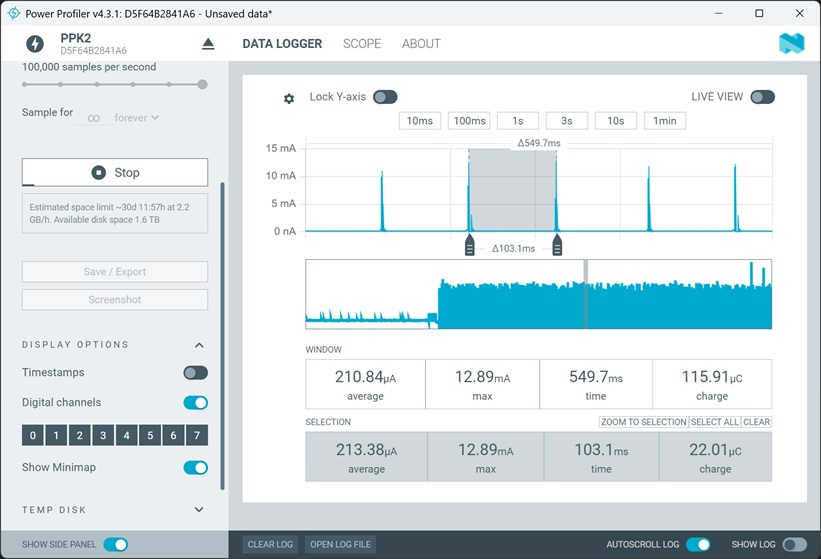
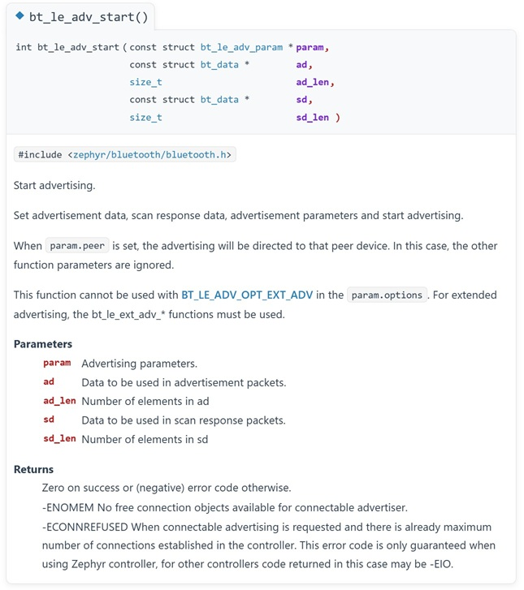
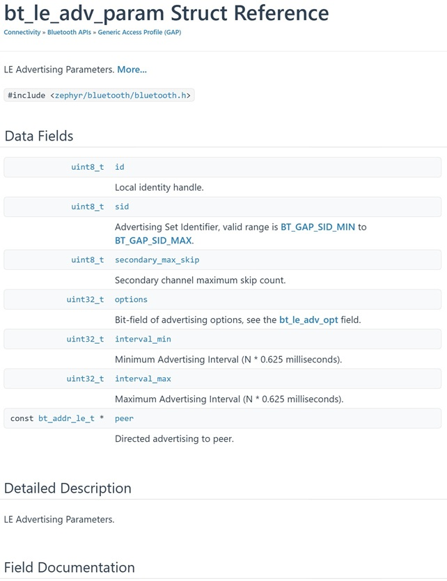
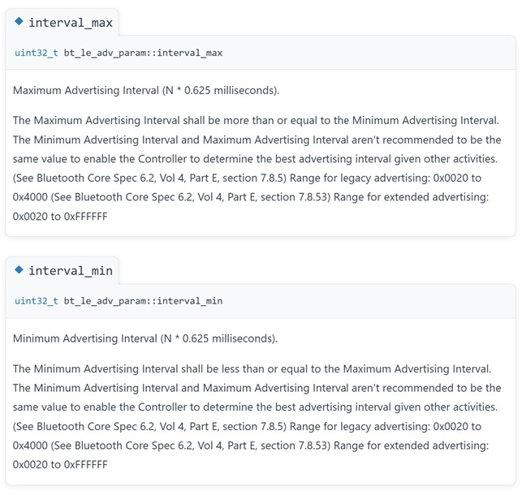
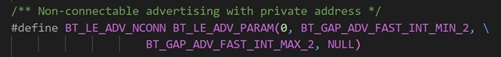
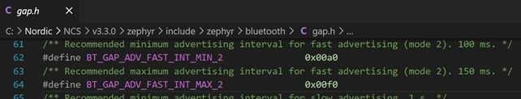
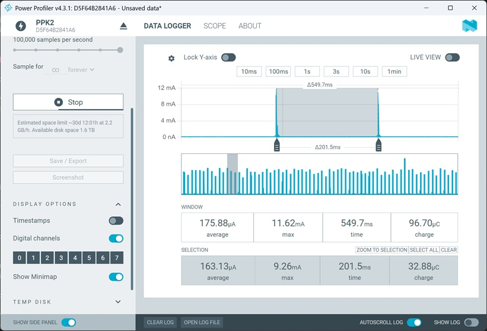

# Bluetooth Low Energy: Advertising Interval Time

## Introduction

In the [previous hands-on session](../basics_beacon/README.md), we implemented a beacon application. When we started advertising, we used a predefined setting in the parameter list that, among other things, defined the advertising interval. In this hands-on session, we’ll take a closer look at what was used here and how the advertising interval can be adjusted.

## Required Hardware/Software
- Development kit 
[nRF54LM20DK](https://www.nordicsemi.com/Products/Development-hardware/nRF54LM20-DK),
[nRF54L15DK](https://www.nordicsemi.com/Products/Development-hardware/nRF54L15-DK), 
[nRF52840DK](https://www.nordicsemi.com/Products/Development-hardware/nRF52840-DK), 
[nRF52833DK](https://www.nordicsemi.com/Products/Development-hardware/nRF52833-DK), or 
[nRF52DK](https://www.nordicsemi.com/Products/Development-hardware/nrf52-dk)
- [Power Profiler Kit II](https://www.nordicsemi.com/Products/Development-hardware/Power-Profiler-Kit-2)
- 2 Micro USB Cable (Note that the cable is not included in the previous mentioned development kits.)
- install the _nRF Connect SDK_ v3.4.0 and _Visual Studio Code_. The installation process is described [here](https://academy.nordicsemi.com/courses/nrf-connect-sdk-fundamentals/lessons/lesson-1-nrf-connect-sdk-introduction/topic/exercise-1-1/).

## Hands-on step-by-step description 

### Create a new project

1) Copy the [beacon project](../basics_beacon) from the previous hands-on.
   
2) Build the project and download it to the devlopment kit, e.g. nRF54L15DK.

  
### Measuring Advertising Interval of Beacon sample

3) We determine the set advertising interval by measuring the time between two RF transmissions in the power profile. The following screenshot shows the measurement taken by the beacon application. Here, we are measuring an advertising interval of 103 ms.

   

4) Let’s check what advertising interval has been set in the code. Once the Bluetooth stack has been successfully initialised, advertising is started using the following line of code.

   <code>err = bt_le_adv_start(BT_LE_ADV_NCONN, ad, ARRAY_SIZE(ad), NULL, 0);</code>

  Let’s take a look at the description of this API function:

   

  The advertising parameter is the one that interests us here. Let’s take a look at exactly what it does:

  
  
    
  In our example, we used the predefined parameter BT_LE_ADV_NCONN. Let’s check exactly what it does. Right-click on this name in VS Code and select “Go to Definition” from the context menu. 

  

  The definitions <code>BT_GAP_ADV_FAST_INT_MIN_2</code> and <code>BT_GAP_ADV_FAST_INT_MAX_2</code> are used here for the parameters interval_min and interval_max. These are defined as follows:

  

### Change Advertising Interval and check again

5) Let’s now change the advertising interval. Instead of 100 ms, we’ll set it to 200 ms.

   interval_min = N * 0.625 ms

   N (interval_min = 200ms) = 200ms / 0.625 ms = 320

   We will set the maximum interval time to 250 ms:

   N (interval_maxn = 250ms) = 250ms / 0.625 ms = 400

6) Let's modify the function call <code>bt_le_adv_start()</code> as follows:

       err = bt_le_adv_start(BT_LE_ADV_PARAM(0,      /* Advertising Options */
                                             320,    /* Minimum advertising interval = 200ms */
                                             400,    /* Maximum advertising interval = 250ms */
                                             NULL),  /* Peer address, set to NULL for undirected advertising */
                             ad, 
                             ARRAY_SIZE(ad), 
                             NULL, 
                             0);
   
7) Build the project and download it to the development kit. Then we'll measure the advertising interval time again. 

   
