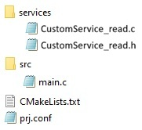
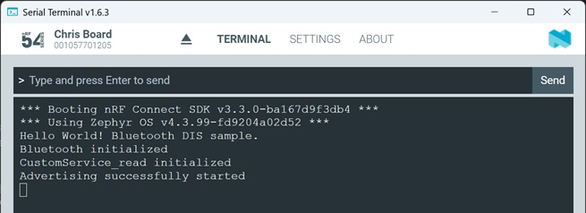
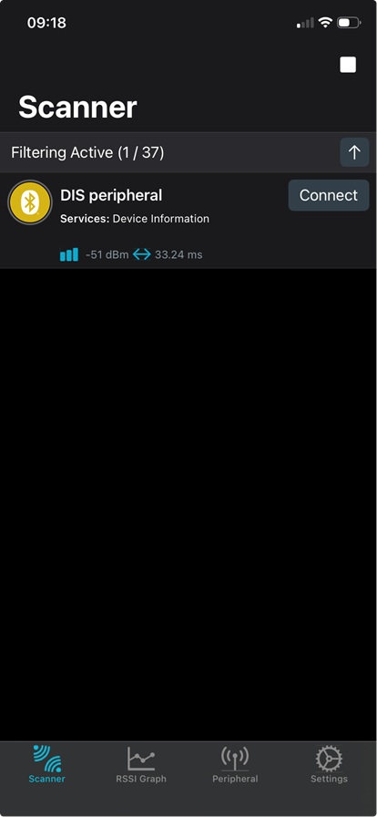
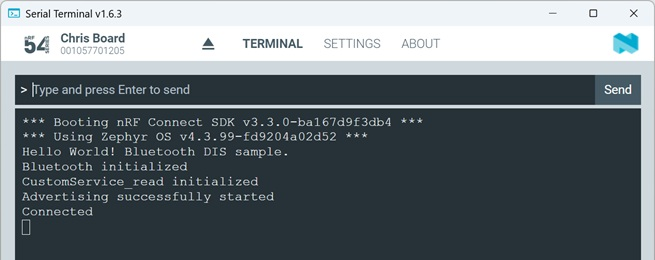
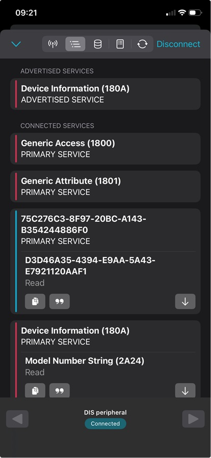
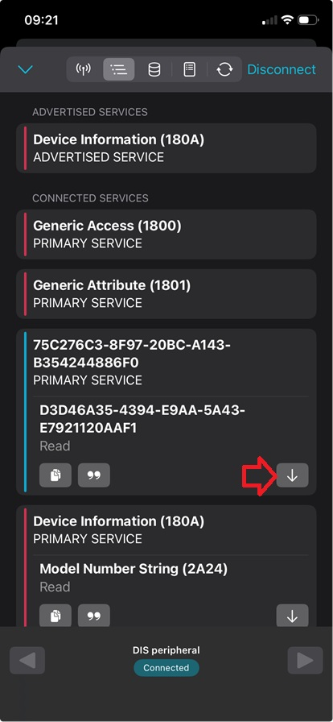
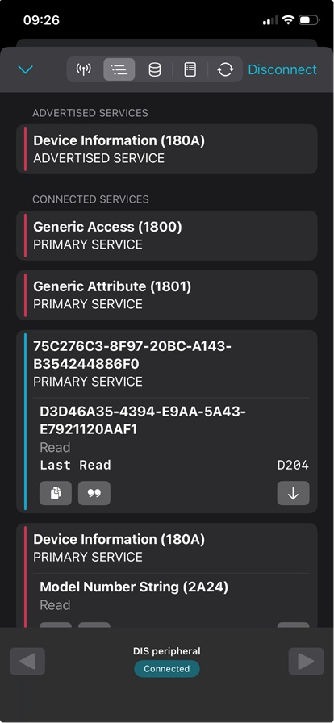
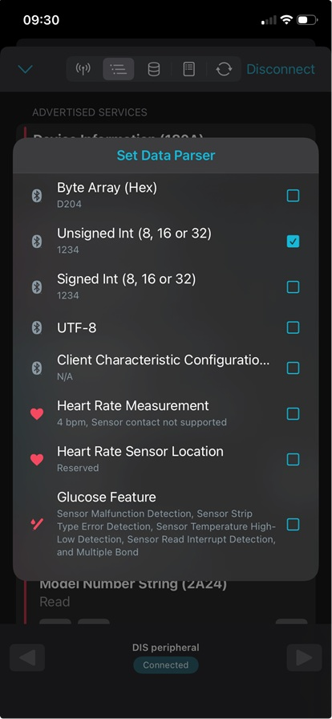

# Bluetooth Low Energy: Peripheral with a user-defined Service (Custom Service) - _Read_

## Introduction

The Bluetooth Standard mentions different data transfer operations. An overview is shown in this picture:

In this hands-on, we use the "Read" data transfer operation. It lets a client device (e.g. smartphone) request and receive the current value of a specific piece of data from a server device (e.g. nRF54L15DK).

## Required Hardware/Software
- Development kit 
[nRF54LM20DK](https://www.nordicsemi.com/Products/Development-hardware/nRF54LM20-DK),
[nRF54L15DK](https://www.nordicsemi.com/Products/Development-hardware/nRF54L15-DK), 
[nRF52840DK](https://www.nordicsemi.com/Products/Development-hardware/nRF52840-DK), 
[nRF52833DK](https://www.nordicsemi.com/Products/Development-hardware/nRF52833-DK), or 
[nRF52DK](https://www.nordicsemi.com/Products/Development-hardware/nrf52-dk) 
- a smartphone ([Android](https://play.google.com/store/apps/details?id=no.nordicsemi.android.mcp&hl=de&gl=US&pli=1) or [iOS](https://apps.apple.com/de/app/nrf-connect-for-mobile/id1054362403)), which runs the __nRF Connect__ app 
- install the _nRF Connect SDK_ v3.4.0 and _Visual Studio Code_. The installation process is described [here](https://academy.nordicsemi.com/courses/nrf-connect-sdk-fundamentals/lessons/lesson-1-nrf-connect-sdk-introduction/topic/exercise-1-1/).

## Hands-on step-by-step description

### Prepare the project

1) Make a copy of the project [Peripheral with Device Information Service](../peripheral_service_DIS/README.md). We will add a custom service and characteristic to this project.

2) Add new folder "services" to the project. Create the files CustomService_read.c and CustomService_read.h in this new folder.

   So, the file/folder structure in your project folder should look like this:

   

3) Add CustomSerice_read.c file to your project by changing the CMakeLists.txt file. The whole file should then look like this:
	
	  _CMakeLists.txt_
	  
       # SPDX-License-Identifier: Apache-2.0

       cmake_minimum_required(VERSION 3.21.0)

       # Find external Zephyr project, and load its settings
       find_package(Zephyr REQUIRED HINTS $ENV{ZEPHYR_BASE})

       # Set project name
       project(MyPeripheralCusSer)

       # Add sources
       target_sources(app PRIVATE src/main.c
                                  services/CustomService_read.c)
			
			
### Adding Custom Service

4) We are using a global variable <code>my_value</code> whose value we want to read from a smartphone via Bluetooth. Let's start by adding this variable to our project.

	_services/CustomService_read.c_
	
       #include <zephyr/kernel.h>
   
       uint16_t my_value = 1234;

6) Let's also add a initialization function for our custom service.

	_services/CustomService_read.c_

       void CustomService_read_init(void)
       {
           printk("CustomService_read initialized\n");
       }

7) Add the declaration of CustomService_read_init() function to header file __CustomService_read.h__:

	_services/CustomService.h_

       #ifndef CUSTOMSERVICE_READ_H_
       #define CUSTOMSERVICE_READ_H_

       void CustomService_read_init(void);

       #endif

8) We need a UUID for the custom service and also for the custom characteristic. Create two UUIDs at https://www.uuidgenerator.net. And add them to CusomtService_read.c:
  
	_services/CustomService_read.c_

       /* Note that UUIDs have Least Significant Byte ordering */
       #define CUSTOM_SERVICE_UUID        0xF0, 0x86, 0x48, 0x24, 0x54, 0xB3, 0x43, 0xA1, 0xBC, 0x20, 0x97, 0x8F, 0xC3, 0x76, 0xC2, 0x75                       
       #define CUSTOM_CHARACTERISTIC_UUID 0xF1, 0xAA, 0x20, 0x11, 0x92, 0xE7, 0x43, 0x5A, 0xAA, 0xE9, 0x94, 0x43, 0x35, 0x6A, 0xD4, 0xD3

   __Note:__ Sometimes a random UUID is generated for the Service only and the Characteristic only uses an incremented Service UUID (_Service UUID_ + 1). 

9) The custom UUIDs have to be declared. Add following lines in CustomService_read.c:

	_services/CustomService_read.c_

       #define BT_UUID_CUSTOM_SERIVCE         BT_UUID_DECLARE_128(CUSTOM_SERVICE_UUID)
       #define BT_UUID_CUSTOM_CHARACTERISTIC  BT_UUID_DECLARE_128(CUSTOM_CHARACTERISTIC_UUID)

   This also requires to add the bluetooth uuid.h header file to the CustomService_read.c file:

	_services/CustomService_read.c_
	
       #include <zephyr/bluetooth/uuid.h>

10) We need to define and register our service and its characteristics. By using the following helper macro we statically register our Service in our BLE host stack.

   Add the following lines __after the lines we added in step 8__ in CustomService_read.c:

_services/CustomService_read.c_

    /* Custom Service Declaration and Registration */
    BT_GATT_SERVICE_DEFINE(CustomService_read,
                    BT_GATT_PRIMARY_SERVICE(BT_UUID_CUSTOM_SERIVCE),
                    BT_GATT_CHARACTERISTIC(BT_UUID_CUSTOM_CHARACTERISTIC,
                                           BT_GATT_CHRC_READ,
                                           BT_GATT_PERM_READ, 
                                           read_my_value, NULL, NULL),
    );

11) And this also requires the gatt.h header file. Include it in the CustomServices_read.c file:
   
   _services/CustomService_read.c_
   
    #include <zephyr/bluetooth/gatt.h>

### Add data transfer (Read) to the project

12) Now add the function that takes care about getting a trigger if data is requested. Add the following to CustomService_read.c just before the __BT_GATT_SERVICE_DEFINE()__ macro is called. This is needed, because the macro defines to call __read_my_value()__ function!

	_services/CustomService_read.c_

        /* READ Callback */
        static ssize_t read_my_value(struct bt_conn *conn,
                                     const struct bt_gatt_attr *attr,
                                     void *buf,
                                     uint16_t len,
                                     uint16_t offset)
        {
            return bt_gatt_attr_read(conn, attr, buf, len, offset,
                                     &my_value, sizeof(my_value));
        }

### Handling of Custom Service in main() function

13) Include CustomService_read.h in your main.c file. Add following line in main.c:

	_src/main.c_

        #include "../services/CustomService_read.h"

   __Note:__ The relative path of the header file is used here. To make it more readable, the include path can also be defined in the CMakeLists.txt file by inserting the following line: __include_directories( services/ )__ This allows to use __#include "CustomService.h"__. Further info about this CMake command can be found [here](https://cmake.org/cmake/help/latest/command/include_directories.html).
   

14) We initialize our service by adding the following after enabling the Bluetooth stack in main.c:

	_src/main.c_ => main() function

             /* Initalize services */
             CustomService_read_init();

### Testing

15) Finally, build the project ("Pristine Build"!!!). 
 
16) Use the _Serial Terminal_ to check the debug output. First connect Terminal, then perform a reset by pressing the reset button on the development kit. Following output should be seen on the terminal:
    
    
    
17) Use the _nRF Connect_ Smartphone app and start scanning. The app should find our device (device name: "DIS peripheral")
    
    
    
18) Click in the smartphone app the "Connect" button. Now a connection between the smartphone and the development kit is established. In the Terminal you should see that the device went into "Connected" mode. 
    
    
    
19) And the smartphone should list the GATT database content in the "Client" tab:
    
    
    
    In the GATT database you find an "Unknown Service" and an "Unknown Characteristic". Check its UUIDs and compare it to the UUIDs we defined in step 6.

20) Click the button with the down arrow in our Read characteristic. 
    
    

	and afterwards you should see the hex value shown in little endian format:

    

  > __Note:__ The smartphone shows the value D204. Let's calculate the decimal value: due to little endian, we have to calculate the decimal number for 0x04d2 = 1234.

21) Let's change the output format on the smartphone by clicking the button with quotation marks. In the following screen we click on "Unsigned int (8, 16 or 32)".

        

    The value should then be displayed in decimal format. 
