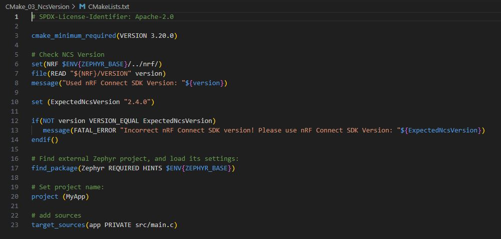
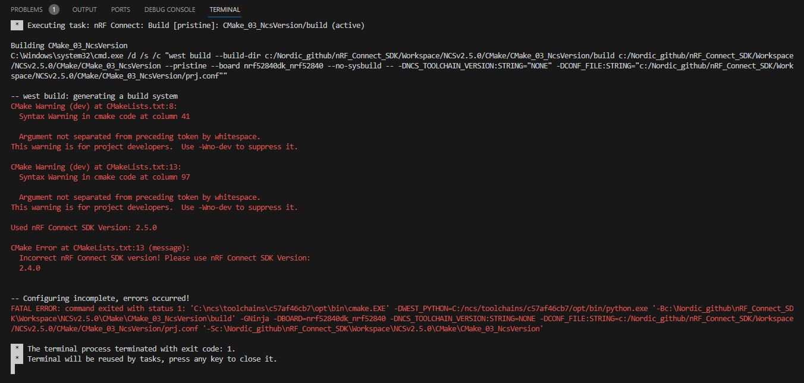

# CMake: Checking _nRF Connect SDK_ Version in CMake

## Introduction

Sometimes it can be helpful to check the selected version of the _nRF Connect SDK_ during the build process and stop the build if an incorrect version is being used. Here is a description of how this can be done. 

Note: further information about CMake can be found on [cmake.org](cmake.org).

## Required Hardware/Software for Hands-on
- development kit (e.g. nRF54LM20DK, nRF54L15DK, nrF54H20DK, nRF7002DK, nRF52840DK, nRF52833DK, or nRF52DK)
- install the _nRF Connect SDK_ and _Visual Studio Code_. 

## Hands-on step-by-step description 

1) Let's start with the hello_world project. Add this project to your Visual Studio Code workspace. 

2) The version of the _nRF Connect SDK_ should be checked early in the build process. Therefore, after checking __cmake_minimu_required()__ in CMakeLists.txt file, we add the following lines.

   CMakeLists.txt 

       # Check NCS Version
       set(NRF $ENV{ZEPHYR_BASE}/../nrf/)
       file(READ "${NRF}/VERSION" version)
       message("Used nRF Connect SDK Version: "${version})

   Here we read the version of the _nRF Connect SDK_ stored in the __nrf/VERSION__ file.

3) Let's define the expected version of the _nRF Connect SDK_ as a variable. This means we only have to define the expected version number in one place.

   CMakeLists.txt 

       set (ExpectedNcsVersion "2.4.0")

4) Now check whether the expected version and the version used are identical. If this is not the case, a fatal error is generated and an error message is displayed.

   CMakeLists.txt 

       if(NOT version VERSION_EQUAL ExpectedNcsVersion)
          message(FATAL_ERROR "Incorrect nRF Connect SDK version! Please use nRF Connect SDK Version: "${ExpectedNcsVersion})
       endif()

Your CMakeLists.txt file should now look like this:

## Testing

5) Now build your project. In my test case, I selected nRF Connect SDK Version 2.5.0 in Visual Studio Code. The error message should then be shown in the terminal.

6) Change the _ExpectedNcsVersion_ in the __CMakeLists.txt__ file to "2.5.0" and rebuild the project. Now only the message indicating which NCS version you are using will be shown. The project build has now been successfully completed. 
