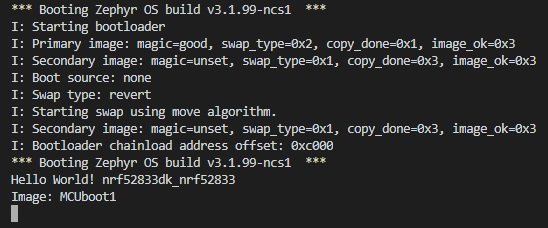

SDK version: NCS v2.3.0 - Link to Hands-on solution: [MCUboot1](https://github.com/ChrisKurz/MCUboot/tree/main/Workspace/NCSv2.3.0/01_MCUboot1), [MCUboot2](https://github.com/ChrisKurz/MCUboot/tree/main/Workspace/NCSv2.3.0/01_MCUboot2)

# MCUboot Hands-on:  adding MCUboot to a project

## Introduction

MCUboot takes care about the boot process. It handles the authentification of the application images and handles to copy the upgrade image to the slot, which is used to execute the code. Download of application image is handled within the application. 
So, first we will focus on the functionality of MCUboot only. We will do the firmware download by using the Programmer. Later on we will add this functionality also in the application software.

## Required Hardware/Software for Hands-on
- one nRF52 development kit (e.g. nRF52DK, nRF52833DK, or nRF52840DK)
- install the _nRF Connect SDK_ v2.3.0 and _Visual Studio Code_. The description of the installation can be found [here](https://developer.nordicsemi.com/nRF_Connect_SDK/doc/2.3.0/nrf/getting_started/assistant.html#).

## Hands-on step-by-step description 

### Create first application (which will be replaced later by the firmware update)

1) create a new application based on the /zephyr/samples/hello_world sample project. (e.g. name of new project: "MCUboot1")

2) add the following line to main function:

	_src/main.c_ => main() function

           printk("Image: MCUboot1 \n");

3) Now we want to include MCUboot into our project. This is done by setting the CONFIG_BOOTLOADER_MCUBOOT. If we set this CONFIG symbol to "y", a multi-image build will be done and the MCUboot project will be included as a child image. 

	_prj.conf_

       CONFIG_BOOTLOADER_MCUBOOT=y

4) Build the project and take a look into build/zephyr folder.

5) Start "Programmer" in nRF Connect for Desktop. 

6) connect to your development kit (e.g. NRF52833DK board). 

7) Click "Add File" and select in your project folder /build/zehpyr/merged.hex file.

8) In the Programmer you should see two blocks:

   

   The orange block at the bottom is the bootloader image, and the green block above is the hello world application image. 

9) Click "Earse all" and afterwards "Erase & write".

10) When programming is completed, check the Terminal output. 

   

   Note: the application is printing just once after a reset. So you have to press the reset button on the nRF52833DK to see the stings in the terminal window. 

### Create second application (here we create the firmware update image)

11) copy the MCUboot1 project and rename the copy to "MCUboot2". Erase the build folder in MCUboot2.

12) Add MCUboot2 to you Visual Studio Code Project

13) Open main.c and change the line __printk("Image: MCUboot1 \n");__ to:

	_src/main.c_ => main() function

            printk("Image: MCUboot2 \n"); 

   Note: this change will later on allow to identify which image is executed. The output "MCUboot2" means that the upgrade image is executed.

14) build the project. 

## Testing

### Following steps are done to test firmware udpate (we will download upgrade image here via the programmer)

15) Now, click "Add file" and select the file /MCUboot2/build/zephyr/app_moved_test_update.hex. Now you should see in the Programmer tool three software blocks. 

   

   We have now added the mcuboot2 application image. It is stored in the secondary slot. 

   In the following steps we emulate the firmware download, which should be handled by the application software. We use here the programmer to load the firmware update image into the flash.

17) Ensure the Terminal is running

18) Click "Erase & Write" button.

19) Check the Terminal. Especially take a look to "Swap type" and the Image string from your application (MCUboot1 or MCUboot2).

   

   We have loaded MCUboot1 image into primary slot. So MCUboot1 should be executed. However, after completing the programming of the device and reset is done. This causes that the MCUboot is executed. MCUboot finds a new image (MCUboot2) in the secondary slot. So it starts to swap the two images. If this is completed it executes the image that is stored in primary slot, which is MCUboot2 image.

20) reset the nRF52833DK board (RESET button) and see what happens...

   

   In the upgrade image (MCUboot2) the swap type "test" is enabled. This means that after a swap the swap type "revert" will be used. So the reset in this step caused that the old image was written back to the primary slot. And execution of the old image (MCUboot1) is done. 

   Any further reset will execute the orignial MCUboot1 image.
