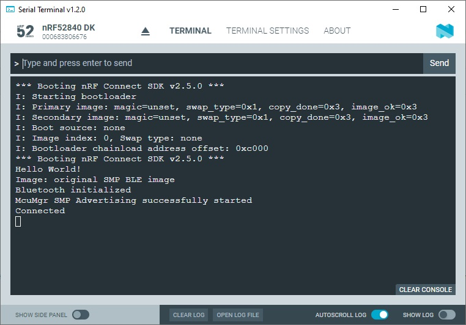
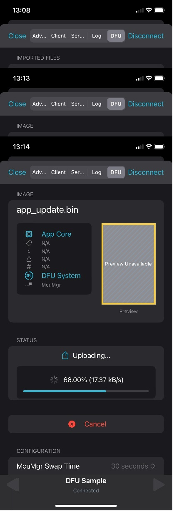
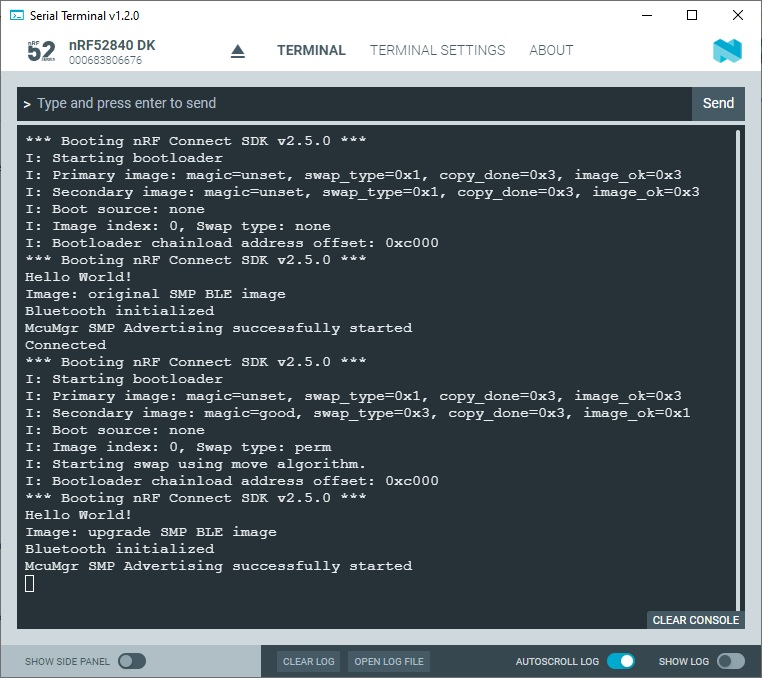

SDK version: NCS v2.5.0 - Link to Hands-on solution: [original image project](https://github.com/ChrisKurz/MCUboot/tree/main/Workspace/NCSv2.5.0/McuMgr_SMP_BLE_original), [upgrade image project](https://github.com/ChrisKurz/MCUboot/tree/main/Workspace/NCSv2.5.0/McuMgr_SMP_BLE_upgrade)

# McuMgr Hands-on:  Adding SMP Server with Bluetooth Transfer to a Project

## Introduction

Here we add Device Firmware Image download capability to an application and perform a firmware upgrade via Bluetooth LE. 

## Required Hardware/Software for Hands-on
- one nRF52 development kit (e.g. [nRF52DK](https://www.nordicsemi.com/Products/Development-hardware/nRF52-DK), [nRF52833DK](https://www.nordicsemi.com/Products/Development-hardware/nRF52833-DK), or [nRF52840DK](https://www.nordicsemi.com/Products/Development-hardware/nRF52840-DK))
- a smartphone is needed with [nRF Connect for Mobile](https://www.nordicsemi.com/Products/Development-tools/nRF-Connect-for-mobile) app ([Android app](https://play.google.com/store/apps/details?id=no.nordicsemi.android.mcp&hl=en&gl=US) or [iOS app](https://apps.apple.com/gb/app/nrf-connect-for-mobile/id1054362403))
- install the _nRF Connect SDK_ v2.5.0 and _Visual Studio Code_. The description of the installation can be found [here](https://developer.nordicsemi.com/nRF_Connect_SDK/doc/2.5.0/nrf/getting_started/assistant.html#).

## Hands-on step-by-step description 

### Create first application (which will be replaced later by the firmware update)

#### start with hello_world project

1) Let's start with the [hello_world](https://github.com/ChrisKurz/nRF_Connect_SDK/tree/main/Workspace/NCSv2.5.0/hello_world) example that we did in _nRF Connect SDK_ course. Name this project "McuMgr_SMP_BLE_original".

2) When debugging, we simply want to see later whether the upgrade image is executed. The easiest way to do this is to send a corresponding message via the virtual com port after booting. We therefore insert the following line.

	_src/main.c_ => main() function

           printf("Image: original SMP BLE image \n");

3) We will do the Bluetooth handling in an own C file. So in main.c we have to add the call to start/initialize the Bluetooth Stack.

	_src/main.c_ => main() function

           start_mcumgr_smp_bluetooth();

4) And we need to include the header file that declares this function.

  _src/main.c_

    #include "mcumgr_smp_bluetooth.h"

#### add MCUboot

5) Now we want to add MCUboot to our project. This is done using CONFIG_BOOTLOADER_MCUBOOT. If we set this CONFIG symbol to "y", a multi-image build is performed and the MCUboot project is added as a child image. 

	_prj.conf_

       # Add MCUboot to the project
       CONFIG_BOOTLOADER_MCUBOOT=y

#### add McuMgr SMP BLE server

6) In the next step we add the McuMgr and the SMP server to the project. This also requires to add some dependencies.

	_prj.conf_

       # Add McuMgr SMP Server
       CONFIG_MCUMGR=y
       CONFIG_MCUMGR_GRP_IMG=y

       # CONFIG_MCUMGR_GRP_IMG dependencies
       CONFIG_FLASH=y
       CONFIG_IMG_MANAGER=y

       # CONFIG_IMG_MANAGER dependencies
       CONFIG_STREAM_FLASH=y

       # CONFIG_MCUMGR dependencies
       CONFIG_NET_BUF=y
       CONFIG_ZCBOR=y

       # Required for CONFIG_IMG_MANAGER
       CONFIG_FLASH_MAP=y

#### add Bluetooth LE

7) add Bluetooth to the project and configure the Bluetooth software module.

	_prj.conf_

       # Enable BLE transfer
       CONFIG_BT=y
       CONFIG_BT_PERIPHERAL=y
       CONFIG_BT_DEVICE_NAME="DFU Sample"
       CONFIG_NCS_SAMPLE_MCUMGR_BT_OTA_DFU=y

       CONFIG_NCS_SAMPLE_MCUMGR_BT_OTA_DFU=y
       CONFIG_NCS_SAMPLE_MCUMGR_BT_OTA_DFU_SPEEDUP=y

8) In this project we will keep the Bluetooth source code separated from main.c file. So we add a second *.c file to the project and define the folder where its header files are located.

	_CMakeLists.txt_

       target_sources(app PRIVATE src/mcumgr_smp_bluetooth.c)
       zephyr_library_include_directories(src)

   NOTE: We keep this example simple and locate the header file also inthe __src__ folder. 

9) Create the mcumgr_smp_bluetooth.c file and mcumgr_smp_bluetooth.h header file in the src directory. 

10) The header file is just used to allow to start the bluetooth SMP server in main function. So the mcumgr_smp_bluetooth.h file should look like this.

	_src/mcumgr_smp_bluetooth.h_

        void start_mcumgr_smp_bluetooth(void);

11) The application code now has to enable the Bluetooth stack, start advertising, and handle connects and disconnects. Let's start to enable the Bluetooth stack.

	_src/mcumgr_smp_bluetooth.c_

        #include <zephyr/bluetooth/bluetooth.h>

        void start_mcumgr_smp_bluetooth(void)
        {
            int err;
   
            /* Initialize the Bluetooth Subsystem */
            err = bt_enable(NULL);

            if (err != 0) {
                printk("Bluetooth init failed (err %d)\n", err);
                return;
            }
            printk("Bluetooth initialized\n");
            start_advertising();
        }

12) Let's add the advertising.

	_src/mcumgr_smp_bluetooth.c_
 
        static const struct bt_data ad[] = {
              BT_DATA_BYTES(BT_DATA_FLAGS, (BT_LE_AD_GENERAL | BT_LE_AD_NO_BREDR)),
              BT_DATA_BYTES(BT_DATA_UUID16_ALL, 
                            0x84, 0xaa, 0x60, 0x74, 0x52, 0x8a, 0x8b, 0x86,
                            0xd3, 0x4c, 0xb7, 0x1d, 0x1d, 0xdc, 0x53, 0x8d),
        };

        void start_advertising(void)
        {
            int err;

            err = bt_le_adv_start(BT_LE_ADV_CONN_NAME, ad, ARRAY_SIZE(ad), NULL, 0);
            if (err) {
                printk("Advertising failed to start (err %d)\n", err);
                return;
            }
            printk("McuMgr SMP Advertising successfully started\n");
        }

13) Now add the connect and disconnect handling.

	_src/mcumgr_smp_bluetooth.c_

        #include <zephyr/bluetooth/conn.h>

        static void connected(struct bt_conn *conn, uint8_t err)
        {
            if (err) {
                printk("Connection failed (err 0x%02x)\n", err);
            } else {
                printk("Connected\n");
            }
        }

        static void disconnected(struct bt_conn *conn, uint8_t reason)
        {
            printk("Disconnected (reason 0x%02x)\n", reason);
            start_advertising();
        }

        /* Register a callback structure for connection events. */
        BT_CONN_CB_DEFINE(conn_callbacks) = {
            .connected = connected,
            .disconnected = disconnected,
        };
    
#### Build the project and save the intel hex file

14) Build the project.
15) You can also copy the generated intel hex file __build/zephyr/merged.hex__ and rename it to __mcumgr_smp_bluetooth_original.hex__. This is our original image that includes MCUboot and the original application code. Flash this project by either clicking on Flash in Action Menu within Visual Studio Code or use the Programmer tool to download the __mcumgr_smp_bluetooth_original.hex__ Intel Hex file.

### Create the Upgrade Image

16) So first, make a copy of the previous project and rename it. (e.g. use project name "McuMgr_SMP_BLE_upgrade")

17) We use basically the same code as before, but we update the message after the boot. By this we can easliy find out which application version (original code or upgrade image) is executed. 

   Replace the line __printf("Image: original SMP BLE image \n");__ in the main.c file by following:

_src/main.c_ => main() function

           printf("Image: upgrade SMP BLE image \n");

18) Build the project. 

19) Here we will do the firmware download via Bluetooth. So we will use the nRF Connect for Mobile Smartphone app and download the upgrade image from there. For this we need the __app_update.bin__ file that is also located in the build/zephyr folder after a successful build.

## Testing

20) Start the terminal program, e.g. __Serial Terminal__ from the _nRF Connect for Desktop_ tool.
21) In case you have already downloaded the code, a reset on the development kit should be done now. In case you have not yet downloaded the __mcumgr_smp_bluetooth_original.hex__ file, you should download it on the connected development kit. After that you should see following outputs in the terminal.

   

   You can see here that the MCUboot bootloader is executed first. Then the code execution of the application is started and we can see the expected output "Image: original SMP BLE image". Moreover, the Bluetooth advertising has started. 

22) Let's start the __nRF Connect for Mobile__ app on your smartphone. Do a scan and look for the "DFU Example" device.

    

23) Click the "Connect" button on the smartphone for the "DFU Example" device. You should now see that a Bluetooth connection is established and in the Serial Terminal the "Connected" message occurs.

    

24) Upload the __app_update.bin__ file (upgrade image) to the smartphone and in the DFU tab select the file and click the "Start" button.

    

    
    
25) Then you should see on the smartphone app that the firmware is downloaded.
  
    

26) You should see in the Serial Terminal that a reset happens and the MCUboot bootloader is executed again. The bootloader detects a valid image in the secondary image slot and does a permanent swap.  The new application is then executed, which can be identified via the line "Image: upgrade SMP BLE image".

    

27) The smartphone app shows after a while a successful firmware upgrade.

    
