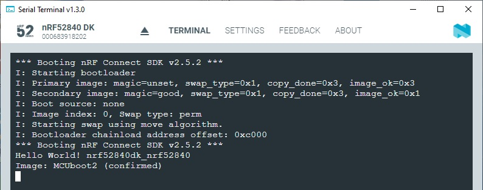
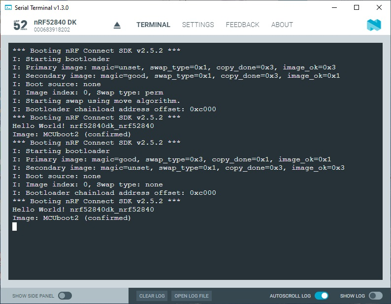

SDK version: NCS v2.5.2 - Link to Hands-on solution: [MCUboot2_confirm](https://github.com/ChrisKurz/MCUboot/tree/main/Workspace/NCSv2.5.2/01a_MCUboot2_confirm)

# MCUboot Hands-on:  Create Image that uses Swap Type "Permanent"

## Introduction

In the previous hands-on we saw that the default setting when generating an upgrade image uses the swap type "test". This is ideal if you want the application to run tests after an image swap and then decide whether to keep the new image or go back to the old image. 

It is of course also possible to create an upgrade image that uses the swap type "permanent". This hands-on shows how to do it.

## Required Hardware/Software
- Development kit [nRF52840DK](https://www.nordicsemi.com/Products/Development-hardware/nRF52840-DK), [nRF52833DK](https://www.nordicsemi.com/Products/Development-hardware/nRF52833-DK), or [nRF52DK](https://www.nordicsemi.com/Products/Development-hardware/nrf52-dk)
- install the _nRF Connect SDK_ v2.5.2 and _Visual Studio Code_. The installation process is described [here](https://academy.nordicsemi.com/courses/nrf-connect-sdk-fundamentals/lessons/lesson-1-nrf-connect-sdk-introduction/topic/exercise-1-1/).

## Hands-on step-by-step description 

### Create new project

1) Copy the [MCUboot2](https://github.com/ChrisKurz/MCUboot/tree/main/Workspace/NCSv2.5.2/01_MCUboot2) project (e.g. name of new project: "MCUboot2_confirm")

2) Replace the instruction __printf("Image: MCUboot2 \n");__ with the following line:

	_src/main.c_ => main() function

           printf("Image: MCUboot2 (confirmed) \n");

3) Open KCONFIG tool and look for the "Extra arguments to pass to imgtool" KCONFIG symbol. Enter "--confirm" in its text box.

   
   
   __NOTE:__ CONFIG_MCUBOOT_EXTRA_IMGTOOL_ARGS allows us to pass further arguments when the build process uses the __imgtool__. We can either enter here "--confirm" and press "Save" button and do only Builds. Important to know is that a "pristine build" would erase this setting! If this KCONFIG symbol should permanently be set then add following line to the prj.conf file. Easiest way to do this is to click on __Save to file__ button in __nRF KCONFIG GUI__ tool.
   
	_prj.conf_
	
       # Confirm the upgrade image. This causes to use swap type "permanent"
       CONFIG_MCUBOOT_EXTRA_IMGTOOL_ARGS="--confirm"
   
4) Build the project.     

### Testing

5) Let's use the __Programmer__ tool within __nRF Connect for Desktop_ and add the MCUboot1 _[merged.hex](https://github.com/ChrisKurz/MCUboot/tree/main/Workspace/NCSv2.5.2/01_MCUboot1)_ image and the image _app_moved_test_update.hex_ from this hands-on.

6) Ensure the Terminal program is running on your computer.

7) In the __Programmer__ tool click the "Erase & Write" button.
8) Now check the Terminal window. Especially take a look to "Swap type".

   

  Note that the swap type now shows "perm". This means that a permanet swap was done. 
  
9) Press again RESET button on your development kit.
  
     
  
   Any furhter RESETs will not cause another swap, except a new upgrade image was downloaded.
