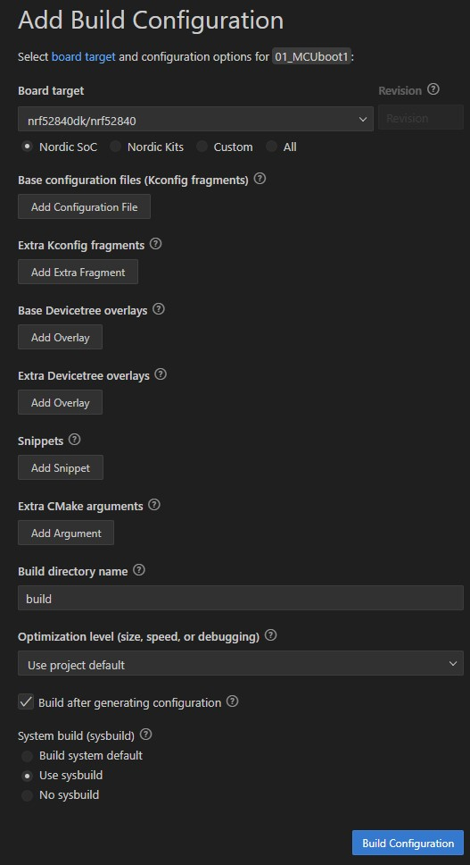
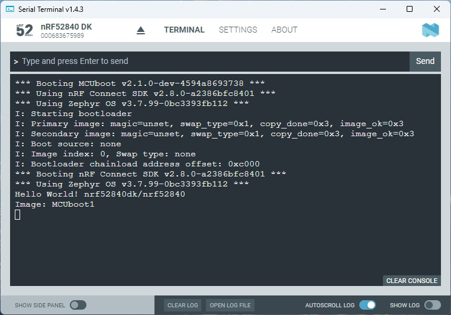

SDK version: NCS v2.8.0 - Link to Hands-on solution: [MCUboot1](https://github.com/ChrisKurz/MCUboot/tree/main/Workspace/NCSv2.8.0/01_MCUboot1)

# MCUboot Hands-on:  Adding MCUboot to a Project

## Introduction

MCUboot takes care about the boot process. It handles the authentification of the application images and handles to copy the upgrade image to the slot, which is used to execute the code. Download of application image is handled within the application. 
So, first we will take a look on how to add MCUboot to an own project. 

## Required Hardware/Software
- Development kit [nRF52840DK](https://www.nordicsemi.com/Products/Development-hardware/nRF52840-DK), [nRF52833DK](https://www.nordicsemi.com/Products/Development-hardware/nRF52833-DK), [nRF52DK](https://www.nordicsemi.com/Products/Development-hardware/nrf52-dk), or [nRF54L15DK](https://www.nordicsemi.com/Products/Development-hardware/nRF54L15-DK)
- install the _nRF Connect SDK_ v2.8.0 and _Visual Studio Code_. The installation process is described [here](https://academy.nordicsemi.com/courses/nrf-connect-sdk-fundamentals/lessons/lesson-1-nrf-connect-sdk-introduction/topic/exercise-1-1/).

## Hands-on step-by-step description 

### Create first application (which will be replaced later by the firmware update)

1) Create a new application based on the /zephyr/samples/hello_world sample project. (e.g. name of new project: "01_MCUboot1")
   
   The Build Configuration should look like this:

   

  It is important to select "Use sysbuild" for the System build! 
  
  > **NOTE**: The _nRF Connect SDK_ versions up to version v2.6.2 used a multi-image build of the _Child and Parent images_, which is set to [deprecated in _nRF Connect SDK_ version 2.7.0](https://docs.nordicsemi.com/bundle/ncs-2.7.0/page/nrf/config_and_build/multi_image.html). It is replaced by the Zephyr's _Sysbuild_. In this hands-on we will use _Sysbuild_.

2) Add the following line to main function:

	_src/main.c_ => main() function

           printf("Image: MCUboot1 \n");

   __Note:__ In previous hands-on we used the function __printk()__, which is included in the Zephyr kernel. In the Zephyr hello_world example the [PICOLIB](https://docs.nordicsemi.com/bundle/ncs-2.8.0/page/zephyr/develop/languages/c/picolibc.html) library is included. This library supports all standard C formatted input and output functions, like _printf()_. This is also the reason why _#include <stdio.h>_ is used in the code example.

3) Now we want to add MCUboot to our project.

   _Sysbuild_ allows us to handle two independent projects within a single project build. So it is basically doing a multi-image build. The images are:
    - our own application image. In this hands-on it is the hello world project that also prints "Image: MCUboot1" and
    - the MCUboot project itself, which is provided by the _nRF Connect SDK_ installation. So here we will only use KCONFIG to define the features that we would like to use from the provided MCUboot project. We will not change the MCUboot source code!

   We will use a _Sysbuild_ KConfig file for doing all the needed sysbuild configurations. Add the file __sysbuild.conf__ to your project folder (this is the folder where the CMakeLists.txt file is located). The file structure of your project should look like this:

    _Workspace folder_/01_MCUboot1 
    |--- src 
    |------ main.c 
    |--- CMakeLists.txt 
    |--- prj.conf 
    |--- **sysbuild.conf**

   Adding MCUboot to our project is done by putting **SB_CONFIG_BOOTLOADER_MCUBOOT=y** into the _sysbuild.conf_ file.

	_sysbuild.conf_

       SB_CONFIG_BOOTLOADER_MCUBOOT=y

4) Build the project and take a look at the **build**, **build/MCUboot1/zephyr**, and **build/mcuboot/zephyr** folders. Adding MCUboot and the associated activation of a multi-image build results in additional files being generated in these folders. The most important files are:

   - __build/MCUboot1/zephyr/zephyr.hex__: This file contains the image of the application project.
   - __build/mcuboot/zephyr/zephyr.hex__: This file contains the image of the bootloader, the mcuboot project. 
   - __build/merged.hex__: The different zephyr.hex files of a multi-image build are merged together and stored in the __merged.hex__ file. So in our example the zephyr.hex files of the _01_MCUboot1_ project and the mcuboot project are merged. 
   
   Further generated files are described [here](https://docs.nordicsemi.com/bundle/ncs-latest/page/nrf/config_and_build/configuring_app/output_build_files.html#common_output_build_files).

## Testing ###

5) Start "Programmer" in nRF Connect for Desktop. 

6) Connect to your development kit. 

7) Click "Add File" and select in your project folder /build/merged.hex file.

8) In the Programmer you should see two blocks:

   

   The orange block at the bottom is the bootloader image. It is located at address 0x0000. Starting at address 0xC000 you find the green block, which is the _hello world_ application image. 

9) In the Programmer tool click "Earse all" and afterwards "Erase & write".

10) When programming is completed, check the Terminal output. 

   

   __Note__: The application is printing just once after a reset. So you have to press the Reset button on the development kit to see the output in the terminal window.
