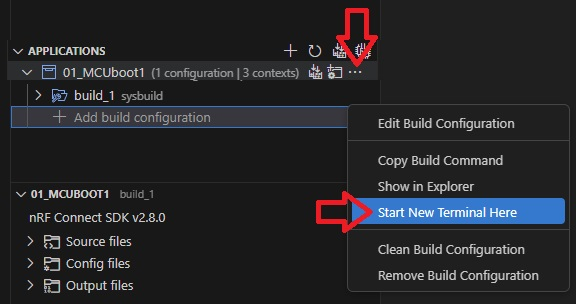

SDK version: NCS v2.8.0

# Generate a Key File

## Introduction 

MCUboot uses a signature for the application images. This means that each application image receives a signing key that is used to authenticate the image. This ensures that only authenticated software is executed.

In this hands-on we will look at the creation of a key file required for these purposes. 

## Required Software
- install the _nRF Connect SDK_ v2.8.0 and _Visual Studio Code_. The installation process is described [here](https://academy.nordicsemi.com/courses/nrf-connect-sdk-fundamentals/lessons/lesson-1-nrf-connect-sdk-introduction/topic/exercise-1-1/).

## Hands-on step-by-step description 

### Generate the key file
First, we generate a PEM file that contains a private/public key pair. The developers of MCUBoot provide a tool for image signing, image encryption, and key management. This tool is called __imgtool__. The __imgtool__ is included in the MCUBoot repository. This means that when you install the _nRF Connect SDK_, you also install MCUBoot and the __imgtool__ included in it. Note that __imgtool__ is a command line tool, which is executed in a command shell.

Note that the environmental variables on the computer has to be set to allow using __imgtool__. In case you start the command line shell in Visual Studio Code all these environmental variables are set. So the easiest way is to open the terminal in Visual Studio Code by clicking on the three dots in the build line and then click on _Start New Terminal Here_. 

## Generating a PEM file...

In general, there are different tools that help to create a PEM file. Here we will use __imgtool__.

The imgtool can be used to generate rsa-2048, rsa-3072, ecdsa-p256, ed25519, and x25519 keys. Here is the instruction:

    imgtool keygen -k <filename> -t <type> [-p]

|OPTIONS:|  |
|--|--|
| -k < filename > | This file will be generated and it contains the keypair. (example: -k my_key.pem) This key file is what is used to sign images. This file should be protected, and not distributed. |
| -p  | Adding this argument will cause to prompt for a password. You will need to enter this password every time you use the private key. No password is used in case you will not mention this argument. |
| -t < type >     | Key type. It should match the one for which mcuboot is configured. (example: -t rsa-2048) |

| Possible types are: | 
|--| 
| rsa-2048   | 
| rsa-3072   |
| ecdsa-p256 |
| ecdsa-p224 |
| ed25519    |
| x25519     |
 
Example:

Enter following line:

    imgtool keygen -k My_Key.pem -t ecdsa-p256

The file _My_Key.pem_ is created and it looks like this:

