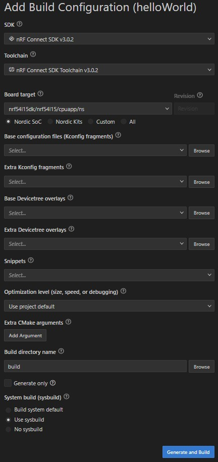
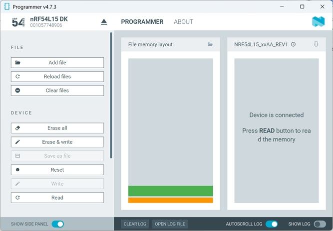
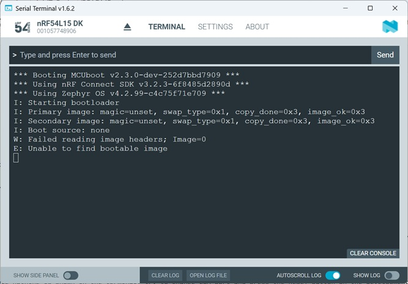
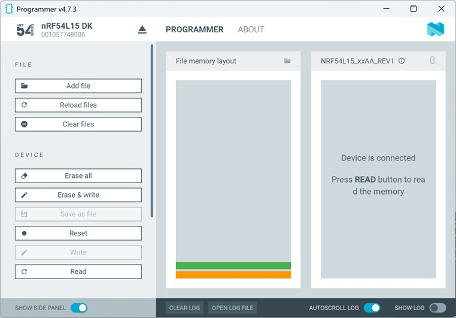
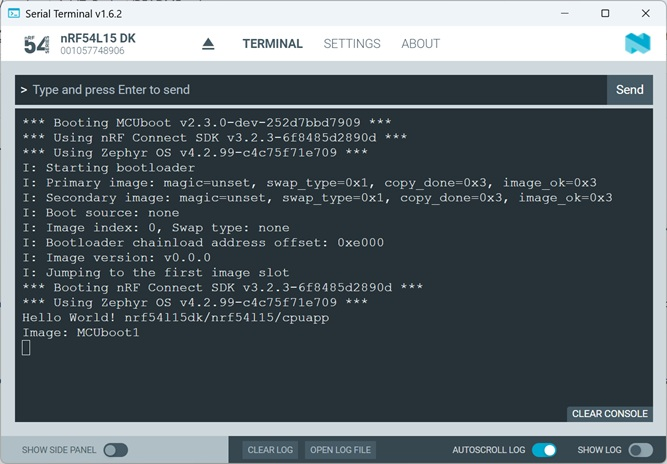
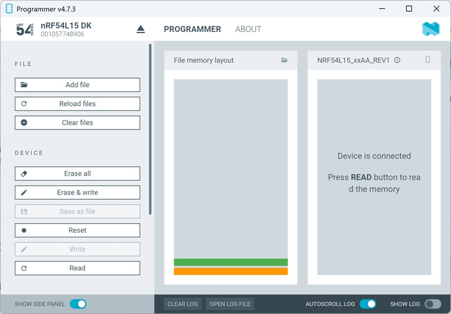

# MCUboot:  Adding MCUboot to a Project

## Introduction

MCUboot takes care about the boot process. It handles the authentification of the application images and handles to copy the upgrade image to the slot, which is used to execute the code. Download of the upgrade image is handled within the application. 

So, first we will take a look on how to add MCUboot to an own project. 

## Required Hardware/Software

- Development kit
[nRF54L15DK](https://www.nordicsemi.com/Products/Development-hardware/nRF54L15-DK),
[nRF52840DK](https://www.nordicsemi.com/Products/Development-hardware/nRF52840-DK),
[nRF52833DK](https://www.nordicsemi.com/Products/Development-hardware/nRF52833-DK), or
[nRF52DK](https://www.nordicsemi.com/Products/Development-hardware/nrf52-dk) 

- install the _nRF Connect SDK_ v3.2.0 and _Visual Studio Code_. The installation process is described [here](https://academy.nordicsemi.com/courses/nrf-connect-sdk-fundamentals/lessons/lesson-1-nrf-connect-sdk-introduction/topic/exercise-1-1/).

## Hands-on step-by-step description 

### Create first application (which will be replaced later by the firmware update)

1) Create a new application based on the /zephyr/samples/hello\_world sample project. (e.g. name of new project: "helloWorld")

   > __Note:__ Do not use "mcuboot" as your project name here! Later on the bootloader project "mcuboot" will be added beside your project. And these two projects must use different names!

&nbsp;  

&nbsp;  The Build Configuration should look like this:

&nbsp; It is important to select "Use sysbuild" for the System build! 

&nbsp; 

> **NOTE**: The _nRF Connect SDK_ versions up to version v2.6.2 used a multi-image build of the _Child and Parent images_, which is set to [deprecated in _nRF Connect SDK_ version 2.7.0](https://docs.nordicsemi.com/bundle/ncs-2.7.0/page/nrf/config\_and\_build/multi\_image.html). It is replaced by the Zephyr's _sysbuild_. In this hands-on we will use _sysbuild_. Multi-image builds functionality based on parent-child images, which was deprecated in nRF Connect SDK v2.7.0 has been removed in _nRF Connect SDK_ V3.0.0. Existing projects must transition to sysbuild (System build).

2) Add the following line to main function:

   _src/main.c_ => main() function

       printf("Image: MCUboot1 \n");

>  __Note:__ In previous hands-on we used the function __printk()__, which is included in the Zephyr kernel. In the Zephyr hello\_world example the [PICOLIB](https://docs.nordicsemi.com/bundle/ncs-3.0.0/page/zephyr/develop/languages/c/picolibc.html) library is included. This library supports all standard C formatted input and output functions, like _printf()_. This is also the reason why _#include <stdio.h>_ is used in the code example.

3) Now we want to add MCUboot to our project. _Sysbuild_ allows us to handle two independent projects within a single project build. So it is basically doing a multi-image build. The images are:
   - our own application image. In this hands-on it is the hello world project that also prints "Image: MCUboot1" and
   - the MCUboot project itself, which is provided by the _nRF Connect SDK_ installation. So here we will only use KCONFIG to define the features that we would like to use from the provided MCUboot project. We will not change the MCUboot source code!

   We will use a _Sysbuild_ KConfig project file for doing all the needed sysbuild configurations. Add the file __sysbuild.conf__ to your project folder (this is the folder where the CMakeLists.txt file is located). The file structure of your project should look like this:

   _Workspace folder_/helloWorld 

&nbsp;   |--- src 
&nbsp;   |--- |--- main.c 
&nbsp;   |--- _sysbuild_ 
&nbsp;   |--- |--- _mcuboot.conf_ 
&nbsp;   |--- CMakeLists.txt 
&nbsp;   |--- prj.conf 
&nbsp;   |--- **sysbuild.conf**

> __NOTE:__ The folder and file structure shown above also contains a folder called _sysbuild_ and the file _mcuboot.conf_. This is not really necessary for this hands-on, as we are currently working with the default configuration of MCUboot. Later, we will add further MCUboot-specific KCONFIG settings to the file _sysbuild/mcuboot.conf_.

Adding MCUboot to our project is done by putting **SB\_CONFIG\_BOOTLOADER\_MCUBOOT=y** into the _sysbuild.conf_ file.

_sysbuild.conf_

    SB_CONFIG_BOOTLOADER_MCUBOOT=y

4) Build the project and take a look at the **build**, **build/hello_world/zephyr**, and **build/mcuboot/zephyr** folders. Adding MCUboot and the associated activation of a multi-image build results in additional files being generated in these folders. The most important files are:
   - __build/hello_world/zephyr/zephyr.hex__: This file contains the image of the application project. However, the image is not signed!
   - __build/hello_world/zephyr/zephyr.signed.hex__: This file contains the image of the application project. It is signed. In this project we used the default key for signature that is for debugging only!
   - __build/mcuboot/zephyr/zephyr.hex__: This file contains the image of the bootloader, the mcuboot project. 
   - __build/merged.hex__: The __zephyr.signed.hex__ file from the application build (_hello_world_) and the __zephyr.hex__ file from mcuboot are merged and stored in the __merged.hex__ file.

  Further generated files are described [here](https://docs.nordicsemi.com/bundle/ncs-latest/page/nrf/app_dev/config_and_build/output_build_files.html#common_output_build_files).

> __Note:__ As mentioned above, a signed image is also generated during the build. Please note that the default debugging key included with MCUboot is used for this purpose. We strongly recommend using your own signing key before deploying the image in production.

## Testing

5) Start "Programmer" in nRF Connect for Desktop. 

6) Connect to your development kit. 

Let's run a few tests with the generated hex files in the next steps. We will look at the following combinations of the _hello_world_ application image and the _mcuboot_ image:
- Application = zephyr.hex, MCUboot = zephyr.hex
- Application = zephyr.signed.hex, MCUboot = zephyr.hex
- Using merged.hex

### Application = zephyr.hex, MCUboot = zephyr.hex

7) You have to add two hex images by clicking "Add File":
   - select in your project folder build/hello_world/zephyr/zephyr.hex  and
   - select mcuboot image in folder build/mcuboot/zephyr/zephyr.hex

8) You can see the two added hex images on the memory map in the programmer app.

   

&nbsp;  The orange block at the bottom is the bootloader image. It is located at address 0x0000. Above this bootloader image you find the green block, which is the _hello_world_ application image.

9) Ensure the Serial Terminal app is running on the PC. 
10) In the Programmer tool click "Erase all" and afterwards "Erase & write".
11) When programming is completed, check the Terminal output. In case nothing is shown in the terminal, try to change COM port and press the RESET button on the development kit. 

    

> __Note:__ We have used the unsigned application image. Since MCUboot is checking the signature of the application image before it is executed, it detects that the code is not valid and it blocks its execution.

### Application = zephyr.signed.hex, MCUboot = zephyr.hex

12) Clear the Programmer app's "file memory layout" by clicking "Clear files" button. Then test the same by using following hex files:
   - select in your project folder build/hello_world/zephyr/zephyr.singed.hex  and
   - select mcuboot image in folder build/mcuboot/zephyr/zephyr.hex

13) You can see the two added hex images on the memory map in the programmer app.

   

&nbsp;  The orange block at the bottom is again the bootloader image. Above this bootloader image you find the green block, which is the signed _hello_world_ application image.

14) In the Programmer tool click "Erase & write".

15) When programming is completed, check the Terminal output. In case nothing is shown in the terminal, try to change COM port and press the RESET button on the development kit. 

    

> __Note:__ Here we have used the signed application image. The signature check done by MCUboot is successful and it finally starts execution of the application image. 

### Using merged.hex

16) Clear the Programmer app's "file memory layout" by clicking "Clear files" button. Then click "Add File" and select in your project folder /build/merged.hex file.

17) In the Programmer you should see two blocks:

   

&nbsp;  As the merged.hex file uses the signed application image and the mcuboot image, the result should be the same as in pevious test.

18) In the Programmer tool click "Erase & write".

19) When programming is completed, check the Terminal output. In case nothing is shown in the terminal, press the RESET button on the development kit.

  
  
__Note__: Since the merged.hex image uses also the singed application image, you should see that the application is executed.

