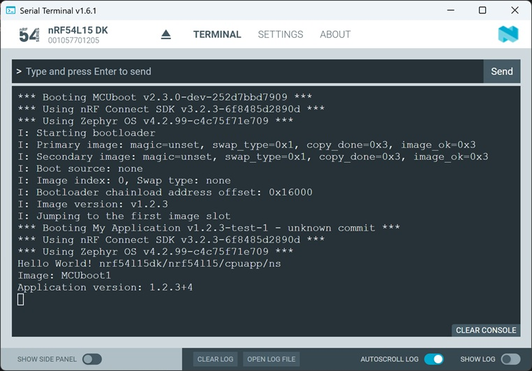

SDK version: NCS v3.2.0 

# MCUboot's Swap Type "Test"

## Introduction

MCUboot supports various operating modes that define how an update image is handled. The following operational modes of MCUboot exist:
- __Swap using Scratch__: Implements an algorithm for swapping images between a slot containing the image to be processed (_slot 0_) and a slot containing the updated image (_slot 1_). The swap is performed using a scratch memory area. 
- __Swap using Move__: Implements an algorithm for swapping images between two slots by moving sectors; offers greater efficiency than swap operations based on a scratch memory area and is suitable only for memory with uniform erase block sizes.
- __Swap using offset__: Introduces a new algorithm for swapping images between two slots, which shifts sectors and improves speed through optimizations; applicable to memory with uniform erase block sizes.
- __Overwrite__: 	Uses a simple algorithm to overwrite the execution images (_slot 0_) with the update image (_slot 1_). 
- __Direct-XIP__: Enables the execution of images directly from its slot memory (_slot 0_ or _slot 1_). A new image is loaded into an alternate slot, where code is also executed. This is eliminating the need to swap out or overwrite NVM.
- __Direct-XIP with revert__: Enables dual-slot image execution directly from storage with additional support for reverting to a previous image if necessary, enhancing system reliability.
- __Firmware loader__: Provides a dual-slot image firmware loading mode that allows dynamic selection of the image slot for booting the application, accommodating slots of different sizes.
- __Single application__: Supports a single application image mode, utilized when only one application image is necessary and dual-slot operations are not required.

With swap solutions in particular, you have the option to revert the image if problems arise with an update image. 

Upgrading an old image with a new one by swapping can be a two-step process. In this process, MCUboot performs a “test” swap of image data in flash and boots the new image or it will be executed during operation. The new image can then update the contents of flash at runtime to mark itself “OK”, and MCUboot will then still choose to run it during the next boot. When this happens, the swap is made “permanent”. If this doesn’t happen, MCUboot will perform a “revert” swap during the next boot by swapping the image(s) back into its original location(s) , and attempting to boot the old image(s).

On startup, MCUboot inspects the contents of flash to decide for each images which of these “swap types” to perform; this decision determines how it proceeds.

The possible swap types, and their meanings, are:
- BOOT_SWAP_TYPE_NONE: The “usual” or “no upgrade” case; attempt to boot the contents of the primary slot.
- BOOT_SWAP_TYPE_TEST: Boot the contents of the secondary slot by swapping images. Unless the swap is made permanent, revert back on the next boot.
- BOOT_SWAP_TYPE_PERM: Permanently swap images, and boot the upgraded image firmware.
- BOOT_SWAP_TYPE_REVERT: A previous test swap was not made permanent; swap back to the old image whose data are now in the secondary slot. If the old image marks itself “OK” when it boots, the next boot will have swap type BOOT_SWAP_TYPE_NONE.
- BOOT_SWAP_TYPE_FAIL: Swap failed because image to be run is not valid.
- BOOT_SWAP_TYPE_PANIC: Swapping encountered an unrecoverable error.

In this hands-on we take a closer look at swap type "test". 

## Required Hardware/Software

- Development kit
[nRF54L15DK](https://www.nordicsemi.com/Products/Development-hardware/nRF54L15-DK),
[nRF52840DK](https://www.nordicsemi.com/Products/Development-hardware/nRF52840-DK),
[nRF52833DK](https://www.nordicsemi.com/Products/Development-hardware/nRF52833-DK), or
[nRF52DK](https://www.nordicsemi.com/Products/Development-hardware/nrf52-dk) 

- install the _nRF Connect SDK_ v3.2.0 and _Visual Studio Code_. The installation process is described [here](https://academy.nordicsemi.com/courses/nrf-connect-sdk-fundamentals/lessons/lesson-1-nrf-connect-sdk-introduction/topic/exercise-1-1/).

## Hands-on step-by-step description 

### Original Application Image

1) Let's use the previous project as the original application image. The Intel Hex file of previous project can be downloaded [here](Intel_Hex_Files/AppImage_merged.hex).

### Update Image

#### Copy previous project

2) Copy the previous project and reanme it. 

   > __Note:__ Do not use "mcuboot" as your project folder name here! 

   Use the same Build Configuration as in previous project.

#### Update Version and output in main function

3) Update VERSION file:

    VERSION   

        VERSION_MAJOR = 2
        VERSION_MINOR = 2
        PATCHLEVEL = 3
        VERSION_TWEAK = 4
        EXTRAVERSION = test-1

4) And change output string "Image: MCUboot1" to the following:

   _src/main.c_ => main() function

       printf("Image: MCUboot2 \n");

## Testing

5) Start "Programmer" in nRF Connect for Desktop. 

6) Connect to your development kit. 

7) Click "Add File" and select the original Application Image file [AppImage_merged.hex](Intel_Hex_Files/AppImage_merged.hex).

8) In the Programmer you should see two blocks:

   

9) Click "Erase & Write" button.
10) You should see in the Serial Terminal that first MCUboot starts and then the application image is executed.

   

11) Let's add the update Image in the programmer. Click "Add File" and select in your project folder /build/<_project folder name_>/zephyr/zephyr.hex file. 

=> VS code does not generate intel hex file that is placed in upper memory... => can imgtool be used to generate a address corrected file?

   use following command line instruction to change the start address of the intel hex file image. 

    arm-none-eabi-objcopy --change-addresses <offset> input.hex output.hex

    <offset> =   0x10000

    if in the input.hex file the start address is 0x080000000 then the start address in output.hex is 0x08010000

    note that the <offset> can also be negative.

8) In the Programmer you should see two blocks:

   

&nbsp;  The orange block at the bottom is the bootloader image. It is located at address 0x0000. Starting at address 0xC000 you find the green block, which is the _hello world_ application image. 

9) In the Programmer tool click "Earse all" and afterwards "Erase & write".

10) When programming is completed, check the Terminal output. In case nothing is shown in the terminal, press the RESET button on the development kit.

  
  
__Note__: The application is printing just once after a reset. So you have to press the Reset button on the development kit to see the output in the terminal window.

