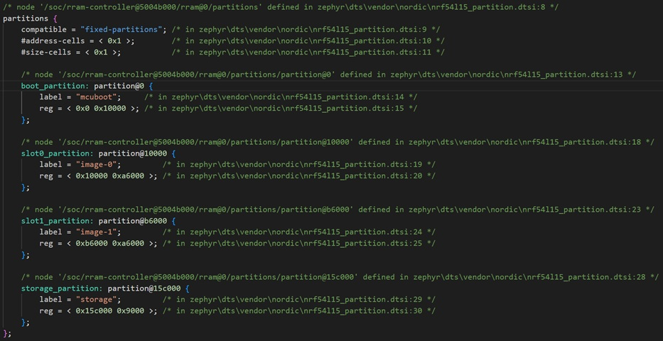
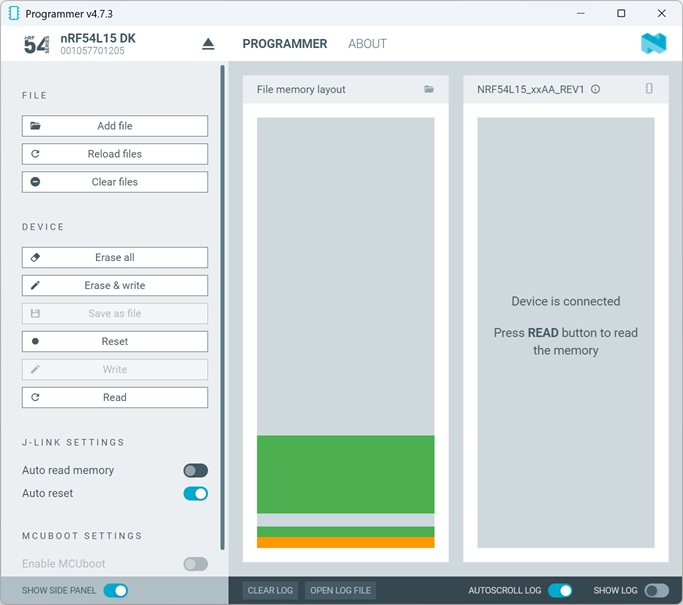
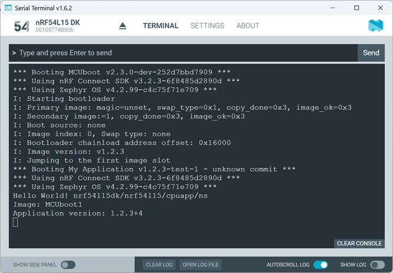
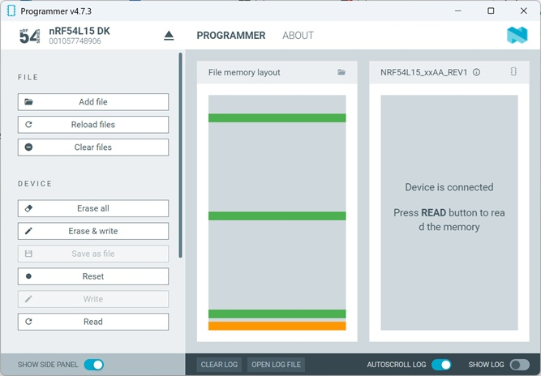
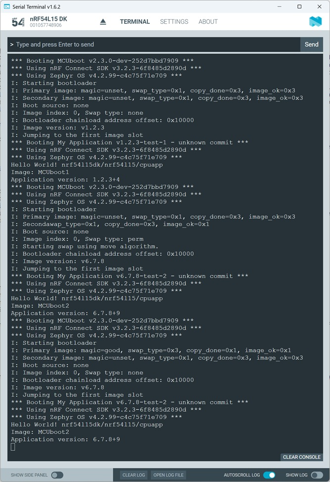
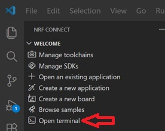
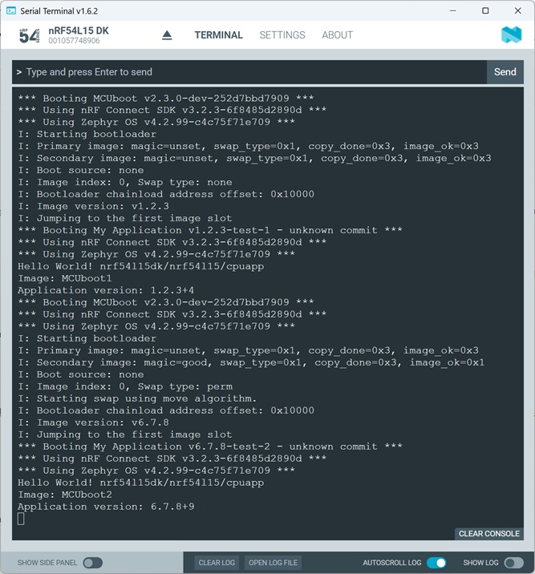

# MCUboot's Swap Type "perm"

## Introduction

At startup, MCUboot checks the contents of the flash memory to determine which of these “swap types” should be executed for the current image. This decision then determines the subsequent sequence of events.

The possible swap types, and their meanings, are:
- BOOT_SWAP_TYPE_NONE: The “usual” or “no upgrade” case; attempt to boot the contents of the primary slot.
- BOOT_SWAP_TYPE_TEST: Boot the contents of the secondary slot by swapping images. Unless the swap is made permanent, revert back on the next boot.
- BOOT_SWAP_TYPE_PERM: Permanently swap images, and boot the upgraded image firmware.
- BOOT_SWAP_TYPE_REVERT: A previous test swap was not made permanent; swap back to the old image whose data are now in the secondary slot. If the old image marks itself “OK” when it boots, the next boot will have swap type BOOT_SWAP_TYPE_NONE.
- BOOT_SWAP_TYPE_FAIL: Swap failed because image to be run is not valid.
- BOOT_SWAP_TYPE_PANIC: Swapping encountered an unrecoverable error.

In this hands-on we take a closer look at swap type "permanent". 

## Required Hardware/Software

- Development kit
[nRF54L15DK](https://www.nordicsemi.com/Products/Development-hardware/nRF54L15-DK),
[nRF52840DK](https://www.nordicsemi.com/Products/Development-hardware/nRF52840-DK),
[nRF52833DK](https://www.nordicsemi.com/Products/Development-hardware/nRF52833-DK), or
[nRF52DK](https://www.nordicsemi.com/Products/Development-hardware/nrf52-dk) 

- install the _nRF Connect SDK_ v3.2.0 and _Visual Studio Code_. The installation process is described [here](https://academy.nordicsemi.com/courses/nrf-connect-sdk-fundamentals/lessons/lesson-1-nrf-connect-sdk-introduction/topic/exercise-1-1/).

## Hands-on step-by-step description 

### Original Application Image

1) Let's use the previous project as the original application image. The Intel Hex file of previous project can be downloaded [here](Intel_Hex_Files/AppImage_merged.hex).

   > __Note:__ This image is the one we prepared in the hands-on [Defining an Appication Image Version](../mcuboot_ApplikationImageVersion/README.md).

### Update Image

#### Copy previous project

2) Copy the previous project and rename it. 

   > __Note:__ Do not use "mcuboot" as your project folder name here! 

   Use the same Build Configuration as in previous project.

#### Update Version and output in main function

3) Update VERSION file:

    VERSION   

        VERSION_MAJOR = 6
        VERSION_MINOR = 7
        PATCHLEVEL = 8
        VERSION_TWEAK = 9
        EXTRAVERSION = test-2

4) And change output string "Image: MCUboot1" to the following:

   _src/main.c_ => main() function

       printf("Image: MCUboot2 \n");

5) Finally, we need to ensure that this image is marked as "permanent". To do this, we must set the status to "confirmed". The easiest way to do this is to use the corresponding KCONFIG symbol.

   prj.conf

       CONFIG_MCUBOOT_GENERATE_CONFIRMED_IMAGE=y

6) Let's also disable Partition Manager and use Zephyr's DeviceTree for definition of memory partitions. 

   sysbuild.conf

       SB_CONFIG_PARTITION_MANAGER=n

7) Now build the project.

### Update Intel Hex file to place Update Image in slot 1

8) The build has generated the file __zephyr.signed.confirmed.hex__. 

   ommand line instruction

       arm-zephyr-eabi-objcopy --change-addresses 0xA6000 zephyr.signed.confirmed.hex zephyr.signed.confirmed.moved.hex

  > __Note:__ In the zephyr.dts file generated during the build, you can check which memory partitions were used. With the default settings for the nRF54L15DK, the code to be executed is placed in the “slot0_partition” (image-0), which starts at address 0x10000. Since we want to generate an update image here that should be located in the slot1_partition (image_1), we need to adjust the address in the Intel Hex file. slot1_partition starts at address 0xB6000. Therefore, we must shift the Intel Hex addresses by the offset 0xB6000 - 0x10000 = 0xA6000. 
  > 
  > > 

## Testing

9) Start "Programmer" in nRF Connect for Desktop. 

10) Connect to your development kit.

### Use Programmer for Update Image

11) Click "Add File" and select the original Application Image files [zephyr.hex (this is MCUboot)](Intel_Hex_Files/zephyr.hex) and [zephyr.signed.hex (this is the original application)](Intel_Hex_Files/zephyr.signed.hex).

12) In the Programmer you should see two blocks:

   

13) Click "Erase All" and aftwards "Erase & Write" button.
14) You should see in the Serial Terminal that first MCUboot starts and then the application image is executed.

   

15) Add the file [zephyr.signed.confirmed.moved.hex](images/zephyr.signed.confirmed.moved.hex) to Programmer and click "Erase & write". You should now see that the Update Image is placed in the upper slot-1.

    

16) The programmer is doing a reset as soon as the program download is completed. So you will see that immediatly the new image is used. Note that swap type is now "perm" (permanent).

   

   > __Note:__ When you again press the Reset button on the development kit, you will see that the swap type is changed to "none". 

### Use nrfutil for Udpate Image

17) Ensure that the original Application Image files [zephyr.hex (this is MCUboot)](Intel_Hex_Files/zephyr.hex) and [zephyr.signed.hex (this is the original application)](Intel_Hex_Files/zephyr.signed.hex) are the selected images in Programmer app. Then Press "Erase All" and afterwards "Erase & write".

18) Terminal should show the original application software output. 

   

19) Now we use nrfutil to download the update image. Open the terminal in Visual Studio Code by clicking the "Open terminal" button.

   

20) Enter following instruction in the terminal:

        nrfutil device program --firmware zephyr.signed.confirmed.moved.hex --options chip_erase_mode=ERASE_NONE --traits jlink

 > __Note:__ This instruction ensures that the memory is not erased and the new code is loaded into slot-1. This command will also not cause a Reset. This means, after execution of this command we have to press the Reset button on the nRF54L15DK.

21) You should see in the terminal that the firmware was updated.

   

