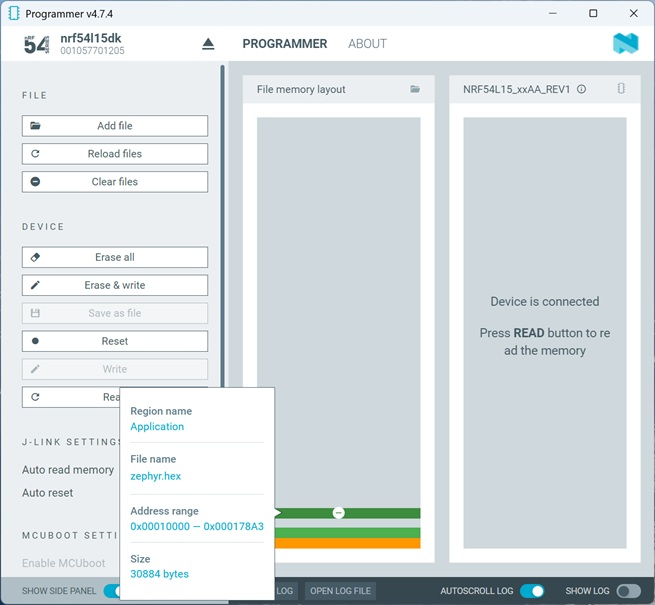
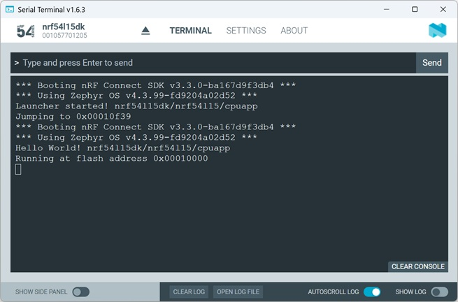

# Memory Partitions:  Place the Project at a Custom Start Address (nRF54L only!)

## Introduction

Usually, when starting out with a Zephyr project, you’ll begin with the default memory partition and not give much thought to where the code or project is located in memory. 
Once you start integrating a bootloader, however, the memory partitions become more interesting. The initial steps often work fine with the default memory partition, but as 
soon as you want to optimize memory usage, you’ll need to modify the partition definition. 

In this chapter, we will take a closer look at how to use the _nRF Connect SDK_ or Zephyr to place a project at a custom start address. We will start with the Zephyr <code>hello_world</code> 
project and place it on a custom memory partition with a start address of 0x10000. To do this, we will define the start address using a DeviceTree overlay file. In addition, we will develop 
a launcher app — also based on Zephyr's <code>hello_world</code> — that allows the actual <code>hello_world</code> application to be launched at a custom start address.
 
> __Important Notes:__
>
> - The definition in the DeviceTree file depends on the MCU family being used. Here, we will focus on the nRF54L series.
> 
> - In the _nRF Connect SDK_, the Partition Manager has been marked as deprecated. The recommended approach for defining a memory partition is now via a Zephyr DTS file. In this hands-on, we will work exclusively with Zephyr DTS.

## Required Hardware/Software

- Development kit
[nRF54LM20DK](https://www.nordicsemi.com/Products/Development-hardware/nRF54LM20-DK),
[nRF54L15DK](https://www.nordicsemi.com/Products/Development-hardware/nRF54L15-DK),

- install the _nRF Connect SDK_ v3.3.0 and _Visual Studio Code_. The installation process is described [here](https://academy.nordicsemi.com/courses/nrf-connect-sdk-fundamentals/lessons/lesson-1-nrf-connect-sdk-introduction/topic/exercise-1-1/).

## Hands-on step-by-step description 

### Running <code>hello_world</code> App in Memory Partition starting at Address 0x10000

#### Start with <code>hello_world</code> Project

1) Create a new application based on the /zephyr/samples/hello_world sample project.

   > __Build Configuration__:
   >
   > _Board Target:_ nrf54l15dk/nrf54l15/cpuapp
   >
   > _System build (sysbuild)_: Use sysbuild

#### Adding the DeviceTree Overlay File
   
2) Add the file <code>boards/nrf54l15dk_nrf54l15_cpuapp</code>:

   _boards/nrf54l15_nrf54l15_cpuapp_

       / {
           chosen {
               zephyr,code-partition = &app_slot;
           };
       };

       &cpuapp_rram {
           partitions {
               compatible = "fixed-partitions";
               #address-cells = <1>;
               #size-cells = <1>;

               app_slot: partition@10000 {
                   label = "app_slot";
                   reg = <0x00010000 0x00070000>;
               };
           };
       };

#### Enable Linker to use <code>zephyr,code-partition</code>

Please note that, by default, the linker uses the KCONFIG settings <code>CONFIG_ROM_START_OFFSET=0</code> and places the code at the start address 0x00000000. 
Even if we define a different start address in the DeviceTree overlay file, this KCONFIG setting would still be used. We need to switch to using the DTS file by setting <code>CONFIG_USE_DT_CODE_PARTITION=y</code>.

3) Enable Linker to use DTS file settings.

   _prj.conf_

       # Link application into /chosen/zephyr,code-partition from devicetree
       CONFIG_USE_DT_CODE_PARTITION=y

#### Add a Debug Output Message in main

4) Let's read the start address of the custom Memory Partition.

   _main.c_

       #include <zephyr/kernel.h>
       #include <zephyr/devicetree.h>

       /* Getting the Start Address */
       #define APP_PARTITION_NODE DT_CHOSEN(zephyr_code_partition)
       #define APP_START_ADDRESS DT_REG_ADDR(APP_PARTITION_NODE)

5) And output the start address in the serial terminal.

   _main.c_

           printf("Running at flash address 0x%08x\n", (uint32_t)APP_START_ADDRESS);

----

### Preparing the <code>hello_world_launcher</code> App

#### Start with <code>hello_world</code> Project

6) Create a new application based on the /zephyr/samples/hello_world sample project.

   > __Build Configuration__:
   >
   > _Board Target:_ nrf54l15dk/nrf54l15/cpuapp
   >
   > _System build (sysbuild)_: Use sysbuild

#### Adding the DeviceTree Overlay File
   
7) Add the file <code>boards/nrf54l15dk_nrf54l15_cpuapp</code>:

   _boards/nrf54l15_nrf54l15_cpuapp_

       / {
           chosen {
               myapp,target-partition = &app_slot;
           };
       };

       &cpuapp_rram {
           partitions {
               compatible = "fixed-partitions";
               #address-cells = <1>;
               #size-cells = <1>;

               app_slot: partition@10000 {
                   label = "app_slot";
                   reg = <0x00010000 0x00070000>;
               };
           };
       };

> __Note:__ As a general rule, you should try to use a shared memory partition file that is used by all projects (<code>hello_world</code> app and <code>hello_world_launcher</code>). In this example, we are using different overlay files for the two projects, although these define the same start addresses and sizes. This is intended to highlight which DeviceTree definitions are important in the individual projects.

#### Enable Linker to use <code>zephyr,code-partition</code>

We’ll leave that out for the launcher. The launcher is placed at the start address 0x00000000. So we can use the default configuration. 

#### Add Code that starts <code>hello_world</code> App 

8) Let's read the address from DeviceTree overlay file.

   _main.c_

       #include <zephyr/kernel.h>
       #include <zephyr/devicetree.h>

       /* Get the Start Address of hello_world app from DeviceTree */
       #define TARGET_NODE DT_CHOSEN(myapp_target_partition)
       #define TARGET_ADDRESS DT_REG_ADDR(TARGET_NODE)
   
9) Add a function that jumps into the other project.

    _main.c_

       typedef void (*entry_t)(void);

       static void start_application(uint32_t addr)
       {
           uint32_t *vector_table = (uint32_t *)addr;
 
           uint32_t stack_pointer = vector_table[0];
           uint32_t reset_handler = vector_table[1];

           printf("Jumping to 0x%08x\n", reset_handler);

           __disable_irq();
           __set_MSP(stack_pointer);
           SCB->VTOR = addr;
           entry_t entry = (entry_t)reset_handler;
           entry();
       }    

10) And finally call the <code>start_application()</code> function.

    _main.c_

            start_application(TARGET_ADDRESS);

    
## Testing

11) Use the __Programmer__ from _nRF Connect for Desktop_ and add following files:
    - __hello_world_10000/build/hello_world_10000/zephyr/zephyr.hex__
    - __hello_world_launcher/build/hello_world_launcher/zephyr/zephyr.hex__

> __Note:__ You should see that both images are located at different start addresses. 

  

12) Click on "Erase & write" button and check the Serial Terminal output. 

   
