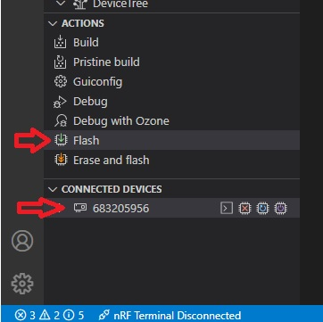

SDK version: NCS v2.2.0

# Creating a Project from Scratch

Creating a project from scratch is quite simple with Zephyr. Here is a description how to create the simplest version of a project. We use Visual Studio Code in this example.

## Creating a Hello World project from Scratch

1) First, create a Workspace directory outside the NCS folder. This will be the folder where all the future projects will be created. For example:   C:/MyWorkspace
2) Our first project is "Hello World". So we create a project folder __hello_world__ in our workspace directory:    C:/MyWorkspace/hello_world

    NOTE: Folder name should start with a letter and there should be no spaces in the folder name!

3) Create the following three files in our project directory:

    _c:/MyWorkspace/hello_world/CMakeLists.txt_
    
       # SPDX-License-Identifier: Apache-2.0

       cmake_minimum_required(VERSION 3.20.0)

       # Find external Zephyr project, and load its settings:
       find_package(Zephyr REQUIRED HINTS $ENV{ZEPHYR_BASE})

       # Set project name:
       project (MyApp)

       # add sources
       target_sources(app PRIVATE src/main.c)             

    _c:/MyWorkspace/hello_world/prj.conf_
    
       # This line is just a comment. In this simple project we can use the default configuration. 
       
    and create main.c in the subfolder _src_ ->
         _c:/MyWorkspace/hello_world/src/main.c_
    
       #include <zephyr/kernel.h>

       void main(void)
       {
            printk("Hello World!\n");
       }

4) Start Visual Studio Code. 
5) Open the "nRF Connect for VS Code" page. This can be done by 
- clicking on __nRF Connect__ icon on the left sidebar. Here you find then the "Open Welcome Page" button. (after a new installation)
- using the "nRF Connect: Welcome" command available in the Command Palette (Ctrl+Shift+P). 

- or you can also use the __Welcome__ menu in the __nRF Connect__ tab. 

6) Click on "Add an existing application to workspace..." and select the __hello_world__ folder. (our project folder is the folder where CMakeLists.txt and prj.conf files are stored.)

7) Before we can work on our project we have to __Add build configuration__. This is done by clicking the folder icon behind our project in the APPLICATIONS section. 

8) In the __Board__ drop down list enter the board name of your development kit. When you enter the name you should see that the list will be filtered. 
9) Let's use the default settings for the rest. Click __Generate Config__ button.
10) After the project build is completed, check all the available files in the hello_world folder.

11) Ensure that the connected kit is found and click __Flash__ in the ACTIONS menu. The code download is downloaded to the kit. 

12) Use command Pallete (Ctrl+Shift+P) and enter __nRF Terminal: Start terminal__. 

or click on "Connect to Serial Port in nRF Terminal" button in the CONNECTED DEVICES section.

13) Further settings are needed for the nRF Terminal:

- select interface => "Serial Port"

- select COM port

- serial port settings => select default setting "115200 8n1"

14) reset the kit. The Zephyr boot message and "Hello World" string is shown in the terminal. 

