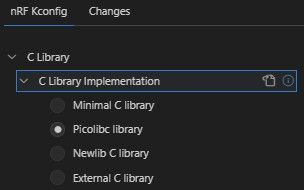
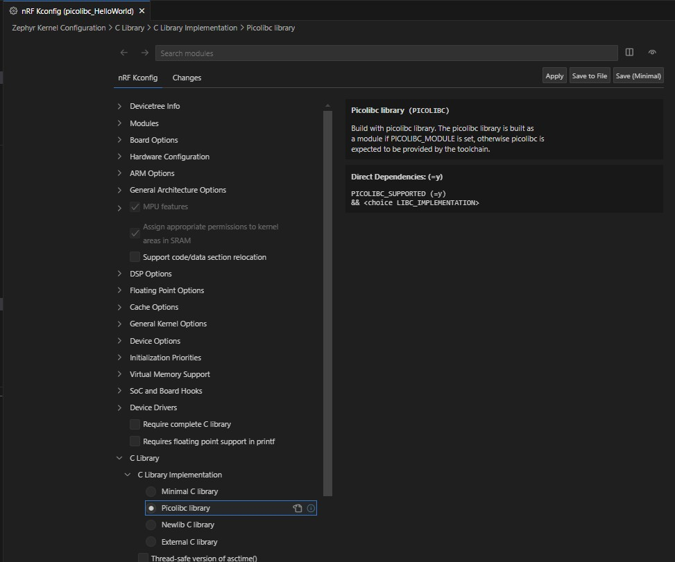

SDK version: NCS v2.9.0  -  Link to Hands-on solution: https://github.com/ChrisKurz/Modules/tree/main/Workspace/NCSv2.9.0/picolibc_HelloWorld

# Zephyr's C Libraries:  PICOLIB

## Introduction

The C standard library provides macros, type definitions and functions for tasks such as string manipulation, mathematical computation, input/output processing, memory managenet, and input/output. 

Zephyr allows to select one for the following C libraries:

   

Picolibc is a copmlete C library implementation written for the embedded systems, targetting C17 (ISO/IEC 9899_2018) and POSIX 2018 (IEEE Std 1003.1-2017) standards. Picolibc is an external [open source project](https://github.com/picolibc/picolibc) which is provided for Zephyr as a module, and included as part of the Zephyr SDK in precompiled from for each supported architecture (libc.a).

## Required Hardware/Software
- Development kit [nRF54L15DK](https://www.nordicsemi.com/Products/Development-hardware/nRF54L15-DK), [nRF52840DK](https://www.nordicsemi.com/Products/Development-hardware/nRF52840-DK), [nRF52833DK](https://www.nordicsemi.com/Products/Development-hardware/nRF52833-DK), or [nRF52DK](https://www.nordicsemi.com/Products/Development-hardware/nrf52-dk) 
- Micro USB Cable (Note that the cable is not included in the previous mentioned development kits.)
- install the _nRF Connect SDK_ v2.9.0 and _Visual Studio Code_. The installation process is described [here](https://academy.nordicsemi.com/courses/nrf-connect-sdk-fundamentals/lessons/lesson-1-nrf-connect-sdk-introduction/topic/exercise-1-1/).

## Hands-on step-by-step description 

### Create needed Folders and Files

1) Create a new application. Use the _zephyr/samples/hello_world_ sample. Change the project name to __picolibc_HelloWorld__, so it is easier lateron to identify this project.  

2) Let's have a look on how the C library is usually selected. You can use the __nRF KCONFIG GUI__ tool to check which C library is selected in this project. 

   

   The Picolibc library is included in the Zephyr toolchain and it is selected by default as the standard C library. 

3) You can explicitly add Picolibc to your project by inlcuding following line in __prj.conf__ file.

   __prj.conf__

       # select C library PICOLIBC
       CONFIG_PICOLIBC=y
