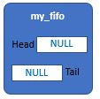
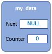
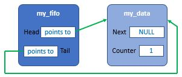
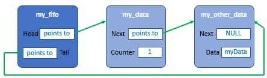

SDK version: NCS v2.9.0  -  Link to Hands-on solution: https://github.com/ChrisKurz/nRF-Connect-SDK-HandsOn/tree/main/Workspace/NCS/NCSv2.9.0/fifo

# Zephyr Kernel Services: Data Passing - FIFO

## Introduction

A FIFO is a kernel object that implements a traditional first in, first out (FIFO) queue, allowing threads and ISRs to add and remove data items of any size.

The Zephyr's FIFO is implemented as a queue and it uses a single-linked list.

Detailed description can be found [here](https://developer.nordicsemi.com/nRF_Connect_SDK/doc/2.9.0/zephyr/kernel/services/data_passing/fifos.html#).

## Required Hardware/Software for Hands-on
- Development kit [nRF54L15DK](https://www.nordicsemi.com/Products/Development-hardware/nRF54L15-DK), [nRF52840DK](https://www.nordicsemi.com/Products/Development-hardware/nRF52840-DK), [nRF52833DK](https://www.nordicsemi.com/Products/Development-hardware/nRF52833-DK), or [nRF52DK](https://www.nordicsemi.com/Products/Development-hardware/nrf52-dk) 
- Micro USB Cable (Note that the cable is not included in the previous mentioned development kits.)
- install the _nRF Connect SDK_ v2.9.0 and _Visual Studio Code_. The installation process is described [here](https://academy.nordicsemi.com/courses/nrf-connect-sdk-fundamentals/lessons/lesson-1-nrf-connect-sdk-introduction/topic/exercise-1-1/).

## Hands-on step-by-step description 

### Create a new Project

1) Create a new project based on the Zephyr button example: /zephyr/samples/basic/button

### Defining a FIFO

2) A FIFO is defined using a variable of type k_fifo. It must then be initialized by calling k_fifo_init(). The following code defines and initializes an empty FIFO.

	_src/main.c_   
  
       struct k_fifo my_fifo;

   The essential parts of _my_fifo_ defined here is a pair of pointer fields, called __head__ and __tail__. The __head__ field points to the first element that was placed in the FIFO. If no element has been put into the FIFO yet, then it is NULL. The __tail__ field points to the last element that was put into the FIFO. If the FIFO is still empty, then a NULL is stored here. The following picture shows the empty _my_fifo_.
   
   

3) And in main loop add:

	_src/main.c_ => main() function   

           k_fifo_init(&my_fifo);

4) Define a Data item:

	_src/main.c_   

       struct data_item_t{
               void *fifo_reserved;  
               int counter;
       };
       struct data_item_t my_data;
   
   A variable to be placed in the FIFO must have the above structure. Here the __fifo_reserved__ is used as pointer to the next element. Beside this pointer in the structure the actual data is stored, in our case the variable _counter_.
 
   

4) In the button_pressed function we write the counter variable to the FIFO:

	_src/main.c_ => button_pressed() function   
  
           my_data.counter=my_data.counter+1;
           k_fifo_put(&my_fifo, &my_data);
	   
   Executing the function __k_fifo_put()__ stores the corresponding pointers. Note that an element with __k_fifo_put()__ can only be placed once in the FIFO due to the single-linked list structure. 
   
   

   __NOTE: The user code must ensure that data is removed before new data is inserted. The user code must also take this into account when handling in interrupt service routines. This hands-on example is not taking care about this! We assume here that pressing the button will not be done so fast.__

   If you now use another variable, e.g. with the name _my_other_data_, and put it into the FIFO via __k_fifo_put()__ function, it would look like this. (But note that this is only a theoretical example here. This was not realized in this hands-on code example).
      
   

5) Reading from the FIFO. A data item is removed from a FIFO by calling k_fifo_get(). The following code uses the FIFO to obtain data items from a producer thread, which are then processed in some manner.

   Add following lines in the main entire loop:

	_src/main.c_ => main() function   

           struct data_item_t *my_getData;

                   my_getData = k_fifo_get(&my_fifo, K_FOREVER);
                   printk("Counter: %d\n",my_getData->counter);

## Testing

6) Build the project and download to an nRF52 development kit (e.g. nRF52840-DK).

7) Check the output sent via virtual COM port. 
