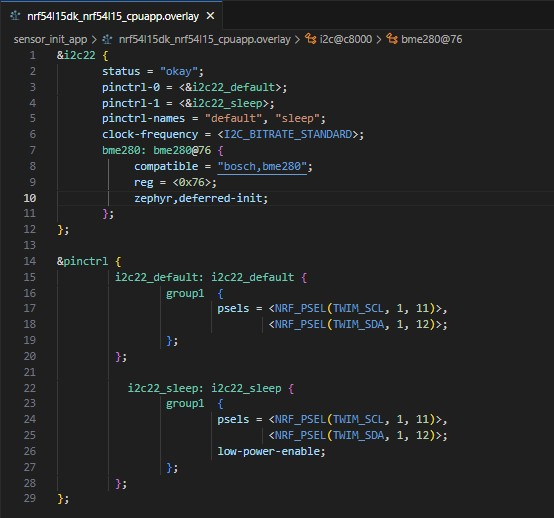
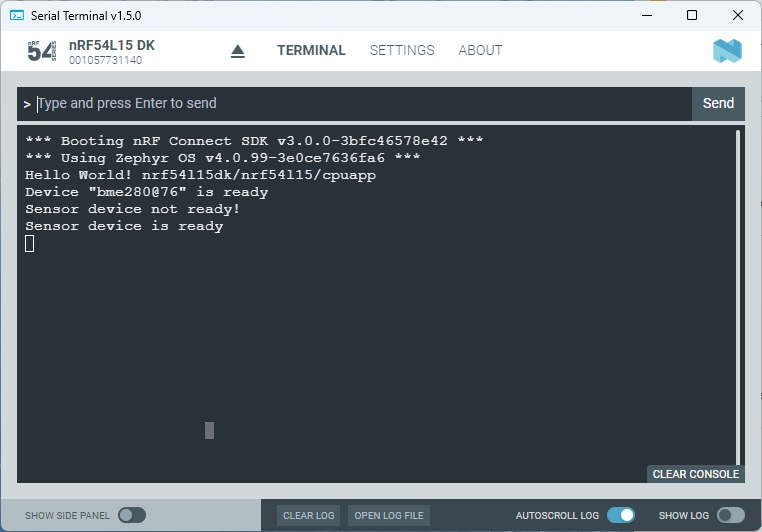

SDK version: NCS v3.0.0  -  Link to Hands-on solution: https://github.com/ChrisKurz/NCS-Tutorial/tree/main/Workspace/NCS/NCSv3.0.0/sensor_init_app

# Basics: Initializing and starting a Sensor Driver

## Introduction

An interesting driver in the Zephyr RTOS is the Sensor Driver. It allows a wide variety of sensors to be used. However, the first essential step is always to initialize and start the Sensor Driver. There are two options here. Firstly, the sensor driver can be started automatically during Zephyr RTOS start-up. On the other hand, the driver can also be started in your own application. 

In this hands-on we start the Sensor driver within the user application.

## Required Hardware/Software
- Development kit [nRF54L15DK](https://www.nordicsemi.com/Products/Development-hardware/nRF54L15-DK), [nRF52840DK](https://www.nordicsemi.com/Products/Development-hardware/nRF52840-DK), [nRF52833DK](https://www.nordicsemi.com/Products/Development-hardware/nRF52833-DK), or [nRF52DK](https://www.nordicsemi.com/Products/Development-hardware/nrf52-dk) 
- BME280 board
- Micro USB Cable (Note that the cable is not included in the previous mentioned development kits.)
- install the _nRF Connect SDK_ v3.0.0 and _Visual Studio Code_. The installation process is described [here](https://academy.nordicsemi.com/courses/nrf-connect-sdk-fundamentals/lessons/lesson-1-nrf-connect-sdk-introduction/topic/exercise-1-1/).

## Hands-on step-by-step description 

### Create a copy of previous project

1) Let's start with the [previous project](ZDD_sensor_basics_initZephyr.md) Make a copy of this project and rename it, e.g.  __C:/Nordic/Workspace/sensor_init_app__

### Hardware Preparation

2) Let's use the same connection as in previous hands-on. The connections are: 

   

    | __Sensor__ | <-> | __nRF54L15DK__ |
    |------------|-----|----------------|
    |    VDD     | <-> |  Port1 VDDOP   |   
    |    GND     | <-> |     GND        |
    |    SCL     | <-> |    P1.11       |
    |    SDA     | <-> |    P1.12       |

### Update DeviceTree

3) Let's do an update of the DeviceTree overlay file. Add following line in the __bme280: bme28@76__ section. 

     __nRF54L15DK_nRF54L15_cpuapp_ns.overlay__ or __nRF54L15DK_nRF54L15_cpuapp.overlay__  

                   zephyr,deferred-init;

  So your overlay file should look like this:
  
   

4) In this case the BME280 Sensor Driver was not yet started. We have to do this manually in our application code. Add following lines after the __device_is_ready()__ check. We call __device_is_ready()__ a second time to see how the behaviour changes after enabling the driver. 

     __main.c__ => main() function  

            device_init(sensor);
   
            if (!device_is_ready(sensor))
            {
                printk("Sensor device not ready!\n");
            } else {
                printk("Sensor device is ready\n");
            }

## Testing

5) Build and download the project.
6) Start Serial Terminal and reset the nRF54L15DK. And then check the Serial Terminal.

   

   > __Note:__ When the __device_init()__ function was not executed yet, the __device_is_ready()__ function returns a failure. After __device_init()__ was called the sensor is running, and if a sensor is correctly connected to the nRF54L15 the __device_is_ready()__ function returns a "ready". 
