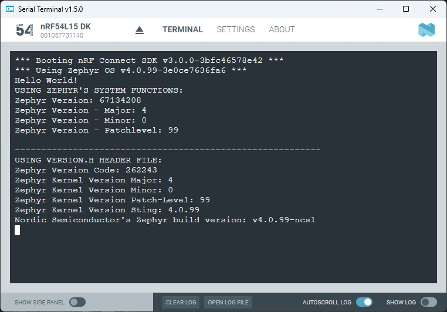

SDK version: NCS v3.0.0  -  Link to Hands-on solution: https://github.com/ChrisKurz/NCS-Tutorial/tree/main/Workspace/NCS/NCSv3.0.0/version_zephyr

# Zephyr Kernel Service: Other - Version

## Introduction

Sometimes it might be helpful to provide the application software with the information of the used Zephyr version. There are different ways in the _nRF Connect SDK_:
- using the Zephyr Kernel Service
- using the generated version.h header file

In this hands-on we will try both. 

## Required Hardware/Software
- Development kit [nRF54L15DK](https://www.nordicsemi.com/Products/Development-hardware/nRF54L15-DK), [nRF52840DK](https://www.nordicsemi.com/Products/Development-hardware/nRF52840-DK), [nRF52833DK](https://www.nordicsemi.com/Products/Development-hardware/nRF52833-DK), or [nRF52DK](https://www.nordicsemi.com/Products/Development-hardware/nrf52-dk) 
- Micro USB Cable (Note that the cable is not included in the previous mentioned development kits.)
- install the _nRF Connect SDK_ v3.0.0 and _Visual Studio Code_. The installation process is described [here](https://academy.nordicsemi.com/courses/nrf-connect-sdk-fundamentals/lessons/lesson-1-nrf-connect-sdk-introduction/topic/exercise-1-1/).

## Hands-on step-by-step description 

### Create a new Project

1) Make a copy of the [hello_world](https://github.com/ChrisKurz/nRF-Connect-SDK-HandsOn/tree/main/Workspace/NCS/NCSv3.0.0/hello_world) project.

### Add Zephyr Kernel Serivce function calls to get Zephyr Version

2) First we define our own variables in which the version number is stored. Add following lines in __main.c__ file in _main()_ function:

	_src/main.c_ => main() function   
  
            uint32_t kernel_version;
            uint8_t  Version_Major;
            uint8_t  Version_Minor;
            uint8_t  Version_Patch;

3) Output the different parts of the version number. 

	_src/main.c_ => main() function   

            printk("USING ZEPHYR'S SYSTEM FUNCTIONS:\n");
            kernel_version=sys_kernel_version_get();
            Version_Major=SYS_KERNEL_VER_MAJOR(kernel_version);
            Version_Minor=SYS_KERNEL_VER_MINOR(kernel_version);
            Version_Patch=SYS_KERNEL_VER_PATCHLEVEL(kernel_version);
            printk("Zephyr Version: %d\n",kernel_version);
            printk("Zephyr Version - Major: %i\n",Version_Major);
            printk("Zephyr Version - Minor: %i\n",Version_Minor);
            printk("Zephyr Version - Patchlevel: %i\n",Version_Patch);
            printk("\n");

   > _NOTE: This part does not need to include the version.h header file!_

### Add version.h header file to get Zephyr version numbers

And here is another way to use Zephyr Version numbers.

4) The version.h is a generated header file, which is created when a build is done. The generated header file can be found in the build folder ./build/zephyr/include/generated/version.h
   
   So we have to include this file by adding following instruction to main.c file:
   
	_src/main.c_   
   
       #include <version.h>   
   
5) Several symbols are defined in the version.h header file. The following lines use all these symbols:

	_src/main.c_ => main() function   

           printk("----------------------------------------------------------\n");
           printk("USING VERSION.H HEADER FILE:\n");
           printk("Zephyr Version Code: %d\n", ZEPHYR_VERSION_CODE);
           printk("Zephyr Kernel Version Major: %i\n", KERNEL_VERSION_MAJOR);
           printk("Zephyr Kernel Version Minor: %i\n", KERNEL_VERSION_MINOR);
           printk("Zephyr Kernel Version Patch-Level: %i\n", KERNEL_PATCHLEVEL);
           printk("Zephyr Kernel Version Sting: %s\n",KERNEL_VERSION_STRING);
           printk("Nordic Semiconductor's Zephyr build version: %s\n", STRINGIFY(BUILD_VERSION));

## Testing
6) Build the project and donwload it to your development kit. 
7) In the terminal you should see following outuput:

   
