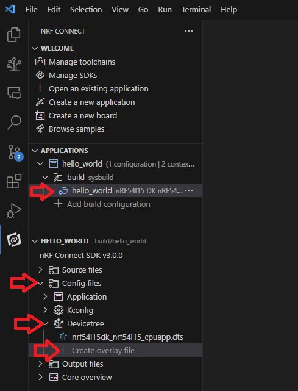
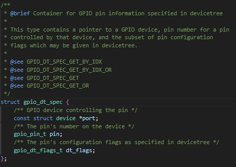
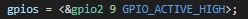
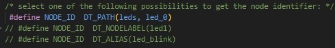
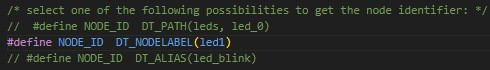
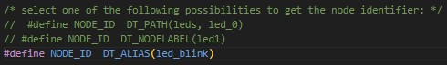

SDK version: NCS v3.1.0 

# Getting started: DeviceTree

## Introduction

A DeviceTree is a hierarchical data structure that is mainly used to describe hardware. Zephyr uses DeviceTree to describe hardware for the Device Driver Model and to provide the initial configuration of this hardware.

In this first example, we will look at how properties from the DeviceTree file can be used in C code.

## Required Hardware/Software
- Development kit [nRF54L15DK](https://www.nordicsemi.com/Products/Development-hardware/nRF54L15-DK), [nRF52840DK](https://www.nordicsemi.com/Products/Development-hardware/nRF52840-DK), [nRF52833DK](https://www.nordicsemi.com/Products/Development-hardware/nRF52833-DK), or [nRF52DK](https://www.nordicsemi.com/Products/Development-hardware/nrf52-dk) 
- Micro USB Cable (Note that the cable is not included in the previous mentioned development kits.)
- install the _nRF Connect SDK_ v3.1.0 and _Visual Studio Code_. The installation process is described [here](https://academy.nordicsemi.com/courses/nrf-connect-sdk-fundamentals/lessons/lesson-1-nrf-connect-sdk-introduction/topic/exercise-1-1/).

## Hands-on step-by-step description 

### Create a new project

1) Make a copy of the [Creating a Project from Scratch](https://github.com/ChrisKurz/nRF-Connect-SDK-HandsOn/tree/main/Workspace/NCS/NCSv3.0.0/hello_world) hands-on and store it in your workspace folder, e.g.  C:/Nordic/Workspace/DeviceTree

### Create an DeviceTree Overlay File

2) Add a DeviceTree overlay file to your project. The easiest way to do this is to open the _hello_word_ directory __Config files/Devicetree__ in details window and click on “Create overlay file”.

   

3) A devicetree entry requires a device driver that has assigned a struct device to this devicetree node. If this is not the case, a linker error occurs during the build because a pointer to an undefined device is requested.

   Therefore we will work with the LED device tree entry.

   __nrf54l15dk_nrf54l15_cpuapp.overlay__ 

       / {

           aliases { 
                    led-power  = &led0;
                    led-status = &led1;
                    led-blink  = &led2;
                    led-user   = &led3;
           };

           leds {
                 compatible = "gpio-leds";

                 led0: led_0 {
                           gpios = <&gpio2 9 GPIO_ACTIVE_HIGH>;
                           label = "Green LED 0";
                 };

                 led1: led_1 {
                           gpios = <&gpio1 10 GPIO_ACTIVE_HIGH>;
                           label = "Green LED 1";
                 };

                 led2: led_2 {
                           gpios = <&gpio2 7 GPIO_ACTIVE_HIGH>;
                           label = "Green LED 2";
                 };

                 led3: led_3 {
                           gpios = <&gpio1 14 GPIO_ACTIVE_HIGH>;
                           label = "Green LED 3";
                 };
           };
       };
   
### Usage in C Code

#### Reading _label_ Property

4) Let's read the properties. In the overlay file we created earlier, there are several properties with the same name: e.g. _gpios_ or _label_

   Therefore, we need to specify which __Node Identifier__ we want to access. This can be done in different ways.

   __src/mainc__

       #include <zephyr/devicetree.h>

       /* select one of the following possibilities to get the node identifier: */
       #define NODE_ID  DT_PATH(leds, led_0)
       // #define NODE_ID  DT_NODELABEL(led1)
       // #define NODE_ID  DT_ALIAS(led_blink)

   > __Note:__ It is important to understand that node identifiers are not values! There is no way to store them in a variable.

5) The correct DeviceTree macro for reading property values depends on the node and the property. Let's try to read the __label__ property. For reading simple properties like integer-, boolean-, string-, numeric-array- and string-array-properties, you can use DT_PROP(node_id, property).

   __src/mainc__ => main() function
    
           char string[20] = DT_PROP(NODE_ID, label);
           printk("property label = %s\n", string);

### Reading _gpios_ Property

6) Accessing the __gpios__ property requires a corresponding driver that defines a struct that takes the information from the DeviceTree file. In the case of the GPIO driver, this is the struct __gpio_dt_spec__.

   We have to include the gpio.h header file and read the gpios property with the DeviceTree macro __GPIO_DT_SPEC_GET()__.

   __src/mainc__

       #include <zephyr/drivers/gpio.h>

       static const struct gpio_dt_spec led = GPIO_DT_SPEC_GET(NODE_ID, gpios);

   > __Note:__ The __struct gpio_dt_spec__ is defined in the gpio.h file, which takes over the information from the DeviceTree file.
   >   
   > 
   >   Here is the __gpios__ property entry from the DeviceTree file for comparison.
   > 
   >   

7) Let's take a look at what the C code has read in with the above line.

   __src/mainc__ => main() function

           printk("GPIO port: %s\n", led.port->name);
           printk("GPIO pin: %i\n", led.pin);
           printk("GPIO flags: %i\n", led.dt_flags);

## Testing

### Testing: Reading _label_ Property

Let's check the outputs for the various node identifiers.

8) We start with __DT_PATH__:

   

   The serial terminal output then looks like this:

   

9) Now use __NODELABEL__:

   

   The serial terminal output then looks like this:

   

10) And here we use __ALIAS__:

   

   The serial terminal output then looks like this:

   

### Testing: Reading _gpios_ Property

11) Let's check what the output is:

   
   
