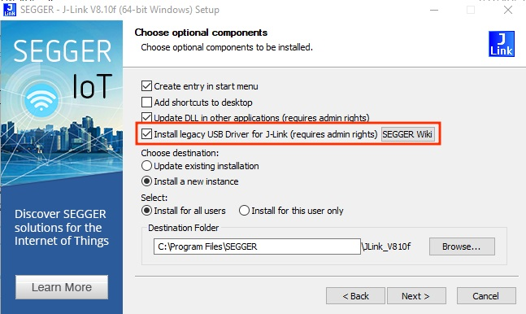
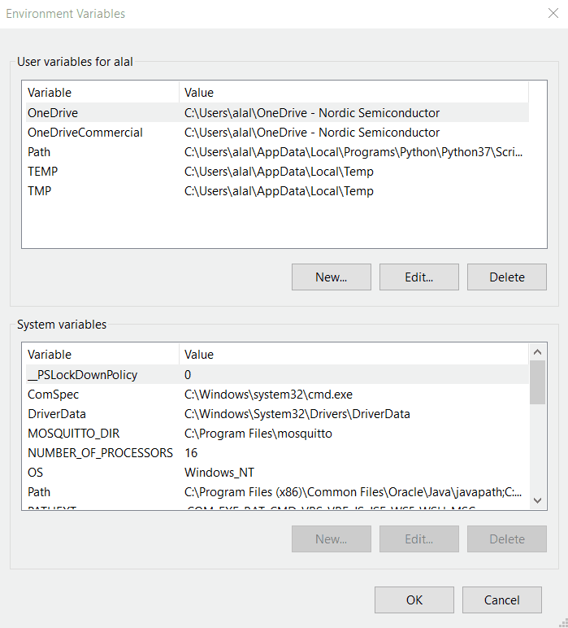

SDK version: NCS v3.0.0 

# Getting started: _nRF Connect SDK_ Installation

## Introduction

This description covers to installation process of the _nRF Connect SDK_, its toolchain, and Visual Studio Code. 

## Installation: A Step-by-Step Description 

### 1) Install SEGGER J-Link v8.18
   
   > Download the installer for your platform from [SEGGER J-Link Software](https://www.segger.com/downloads/jlink/#J-LinkSoftwareAndDocumentationPack). Run the installer; when you reach the ‘Choose Optional Components’ window during installation, be sure to select ‘Install Legacy USB Driver for J-Link’ This driver is necessary for some supported Development Kits.
   >
   >    
      
### 2) Install _nrfutil_ and the _nrfutil device_ command
#### 2.1) Install _nrfutil_
##### 2.1.1) Download nrfutil
   > Download the binary compatible with your OS from the [nRF Util product page](https://www.nordicsemi.com/Products/Development-tools/nRF-Util/Download?lang=en#infotabs) and store it somewhere on your disk drive (For example C:\nordic_tools\nrfutil.exe for Windows).
   >
   > If you are running on macOS or Linux, you can store it in a folder that is already added in the system’s PATH (E.g. /usr/bin/ ), so that you can skip step 2.2
   >
   >  __NOTE:__ For Linux, keep in mind that nrfutil has some prerequisites that are listed in Installing [nRF Util prerequisites](https://docs.nordicsemi.com/bundle/nrfutil/page/guides/installing.html#prerequisites). Make sure you also download them, if you don’t have them on your machine already.
 
##### 2.1.2.) Update Systems's PATH

   > (Windows) Update your system’s PATH to include the location where nrfutil is stored. Open Edit environment variable for your account and add the path where you stored the nrfutil binary, as shown below:
   >
   > 

##### 2.1.3) Ensure the latest nrfutil Version is installed

   > To make sure we have the latest nrfutil version, run the following command in a terminal (Command Prompt or PowerShell). It doesn’t matter which terminal since nrfutil is set globally in step 2.1.2.

    nrfutil self-upgrade

 #### 2.2) Install _nrfutil device_ command
   > The nrfutil binary you just downloaded does not come with any pre-installed commands. In this step, we will upgrade the core nrfutil and download the device command.
   >
   > For this course, we will need the device command to flash binaries to development kits.
   >
   > In your active terminal, type:

    nrfutil install device

### 3) Install Visual Studio Code

> Go to [https://code.visualstudio.com/download](https://code.visualstudio.com/download) and install the version that matches your operating system.

### 4) Install _nRF Connect Extension Pack_ in Visual Studio Code

> In the __Activity Bar__, click the __Extensions__ icon, then type __nRF Connect for VS Code Extension Pack__ in the search field, and click on __Install__.

### 5) Install Toolchain in Visual Studio Code

> The first time you open nRF Connect for VS Code, it will prompt you to install a toolchain. This usually happens when the extension does not find any installed toolchain on your machine.
>
> Click on __Install Toolchain__. It will list the available versions of toolchains that can be downloaded and installed on your machine. Select the toolchain version that matches the nRF Connect SDK version you plan to use. We always recommend using the latest tagged version of the nRF Connect SDK.

### 6) Install _nRF Connect SDK_ in Visual Studio Code

> In nRF Connect for VS Code, click on __Manage SDKs__. Click on __Install SDK__. It will list the available versions of the nRF Connect SDK that can be downloaded and installed on your machine. Choose the nRF Connect SDK version you wish to use for your project development.
