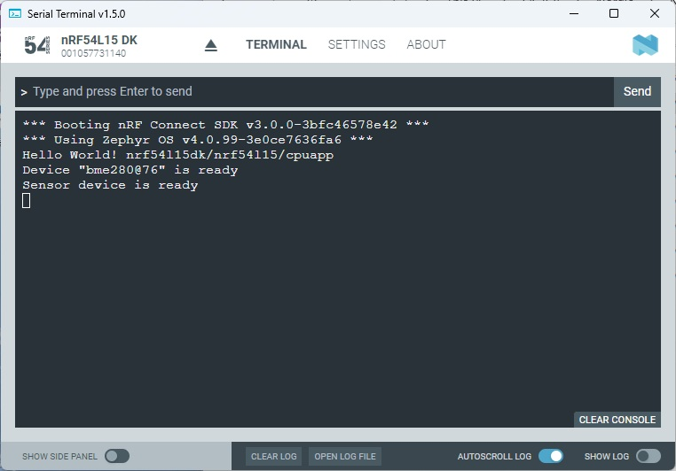
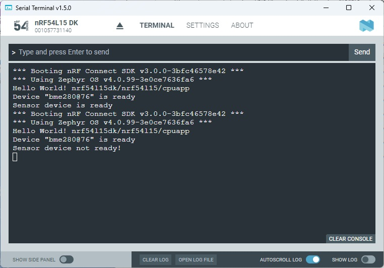

SDK version: NCS v3.1.0 

# Basics: Initializing and starting a Sensor Driver

## Introduction

An interesting driver in the Zephyr RTOS is the Sensor Driver. It allows a wide variety of sensors to be used. However, the first essential step is always to initialize and start the Sensor Driver. There are two options here. Firstly, the sensor driver can be started automatically during Zephyr RTOS start-up. On the other hand, the driver can also be started in your own application. 

In this hands-on we use the automatic startup at Zephyr RTOS boot.

## Required Hardware/Software
- Development kit [nRF54L15DK](https://www.nordicsemi.com/Products/Development-hardware/nRF54L15-DK), [nRF52840DK](https://www.nordicsemi.com/Products/Development-hardware/nRF52840-DK), [nRF52833DK](https://www.nordicsemi.com/Products/Development-hardware/nRF52833-DK), or [nRF52DK](https://www.nordicsemi.com/Products/Development-hardware/nrf52-dk) 
- Micro USB Cable (Note that the cable is not included in the previous mentioned development kits.)
- install the _nRF Connect SDK_ v3.1.0 and _Visual Studio Code_. The installation process is described [here](https://academy.nordicsemi.com/courses/nrf-connect-sdk-fundamentals/lessons/lesson-1-nrf-connect-sdk-introduction/topic/exercise-1-1/).

## Hands-on step-by-step description 

### Create a new Project

1) Create a new project based on the Zephyr example __hello_world_ (./zephyr/samples/hello_world). Name this project for example __C:/Nordic/Workspace/sensor_init_zephyr__

### Hardware Preparation

2) Let's prepare the hardware setup. You need an BME280 sensor board. Connect the Board to the nRF54L15DK as shown in following picture:

   

    | __Sensor__ | <-> | __nRF54L15DK__ |
    |------------|-----|----------------|
    |    VDD     | <-> |  Port1 VDDOP   |   
    |    GND     | <-> |     GND        |
    |    SCL     | <-> |    P1.11       |
    |    SDA     | <-> |    P1.12       |

### Include Sensor and I2C Driver

3) First of all we activate the Sensor Driver.

     _prj.conf_  

       # Enable Sensor Driver
       CONFIG_SENSOR=y
   
5) We want to connect the sensor via I2C. So we have to enable the I2C driver.

     _prj.conf_  

       # Enable I2C Driver
       CONFIG_I2C=y

### DeviceTree: Enable BMI280 sensor

6) Let's use the nRF54L15 I2C22 for the sensor. Create the overlay file __nRF54L15DK_nRF54L15_cpuapp_ns.overlay__ in case you have chosen board __nRF54L15DK/nRF54L15/cpuapp/ns__ or __nRF54L15DK_nRF54L15_cpuapp.overlay__ in case you have chosen board __nRF54L15DK/nRF54L15/cpuapp__. And add follwowing lines in this file:

     __nRF54L15DK_nRF54L15_cpuapp_ns.overlay__ or __nRF54L15DK_nRF54L15_cpuapp.overlay__  

       &i2c22 {
              status = "okay";
              pinctrl-0 = <&i2c22_default>;
              pinctrl-1 = <&i2c22_sleep>;
              pinctrl-names = "default", "sleep";
              clock-frequency = <I2C_BITRATE_STANDARD>;
              bme280: bme280@76 {
                   compatible = "bosch,bme280";
                   reg = <0x76>;
              };
       };

       &pinctrl {
                i2c22_default: i2c22_default {
                        group1  {
                                psels = <NRF_PSEL(TWIM_SCL, 1, 11)>,
                                        <NRF_PSEL(TWIM_SDA, 1, 12)>;
                        };
                };

	              i2c22_sleep: i2c22_sleep {
                        group1  {
                                psels = <NRF_PSEL(TWIM_SCL, 1, 11)>,
                                        <NRF_PSEL(TWIM_SDA, 1, 12)>;
                                low-power-enable;
                        };
                };
       };

7) We have to include a few header files.

     __main.c__  

       #include <zephyr/kernel.h>
       #include <zephyr/devicetree.h>
       #include <zephyr/drivers/sensor.h>

9) Now we use the DeviceTree data in our C Code.

     __main.c__  

       #define SENSOR_NODE DT_NODELABEL(bme280)

10) Let's read in the DeviceTree data for the sensor. 

     __main.c__ => main() function  

            const struct device *sensor = DEVICE_DT_GET(SENSOR_NODE);
            if (sensor == NULL)
            {
                /* No such node, or the node does not have status "okay" */
                printk("Error: No device \"%s\" found in DeviceTree.\n", sensor->name);
                return -1;
            }
            printk("Device \"%s\" is ready\n",sensor->name);

11) And finally check if the hardware is functional.

     __main.c__ => main() function  

            if (!device_is_ready(sensor))
            {
                printk("Sensor device not ready!\n");
            } else {
                printk("Sensor device is ready\n");
            }

## Testing

12) Build and download the project.
13) Start Serial Terminal and reset the nRF54L15DK. You should get the following output.

    

14) Now, we want to check if the device check will fail if the sensor communication is not possible. Remove the sensor and press on nRF54L15DK the Reset button.

        

> __Note:__ The first check is still ok. Reason is because it only checks if the DeviceTree entries are correctly done. The function call __device_is_ready()__ however fails. Here the software tries to read the Chip ID from the sensor, which is failing since the sensor is not connected... 
