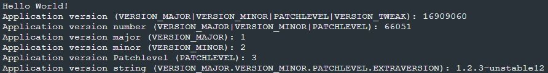

SDK version: NCS v3.1.0 

# Application Version Management

## Introduction

In addition to the Zephyr version and the nRF Connect SDK version, your own application can also have a version number. In this hands-on we look at how this is implemented.

Note that the Application Version Management is a functionality that was first time included in _nRF Connect SDK version 2.5.0_!

## Required Hardware/Software
- Development kit [nRF54L15DK](https://www.nordicsemi.com/Products/Development-hardware/nRF54L15-DK), [nRF52840DK](https://www.nordicsemi.com/Products/Development-hardware/nRF52840-DK), [nRF52833DK](https://www.nordicsemi.com/Products/Development-hardware/nRF52833-DK), or [nRF52DK](https://www.nordicsemi.com/Products/Development-hardware/nrf52-dk) 
- Micro USB Cable (Note that the cable is not included in the previous mentioned development kits.)
- install the _nRF Connect SDK_ v3.1.0 and _Visual Studio Code_. The installation process is described [here](https://academy.nordicsemi.com/courses/nrf-connect-sdk-fundamentals/lessons/lesson-1-nrf-connect-sdk-introduction/topic/exercise-1-1/).

## Hands-on step-by-step description 

### Create a new Project

1) Make a copy of the [hello_world](https://github.com/ChrisKurz/nRF-Connect-SDK-HandsOn/tree/main/Workspace/NCS/NCSv3.0.0/hello_world) project. 

### Add Application Version File

2) A new file is needed within the project folder. So add a file __VERSION__ (no extension in file name!) in the path where also the __CMakeLists.txt__ file is located.

	_VERSION_ 

       VERSION_MAJOR = 1
       VERSION_MINOR = 2
       PATCHLEVEL = 3
       VERSION_TWEAK = 4
       EXTRAVERSION = unstable12

 > __NOTE:__ Use numbers for VERSION_MAJOR, VERSION_MINOR, PATCHLEVEL, and VERSION_TWEAK. You can use alphanumerical characters (lowercase a-z and 0-9) for EXTRAVERSION. 

### Use in C Code

3) To use the version information in application code, you must first include the version file. Add the following line in main.c file:

	_src/main.c_

       #include "app_version.h"

4) Then the version numbers of the application can be read out using the defines shown in this example:

	_src/main.c_ => main() function

            printk("Application version (VERSION_MAJOR|VERSION_MINOR|PATCHLEVEL|VERSION_TWEAK): %s\n", APPVERSION);
            printk("Application version number (VERSION_MAJOR|VERSION_MINOR|PATCHLEVEL): %s\n", APP_VERSION_NUMBER);
            printk("Application version major (VERSION_MAJOR): %i\n", APP_VERSION_MAJOR);
            printk("Application version minor (VERSION_MINOR): %i\n", APP_VERSION_MINOR);
            printk("Application version Patchlevel (PATCHLEVEL): %i\n", APP_PATCHLEVEL);
            printk("Application version string (VERSION_MAJOR.VERSION_MINOR.PATCHLEVEL.EXTRAVERSION): %s\n", APP_VERSION_STRING);
            printk("Application build version: %s\n", APP_BUILD_VERSION);

## Testing
5) Build the project and donwload it to your development kit. 
6) In the terminal you should see following outuput:

   

>__Note__: You can read the application version and application version number better if you convert them to hexadecimal.
>
>          16909060 (decimal) = 0x01020304 (hexadecimal)
>          66051 (decimal) = 0x010203 (hexadecimal)
