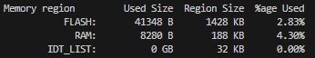
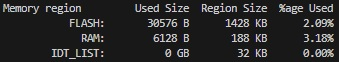
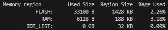
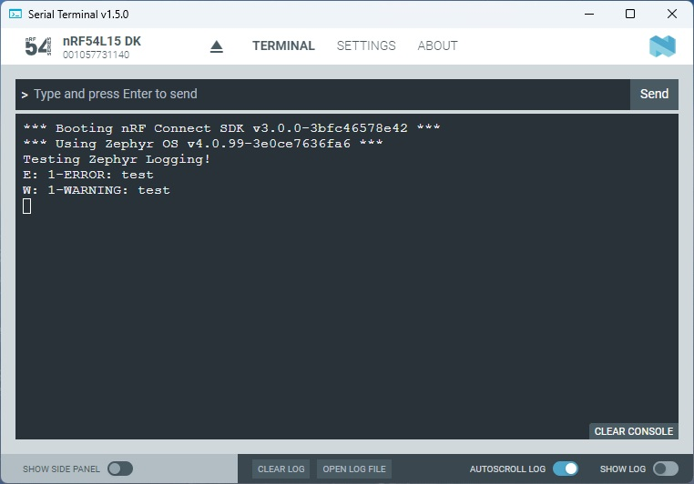

SDK version: NCS v3.0.0  -  Link to Hands-on solution: https://github.com/ChrisKurz/NCS-Tutorial/tree/main/Workspace/NCSv2.5.0/02_Logging_minimal

# Zephyr Logging - Minimal Memory Footprint

## Introduction

Zephyr Logging helps a lot when debugging during runtime is needed. However, it also requires a lot of memory resources. Since all the debug messages has to be stored in the code, the memory footprint is much bigger in larger projects. 

Here is a simple comparison of a really simple project. I have used the [Zehpyr Logging](https://github.com/ChrisKurz/nRF_Connect_SDK/blob/main/doc/NCS/NCSv2.5.0/NCSv2.5.0_02_ZephyrLogging.md) hands-on example and modified the code in different ways. 

1) Original Memory Footprint of the Zephyr Logging example. This one was tested with _nRF Connect SDK_ V3.0.0. 

   

3) Completely removing Zephyr Logging (CONFIG_LOG=n, removing Logging related code in main.c file). This one was tested with _nRF Connect SDK_ v3.0.0.

   

4) In this hands-on we will enable minimal mode for Logging. Enable minimal logging has very little footprint overhead on top of the printk() implementation for standard logging macros. Hexdump macros are also supported, with a small amount of code pulled in if used. Build time filtering is supported, but not runtime filtering. There are no timestamps, prefixes, colors, or asynchronous logging, and all messages are simply sent to printk(). Enabling minimal logging mode results for our test in following memory footprint. This one was tested with _nRF Connect SDK_ V3.0.0.

   

If you compare these three projects, you will notice that Zephyr Logging occupies 10772 additional bytes in flash, while minimal Zephyr Logging occupies only 8248 additional bytes in flash. For larger projects, the difference can be much higher due to the much larger number of debug messages. 

> __Note:__ When these code sizes were determined, default settings were used. The memory size was not optimized!

## Required Hardware/Software
- Development kit [nRF54L15DK](https://www.nordicsemi.com/Products/Development-hardware/nRF54L15-DK), [nRF52840DK](https://www.nordicsemi.com/Products/Development-hardware/nRF52840-DK), [nRF52833DK](https://www.nordicsemi.com/Products/Development-hardware/nRF52833-DK), or [nRF52DK](https://www.nordicsemi.com/Products/Development-hardware/nrf52-dk)
- Micro USB Cable (Note that the cable is not included in the previous mentioned development kits.)
- install the _nRF Connect SDK_ v3.0.0 and _Visual Studio Code_. The installation process is described [here](https://academy.nordicsemi.com/courses/nrf-connect-sdk-fundamentals/lessons/lesson-1-nrf-connect-sdk-introduction/topic/exercise-1-1/).

## Hands-on step-by-step description 

### Copy existing Zephyr Logging Project

1) Make a copy of the [Zephyr Logging](https://github.com/ChrisKurz/NCS-Tutorial/tree/main/Workspace/NCS/NCSv3.0.0/logging) project. 

2) Add in the __prj.conf__ file the following line. 

   __prj.conf__

       CONFIG_LOG_MODE_MINIMAL=y

3) build the project and flash it on your development kit. 

## Testing

4) When doing the build, check the memory footprint.
5) Check the termninal output. You should see that timestamp, prefix and color are no longer handled and the output string is minimized. 

   
