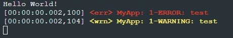

SDK version: NCS v3.1.0 

# Zephyr Logging

## Introduction

Zephyr consists of very many software modules, which can be added individually to the own project. The adding is done with the help of KCONFIG settings. 

In this chapter we will look at the Zephyr Logging library. The implemented logging solution is very extensive. So here we will only look at the very basic functionality. 

In previous chapter we have already seen a simple way to send a message via UART; we used the __printk__ instruction. This is a simple method, but Zephyr Logging offers more functionality. Logging is very common in the Zephyr project. It is used in its software modules and it can individually be enabled. These debug messages can consist of text strings or data, for example debug messages, measurement results or content of varialbes. 

The Zephyr Logging allows debugging during runtime, which is very useful for runtime critical applications like RTOS or debugging Bluetooth connections.
And it can also be used for your own application. We will have a closer look at this in the next example project.

## Required Hardware/Software
- Development kit [nRF54L15DK](https://www.nordicsemi.com/Products/Development-hardware/nRF54L15-DK), [nRF52840DK](https://www.nordicsemi.com/Products/Development-hardware/nRF52840-DK), [nRF52833DK](https://www.nordicsemi.com/Products/Development-hardware/nRF52833-DK), or [nRF52DK](https://www.nordicsemi.com/Products/Development-hardware/nrf52-dk)
- Micro USB Cable (Note that the cable is not included in the previous mentioned development kits.)
- install the _nRF Connect SDK_ v3.1.0 and _Visual Studio Code_. The installation process is described [here](https://academy.nordicsemi.com/courses/nrf-connect-sdk-fundamentals/lessons/lesson-1-nrf-connect-sdk-introduction/topic/exercise-1-1/).

## Hands-on step-by-step description 

### Create a new Project

1) Make a copy of the [Creating a Project from Scratch](https://github.com/ChrisKurz/NCS-Tutorial/tree/main/Workspace/NCS/NCSv3.0.0/hello_world) hands-on and store it in your workspace folder, e.g.  C:/Nordic/Workspace/logging 

2) Start Visual Studio Code and open the __Logging__ project.

### Include and register Zephyr Logging

3) Add __Zephyr Logging__ Software Module to your project by adding following lines in __prj.conf__ file. 

   _prj.conf_ 
   
       # Enable Logging
       CONFIG_LOG=y

   __NOTE: When setting a CONFIG value ensure that there are no spaces around the equal sign!__

4) We need to include the logging header file to get access in C code to the logging functionality. This is done by adding following line in main.c:

   _src/main.c_ 
   
       #include <zephyr/logging/log.h>
       
5) Before we can use the logging instructions, we have to register the logging for this new software module (the new software module is our own application). This is done by adding following lines before the main function:

   _src/main.c_ 
   
       /** LOG MODULE REGISTRATION:
           - First parameter: module name
           - Second Parameter (optional): log level
                Following Log-Levels can be used:
                    LOG_LEVEL_NONE  => OFF:     log will not be active. 
                    LOG_LEVEL_ERR   => ERROR:   write only LOG_ERR messages
                    LOG_LEVEL_WRN   => WARNING: write LOG_WRN and LOG_ERR messages
                    LOG_LEVEL_INF   => INFO:    write LOG_INF, LOG_WRN, and LOG_ERR messages
                    LOG_LEVEL_DBG   => DEBUG:   write LOG_DBF, LOG_INF, LOG_WRN, and LOG_ERR messages
       **/
       LOG_MODULE_REGISTER(MyApp,LOG_LEVEL_WRN);

### Adding Logging example messages

6) Now we are ready to create debug outputs in our own application. For test purposes we add the following lines in main function:

   _src/main.c_ => add in main() function 

            LOG_INF("1-This is a test");
            LOG_ERR("1-ERROR: test");
            LOG_WRN("1-WARNING: test");
            LOG_DBG("1-DEBUG: test");
       
## Testing

7) Build the project, download the code to a development kit, and check the output via the virtual COM port (Settings: 115200 baud, 8 data bits, 1 stop bit, no partiy, no flow control). Easiest way is to use the _Serial Terminal_ in the _nRF Connect for Desktop_ tool.

   

   > **_Note:_** We have set the Log Level to "LOG_LEVEL_WRN". Because of this the output only shows the _warnings_ and _errors_.

8) Change the log level in the LOG_MODULE_REGISTER instruction and check the debug messages seen on your computer terminal.  

   

   > **_Note:_** In above screen shot the Log Level was set to "LOG_LEVEL_INF". 

