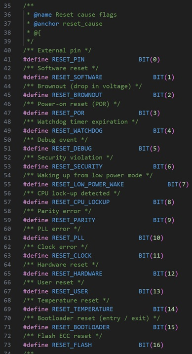
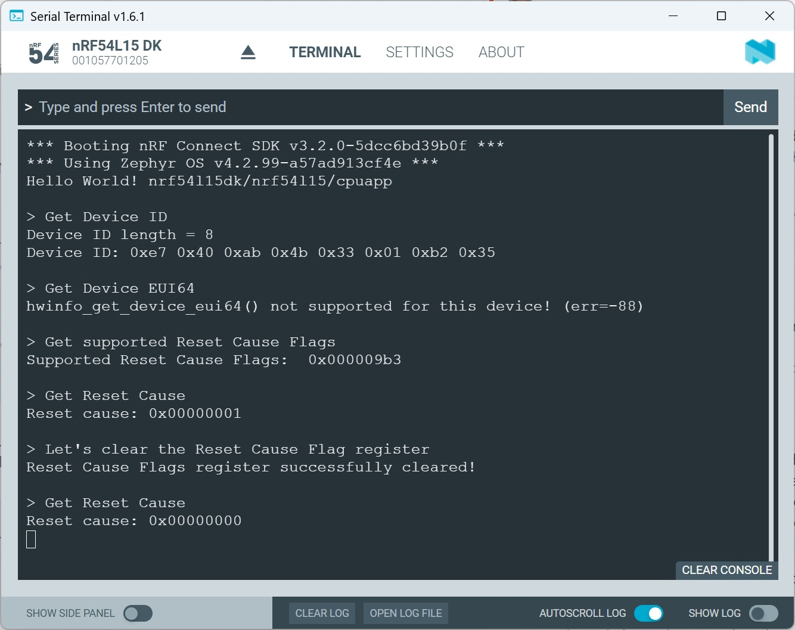

SDK version: NCS v3.2.0 

# Zephyr Hardware Driver: Hardware Info - Reading Device ID and getting cause of Reset

## Introduction

The HW Info API provides access to hardware information such as device identifiers and reset cause flags.

Reset cause flags can be used to determine why the device was reset; for example due to a watchdog timeout or due to power cycling. 

Different devices support different subset of flags. Use hwinfo_get_supported_reset_cause() to retrieve the flags that are supported by that device.

## Required Hardware/Software
- Development kit 
[nRF52840DK](https://www.nordicsemi.com/Products/Development-hardware/nRF52840-DK), 
[nRF52833DK](https://www.nordicsemi.com/Products/Development-hardware/nRF52833-DK), or 
[nRF52DK](https://www.nordicsemi.com/Products/Development-hardware/nrf52-dk), 
(nRF54L15DK)
  > __Note__: Two development kits allow to check communication between boards. It is also possible to test the software with one development kit; in this case the board receives the data byte it has sent.
- Micro USB Cable (Note that the cable is not included in the previous mentioned development kits.)
- install the _nRF Connect SDK_ v3.2.0 and _Visual Studio Code_. The installation process is described [here](https://academy.nordicsemi.com/courses/nrf-connect-sdk-fundamentals/lessons/lesson-1-nrf-connect-sdk-introduction/topic/exercise-1-1/).

## Hands-on step-by-step description 

### Create a new Project

1) Create a new project based on Zephyr's __hello_world__.

   > __Note:__ The hardware info driver reads the FICR registers to get the device ID. Access to this register is limited. So the code has to run in secure domain. When you add a build configuration ensure that the selected board target is using a non-secure domain.

### Add Hardware Info driver

2) Enable Hardware Info driver by enabling the appropriate KCONFIG. 

   prj.conf 

      # enable hardware info driver
      CONFIG_HWINFO=y

3) Include the header file that defines the Hardware Info API.

   main.c 

      #include <zephyr/drivers/hwinfo.h>

### Get Device ID

4) We will store the device ID in a buffer. So let's declare it.

   main.c 

          #define BUFFER_LENGTH  8 

          uint8_t buffer[BUFFER_LENGTH];
          ssize_t ret;

          /*--- Get Device ID ---*/
          printf("\n> Get Device ID\n");

          ret = hwinfo_get_device_id(buffer, BUFFER_LENGTH);
          if (ret == -ENOTSUP){
              printf("hwinfo_get_device_id() not supported for this device! (err=%d)\n", ret);
              return 0;
          }
          else {
              if (length_read < 0){
              printf("hwinfo_get_device_id() call caused an error! (err=%d)\n", ret);
              return 0;
          }

   > __NOTE:__ BUFFER_LENGTH is set here to 8. This is the length the nRF5x devices from Nordic Semiconductor is usually using. 

5) Let's do also a check how many bytes the __hwinfo_get_device_id()__ function delivers.

   main.c 

          printf("Device ID length = %i \n", ret);

6) And finally we print the device ID.

   main.c 

          printf("Device ID: ");
          for (int i=0; i<=BUFFER_LENGTH-1; i++){
             printf("%x ", buffer[i]);
          }	
          printf ("\n");

### Get Device EUI64

7) Let's check the __hwinfo_get_device_eui64()__ API.

   main.c 

          /*--- Get device EUI64 ---*/
          printf("\n> Get Device EUI64\n");

          ret = hwinfo_get_device_eui64(buffer);
          if (ret == -ENOSYS){
              printf("hwinfo_get_device_eui64() not supported for this device! (err=%d)\n", ret);
          }
          else {
              if (ret < 0){
                 printf("hwinfo_get_device_eui64() call caused an error! (err=%d)\n", ret);
              }
          }

   > __NOTE:__ This one is not supported by Nordic's nRF5x devices. So we should get an error message.

### Reset Cause

8) Let's check first which Reset Cause Flags are supported by Nordic's nRF5x. 

   main.c 

          /*--- Get supported Reset Cause Flags ---*/
          printf("\n> Get supported Reset Cause Flags\n");

          uint32_t supportedFlags;

          ret = hwinfo_get_supported_reset_cause(&supportedFlags);
          if (ret == -ENOSYS){
              printf("hwinfo_get_supported_reset_cause() not supported for this device! (err=%d)\n", ret);
              return 0;
          }
          else {
              if (ret < 0){
                 printf("hwinfo_get_supported_reset_cause() call caused an error! (err=%d)\n", ret);
                 return 0;
              }
          }
          printf("Supported Reset Cause Flags:  0x08%x\n", supportedFlags);

  > __Note:__ The Reset Cause Flags are defined in the __hwinfo.h__ header file. Following definition can be found there.
  > 
  >    

9) Let's output the Reset cause. 

   main.c 

          /*--- Check Reset Cause ---*/
          printf("\n> Get Reset Cause\n");

          uint32_t resetCause;

          ret = hwinfo_get_reset_cause(&resetCause);
          if (ret == -ENOSYS){
              printf("hwinfo_get_reset_cause() not supported for this device! (err=%d)\n", ret);
              return 0;
          }
          else {
              if (ret < 0){
                  printf("hwinfo_get_reset_cause() call caused an error! (err=%d)\n", ret);
                  return 0;
              }
          }
          printf("Reset cause: 0x%08x\n", resetCause);

10) And as a final step we clear the Reset Cause Flag register. 

   main.c 

          /*--- Clear Reset Cause Flag register*/
          printf("\n> Let's clear the Reset Cause Flag register\n");

          ret = hwinfo_clear_reset_cause();
          if (ret == -ENOSYS){
              printf("hwinfo_clear_reset_cause() not supported for this device! (err=%d)\n", ret);
              return 0;
          }
          else {
              if (ret < 0){
                  printf("hwinfo_clear_reset_cause() call caused an error! (err=%d)\n", ret);
                  return 0;
              }
          }
          printf("Reset Cause Flags register successfully cleared!\n");

11) We can check again the Reset Cause and see if the previously seen flag is cleared.

   main.c 

          /*--- Check again Reset Cause ---*/
          printf("\n> Get Reset Cause\n");

          ret = hwinfo_get_reset_cause(&resetCause);
          if (ret == -ENOSYS){
              printf("hwinfo_get_reset_cause() not supported for this device! (err=%d)\n", ret);
              return 0;
          }
          else {
              if (ret < 0){
                  printf("hwinfo_get_reset_cause() call caused an error! (err=%d)\n", ret);
                  return 0;
              }
          }
          printf("Reset cause: 0x%08x\n", resetCause);

## Testing

12) Build the project and download to a dev kit. 

13) Open Serial Terminal and check the output. It should look like this:

   
