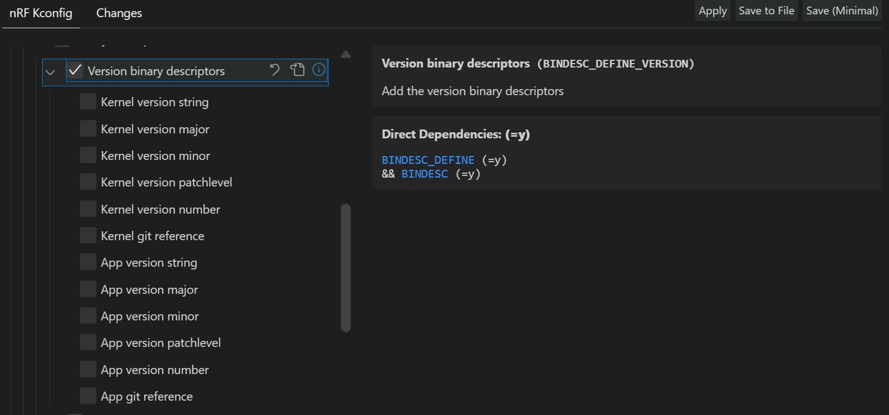
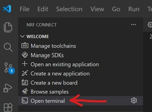
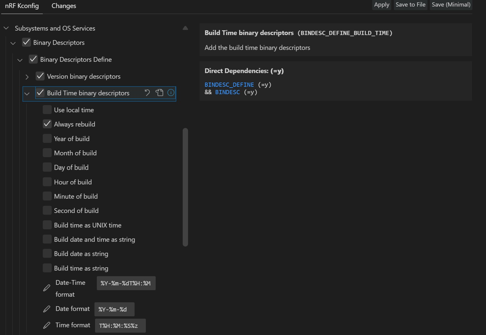
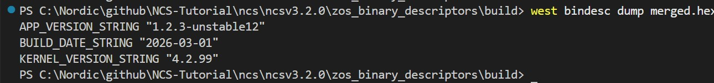
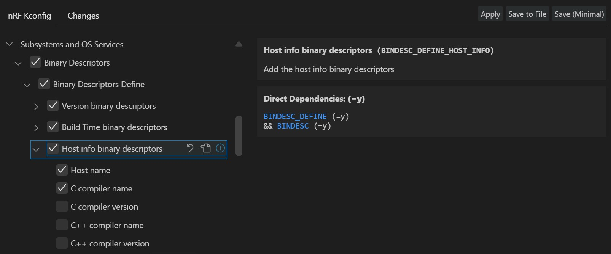
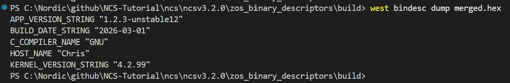
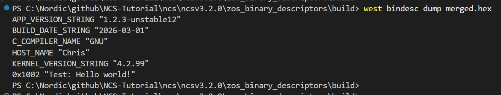

SDK version: NCS v3.2.0 

# Zephyr Binary Descriptors

## Introduction

[Binary descriptors](https://docs.nordicsemi.com/bundle/ncs-latest/page/zephyr/services/binary_descriptors/index.html) are constant data objects that store information about the executable binary file (application image). Unlike “normal” constants, binary descriptors are linked to a known offset in the binary file, making them accessible to other programs, such as another image running on the same device or a PC tool that reads information from the existing image. Some examples of constants that could serve as useful binary descriptors are: kernel version, app version, build time, compiler version, environment variables, name of the compiling host, etc.

## Required Hardware/Software
- Development kit 
[nRF54LM20DK](https://www.nordicsemi.com/Products/Development-hardware/nRF54LM20-DK), 
[nRF54L15DK](https://www.nordicsemi.com/Products/Development-hardware/nRF54L15-DK), 
[nRF52840DK](https://www.nordicsemi.com/Products/Development-hardware/nRF52840-DK), 
[nRF52833DK](https://www.nordicsemi.com/Products/Development-hardware/nRF52833-DK), or 
[nRF52DK](https://www.nordicsemi.com/Products/Development-hardware/nrf52-dk)
- Micro USB Cable (Note that the cable is not included in the previous mentioned development kits.)
- install the _nRF Connect SDK_ v3.2.0 and _Visual Studio Code_. The installation process is described [here](https://academy.nordicsemi.com/courses/nrf-connect-sdk-fundamentals/lessons/lesson-1-nrf-connect-sdk-introduction/topic/exercise-1-1/).

## Hands-on step-by-step description 

### Create a new Project

1) Let's start with the Zephyr _hello_world_ project. Create a copy of this project (zephyr/samples/hello_world).

### Adding Standard Descriptors

2) First, we have to enable binary descriptions by setting <code>CONFIG_BINDESC</code>. 

   _prj.conf_ 
   
       # Enable Binary Descriptors
       CONFIG_BINDESC=y

       # Enable the app to define its own binary descriptors
       CONFIG_BINDESC_DEFINE=y

#### Adding Version Descriptors

3) There are several predefined descriptors that can be easily activated via KCONFIG. Let's first take a look at the _Version binary descriptors_. The following screenshot of the _nRF KCONFIG GUI_ tool shows the selectable version numbers. 

   

   Let's use the Kernel version string and the App version number.

   _prj.conf_ 
   
       # Add the version binary descriptors
       CONFIG_BINDESC_DEFINE_VERSION=y

       # Enable the Kernel version string
       CONFIG_BINDESC_KERNEL_VERSION_STRING=y

       # Enable the App version string
       CONFIG_BINDESC_APP_VERSION_STRING=y

   > __Note:__ We also activated to store the application version in the binary descriptor. However, the app version was not yet defined in the _hello_world_ project. If we were to create the project now, there would be no app version because none has been defined. In the next step we add an app version to our project. 

4) Note that the app version is not yet defined. We need to add the __VERSION__ file to our project and define an app version in this file. (see also NCS tutorial about [application version](../ZKS_other_version_app/README.md))

   _VERSION_ 
   
       VERSION_MAJOR = 1
       VERSION_MINOR = 2
       PATCHLEVEL = 3
       VERSION_TWEAK = 4
       EXTRAVERSION = unstable12

##### TESTING

5) Build the project.
6) Open the commmand line terminal. 

   

7) Enter following command in command line Terminal:

       west bindesc dump merged.hex

   You should see following response:

   

#### Adding Build Time Descriptors

8) There are also several predefined descriptors covering _build time_. The following screenshot of the _nRF KCONFIG GUI_ tool shows the selectable build time parameters.

   

   Let's activate the _build time_ descriptors and use the _build date as string_.

   _prj.conf_ 
   
       # Add the version binary descriptors
       CONFIG_BINDESC_DEFINE_BUILD_TIME=y
       CONFIG_BINDESC_BUILD_DATE_STRING=y       # Enable build time as string

##### TESTING

9) Build the project and enter following command line instruction:

       west bindesc dump merged.hex

   You should see following response:

   

#### Adding Host Info Descritors

10) Now add host info descriptors. The following screenshot of the _nRF KCONFIG GUI_ tool shows the selectable host info descriptors.

   

   Let's enable _host name_ and _C compiler name_. 

   _prj.conf_ 
   
       # Add Host Info descritor
       CONFIG_BINDESC_DEFINE_HOST_INFO=y
       CONFIG_BINDESC_HOST_NAME=y               # Enable Host Name
       CONFIG_BINDESC_C_COMPILER_NAME=y         # Enable C Compiler name

##### TESTING

11) Build the project and enter following command line instruction:

       west bindesc dump merged.hex

   You should see following response:

   

### Adding User Defined Descriptors

12) Let's add a user defined string. 

   _main.c_ 
   
       #include <zephyr/bindesc.h>

       BINDESC_STR_DEFINE(my_string, 2, "Test: Hello world!"); // Unique ID is 2

13) Build the project and read the binary descriptors with the <code>west bindesc</code> command. You should see following respones:

    

### Reading Binary Descriptors from C Code

Please take a look at the [Reading Descriptors](https://docs.nordicsemi.com/bundle/ncs-latest/page/zephyr/services/binary_descriptors/index.html#reading_descriptors) chapter. 
