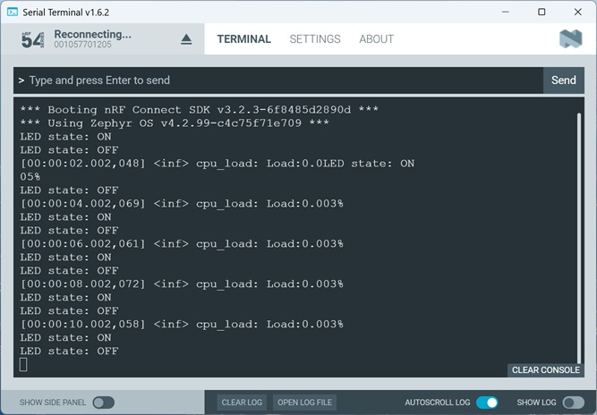

SDK version: NCS v3.2.0 

# Zephyr CPU Load

## Introduction

Sometimes it can be helpful to determine how much CPU load a piece of software is consuming. Zephyr offers several ways to measure CPU load. The thread analyzer is one option. CPU Load is another, which is more accurate because it also takes into account the time spent in interrupt context. 

## Required Hardware/Software
- Development kit 
[nRF54L15DK](https://www.nordicsemi.com/Products/Development-hardware/nRF54L15-DK), 
[nRF52840DK](https://www.nordicsemi.com/Products/Development-hardware/nRF52840-DK), 
[nRF52833DK](https://www.nordicsemi.com/Products/Development-hardware/nRF52833-DK), or 
[nRF52DK](https://www.nordicsemi.com/Products/Development-hardware/nrf52-dk)
- Micro USB Cable (Note that the cable is not included in the previous mentioned development kits.)
- install the _nRF Connect SDK_ v3.2.0 and _Visual Studio Code_. The installation process is described [here](https://academy.nordicsemi.com/courses/nrf-connect-sdk-fundamentals/lessons/lesson-1-nrf-connect-sdk-introduction/topic/exercise-1-1/).

## Hands-on step-by-step description 

### Create a new Project

1) Make a copy of the Zephyr sample _blink_. 

### Adding _CPU Load_ Module

2) The CPU Load module can be used in different ways, like handling it in software or periodically getting a measure. In this hands-on we use the periodical output of CPU load value. Add following KCONFIG settings to your prj.conf file.

   __prj.conf__

       # Zephyr Logging must be enabled to allow CPU Load module to output result
       CONFIG_LOG=y

       # Enable CPU Load and define a periodical interval of 2 seconds
       CONFIG_CPU_LOAD=y
       CONFIG_CPU_LOAD_LOG_PERIODICALLY=2000

## Testing

3) Build the projecet (-> pristine build!) and flash it on your dev kit.
4) Check the Serial Terminal output.

   
