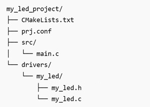

# Creating a custom Device Driver within the Application Project Folder

## Introduction

This hands-on shows how to create a simple custom LED driver in Zephyr that:
- Turns an LED on
- Turns an LED off
- Blinks an LED
- Allows configurable blink timing

## Required Hardware/Software
- Development kit 
[nRF54LM20DK](https://www.nordicsemi.com/Products/Development-hardware/nRF54LM20-DK),
[nRF54L15DK](https://www.nordicsemi.com/Products/Development-hardware/nRF54L15-DK), 
[nRF52840DK](https://www.nordicsemi.com/Products/Development-hardware/nRF52840-DK), 
[nRF52833DK](https://www.nordicsemi.com/Products/Development-hardware/nRF52833-DK), or 
[nRF52DK](https://www.nordicsemi.com/Products/Development-hardware/nrf52-dk), (nRF54L15DK)
- Micro USB Cable (Note that the cable is not included in the previous mentioned development kits.)
- install the _nRF Connect SDK_ v3.3.0 and _Visual Studio Code_. The installation process is described [here](https://academy.nordicsemi.com/courses/nrf-connect-sdk-fundamentals/lessons/lesson-1-nrf-connect-sdk-introduction/topic/exercise-1-1/).

## Hands-on step-by-step description 

### Project Structure

1) Create the following structure:

   
   
   

### Create the Driver Header File (my_led.h)

2) Content of my_led.h file:

   __drivers/my_led/my_led.h__

       #ifndef MY_LED_H
       #define MY_LED_H

       #include <zephyr/kernel.h>

       int my_led_init(void);
       int my_led_on(void);
       int my_led_off(void);
       void my_led_blink_start(uint32_t interval_ms);
       void my_led_blink_stop(void);

       #endif

### Create the Driver Source File (my_led.c)

3) Content of my_led.c file:

   __drivers/my_led/my_led.c__

       #include "my_led.h"

       #include <zephyr/device.h>
       #include <zephyr/drivers/gpio.h>
       #include <zephyr/kernel.h>
       #include <zephyr/devicetree.h>

       #define LED_NODE DT_ALIAS(led0)

       static const struct gpio_dt_spec led = GPIO_DT_SPEC_GET(LED_NODE, gpios);

       static struct k_timer blink_timer;

       static bool blinking = false;
       static bool led_state = false;

       static void blink_timer_handler(struct k_timer *timer)
       {
           ARG_UNUSED(timer);

           led_state = !led_state;
           gpio_pin_set_dt(&led, led_state);
       }

       int my_led_init(void)
       {
           if (!gpio_is_ready_dt(&led)) {
               return -ENODEV;
           }
   
           int ret = gpio_pin_configure_dt(&led, GPIO_OUTPUT_INACTIVE);
           if (ret < 0) {
               return ret;
           }
           k_timer_init(&blink_timer, blink_timer_handler, NULL);

           return 0;
       }

       int my_led_on(void)
       {
           blinking = false;
           k_timer_stop(&blink_timer);
           led_state = true;
           return gpio_pin_set_dt(&led, 1);
       }  

       int my_led_off(void)
       {
           blinking = false;
           k_timer_stop(&blink_timer);
           led_state = false;
           return gpio_pin_set_dt(&led, 0);
       }

       void my_led_blink_start(uint32_t interval_ms)
       {
           blinking = true;

           k_timer_start(
               &blink_timer,
               K_MSEC(interval_ms),
               K_MSEC(interval_ms));
       }

       void my_led_blink_stop(void)
       {
           blinking = false;
           k_timer_stop(&blink_timer);
          gpio_pin_set_dt(&led, 0);
          led_state = false;
       }

### Create the Driver CMake File

4) Content of drivers/my_led/CMakeLists.txt file:

   __drivers/my_led/CMakeLists.txt__

       zephyr_library()
       zephyr_library_sources(my_led.c)

### Create the main Application

5) Add following test code in the main.c file.

   __src/main.c__

       #include <zephyr/kernel.h>
       #include "my_led.h"

       int main(void)
       {
           int ret;

           ret = my_led_init();
           if (ret < 0) {
               return 0;
           }

           while (1) {

               my_led_on();
               k_sleep(K_SECONDS(2));

               my_led_off();
               k_sleep(K_SECONDS(2));
  
               my_led_blink_start(500);
               k_sleep(K_SECONDS(5));

               my_led_blink_stop();
               k_sleep(K_SECONDS(2));
           }

           return 0;
       }

   ### Create the Top-Level CMake File

   6) Add following lines in CMakeLists.txt file.

   __src/main.c__

       cmake_minimum_required(VERSION 3.20.0)

       find_package(Zephyr REQUIRED HINTS $ENV{ZEPHYR_BASE})

        project(my_led_project)

        add_subdirectory(drivers/my_led)

        target_sources(app PRIVATE src/main.c)

        target_include_directories(app PRIVATE drivers/my_led)

### Create prj.conf

8) Enable GPIO support.

   __prj.conf__

       CONFIG_GPIO=y

## Testing

9) Build the project and download to a development kit.
10) Check the output in Serial Terminal. 

   
