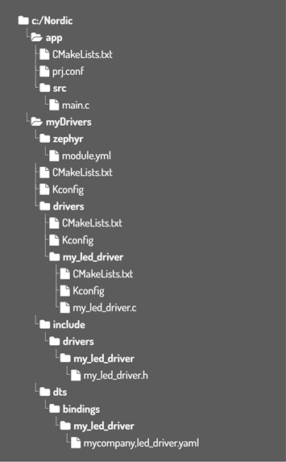
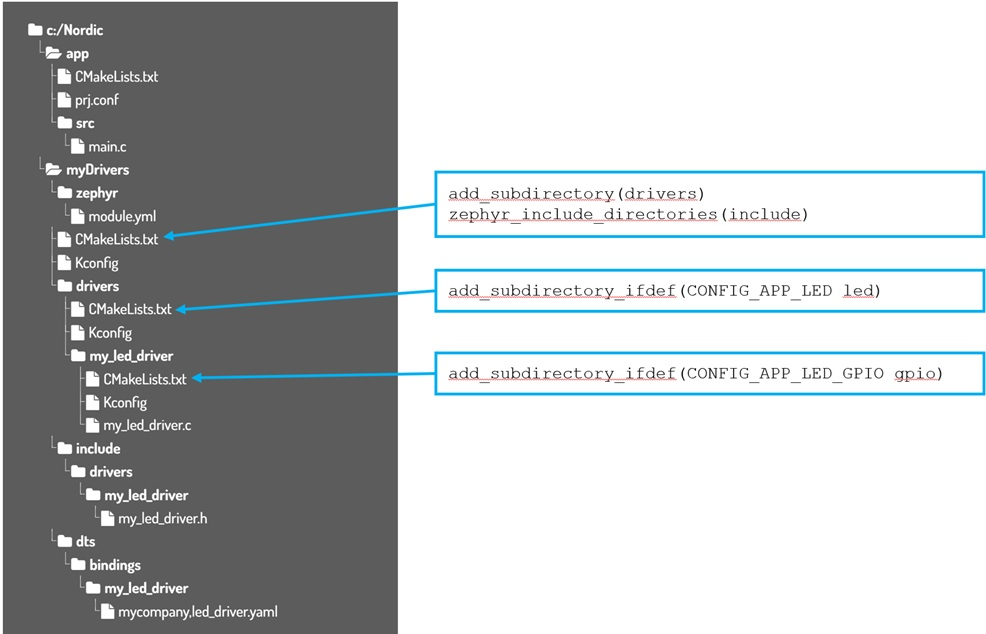
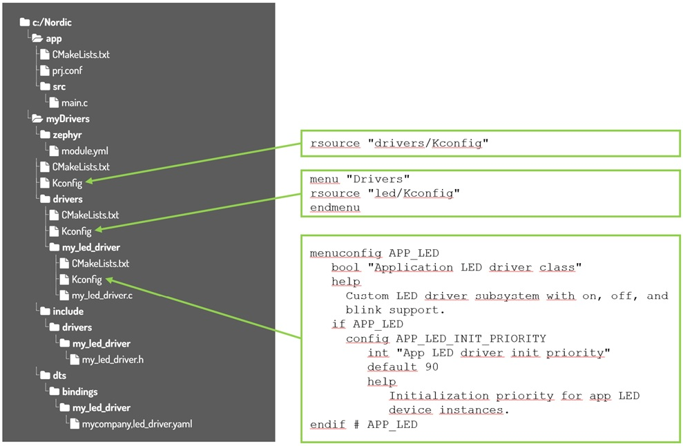

# !!! WORK IN PROGRESS !!!
-----
# Writing a user-defined driver located in a separate driver directory outside the SDK

## Introduction

This hands-on shows how to create a simple custom LED driver in Zephyr that:
- Turns an LED on
- Turns an LED off
- Blinks an LED
- Allows configurable blink timing

The driver is done as a Zephyr external module stored in its own folder outside the _nRF Connect SDK_ tree. 

## Required Hardware/Software
- Development kit 
[nRF54LM20DK](https://www.nordicsemi.com/Products/Development-hardware/nRF54LM20-DK),
[nRF54L15DK](https://www.nordicsemi.com/Products/Development-hardware/nRF54L15-DK), 
[nRF52840DK](https://www.nordicsemi.com/Products/Development-hardware/nRF52840-DK), 
[nRF52833DK](https://www.nordicsemi.com/Products/Development-hardware/nRF52833-DK), or 
[nRF52DK](https://www.nordicsemi.com/Products/Development-hardware/nrf52-dk), (nRF54L15DK)
- Micro USB Cable (Note that the cable is not included in the previous mentioned development kits.)
- install the _nRF Connect SDK_ v3.3.0 and _Visual Studio Code_. The installation process is described [here](https://academy.nordicsemi.com/courses/nrf-connect-sdk-fundamentals/lessons/lesson-1-nrf-connect-sdk-introduction/topic/exercise-1-1/).


## Hands-on step-by-step description 

### Project Structure

1) Create the following structure:
   
  
   

### Register the Folder as a Zephyr Module

In Zephyr, external drivers are typically integrated as __modules__. This means your driver can be located entirely outside the Zephyr or _nRF Connect SDK_ repository.

How does Zephyr find external modules? During the build, Zephyr scans the main project and all registered modules. A module is identified by the <code>zephyr/module.yml</code> file. This <code>module.yml</code> file tells Zephyr where Kconfig is located, where CMake is located, and any optional additional metadata.

2) Zephyr discovers external code through __zephyr/module.yml__. Create <code>modules/app_led_driver/zephyr/module.yml</code>.

   <sup>__modules/app_led_driver/zephyr/module.yml__</sup>

```yaml
name: my_led_driver
build:
  kconfig: Kconfig
  cmake: .
  settings:
    dts_root: .
```

> __Note:__
> - <code>cmake</code> and <code>kconfig</code> point to the module root build files
> - <code>dts_root</code> tells Zephyr to pick up custom DeviceTree bindings from this module

> __Note:__ _Why are the fields <code>cmake</code> and <code>kconfig</code> differently handled?_
>
> Both fields live under <code>build:</code> in <code>module.yml</code>, but they do not mean the same thing. That's why we use <code>cmake: .</code> together with <code>kconfig: Kconfig</code>, despite both files are located in the same folder.
>
> The <code>cmake:</code> field expects a directory in which the file <code>CMakeLists.txt</code> can be found. While the field <code>kconfig:</code> expects a file path to the Kconfig file to include.
>
> <code>build:</code> <br>
> <code>  cmake: .          # directory → ./CMakeLists.txt </code> <br>
> <code>  kconfig: Kconfig  # file      → ./Kconfig </code> 

### Integrate the Module into CMake and Kconfig

3) Here are the required CMakeLists.txt files. 

  

   <sup>__myDrivers/CMakeLists.txt__</sup>

    add_subdirectory(drivers)
    zephyr_include_directories(include)

-----
   <sup>__myDrivers/drivers/CMakeLists.txt__</sup>

    add_subdirectory_ifdef(CONFIG_APP_LED led)
-----
   <sup>__myDrivers/drivers/CMakeLists.txt__</sup>

    add_subdirectory_ifdef(CONFIG_APP_LED_GPIO gpio)

4) And here are the required Kconfig files.

   


### Create the DeviceTree Binding

5) The binding file describe valid DeviceTree nodes.

   <sup>myDriver/dts/bindings/my_led_driver/mycompany,led_driver.yaml

       description: GPIO LED with on/off/blink driver
   
       compatible: "app-led-gpio"
   
       include: base.yaml
   
       properties:
          led-gpios:
              type: phandle-array
              required: true
              description: GPIO connected to the LED.
   
          blink-period-ms:
              type: int
              default: 0
              description: |
                Initial blink period in milliseconds. 0 means LED starts off.
                Half of this value is used for ON time and half for OFF time.

### Define the Driver API


### Implement the Driver


### Connect the Module to your Application

#### Tell CMake where the Module lives

x) In __app/CMakeLists.txt__ fille add <code>EXTRA_ZEPHYR_MODULES</code> __before__ <code>find_package(Zephyr ...)</code>. 

   <sup>__app/CMakeLists.txt__</sup>

    list(APPEND EXTRA_ZEPHYR_MODULES ${CMAKE_CURRENT_SOURCE_DIR}/../myDrivers/drivers)

  > __Note:__ <code>EXTRA_ZEPHYR_MODULES</code> merges your module into the build without modifying the SDK. This is the recommended approach for freestanding applications.

  > __Note:__ <code>CMAKE_CURRENT_SOURCE_DIR</code> is a built-in CMake variable that stores the absolute path to the directory containing the CMakeLists.txt file currently being processed. It is the most reliable way to reference local source file relative to your current processing scope.

  > __Alternative:__ Add the module to _west.yml_ so <code>west update</code> clones it automatically. For a module that already exists locally, <code>EXTRA_ZEPHYR_MODULE</code> is simpler.> 


#### Enable the Driver in Kconfig

x) The driver is added to the application project via its Kconfig symbol. 

   <sup>__app/prj.conf__</sup>

    CONFIG_GPIO=y
    CONFIG_APP_LED=y
    CONFIG_APP_LED_GPIO=y

    CONFIG_LOG=y
    CONFIG_APP_LED_LOG_LEVEL_DBG=y
   

#### Describe the Hardware in DeviceTree

x) Create the file __app/boards/nrf54l15dk_nrf54l15_cpuapp.overlay. 

   <sup>__app/boards/nrf54l15dk_nrf54l15_cpuapp.overlay__</sup>

    / {
        app_led0: app-led-0 {
            compatible = "app-led-gpio";
            led-gpios = <&gpio2 9 GPIO_ACTIVE_LOW>;
            blink-period-ms = <0>;
        };
    };

> __Note:__ Set <code>blink-period-ms = <1000></code> if you want blinking to start automatically at boot.


### Write the Application


## Testing

7) Build the project and download to a development kit.
8) Check the LED on your development kit. You should see:
   - LED on for 2 seconds
   - LED off for 2 seconds
   - LED blinks every 500ms for 5 seconds
   - Repeat forever
