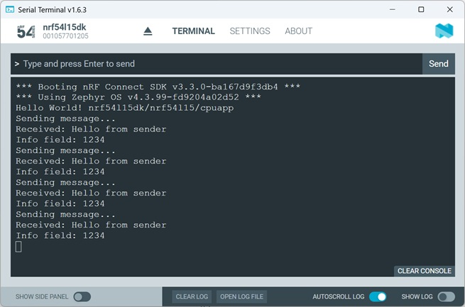

# Zephyr Kernel Services: Data Passing - Mailbox

## Introduction

In a Zephyr project, a mailbox (k_mbox) is a kernel communication object used for passing messages between threads. It is more flexible than a message queue because:
- messages can be variable size
- sender and receiver can identify each other
- synchronous and asynchronous communication are supported
- large data transfers are possible

Detailed description can be found [here](https://docs.nordicsemi.com/bundle/ncs-latest/page/zephyr/kernel/services/data_passing/mailboxes.html).

## Required Hardware/Software for Hands-on
- Development kit 
[nRF54LM20DK](https://www.nordicsemi.com/Products/Development-hardware/nRF54LM20-DK),
[nRF54L15DK](https://www.nordicsemi.com/Products/Development-hardware/nRF54L15-DK), 
[nRF52840DK](https://www.nordicsemi.com/Products/Development-hardware/nRF52840-DK), 
[nRF52833DK](https://www.nordicsemi.com/Products/Development-hardware/nRF52833-DK), or 
[nRF52DK](https://www.nordicsemi.com/Products/Development-hardware/nrf52-dk) 
- Micro USB Cable (Note that the cable is not included in the previous mentioned development kits.)
- install the _nRF Connect SDK_ v3.3.0 and _Visual Studio Code_. 

## Hands-on step-by-step description 

### Create a new Project

1) Create a new project based on the Zephyr hello_world example (/zephyr/samples/hello_world)

2) Include the Zephyr Kernel header file. This gives access to mailbox APIs, thread APIs, timing functions and printk().

	_src/main.c_   

       #include <zephyr/kernel.h>

### Defining the Mailbox

3) Let's add this definition globally. This macro creates a mailbox object, initializes it automatically and makes it ready before <code>main()</code> starts. 

	_src/main.c_   
  
       K_MBOX_DEFINE(my_mailbox);

   > __Note:__ Instead of automatically creating the mailbox before main() execution, it is also possible to manually create the mailbox during runtime. Here is an example that shows how to do it manually:
   >
   > <code>struct k_mbox my_mailbox;
           k_mbox_init(&my_mailbox);</code>

### Create Sender and Receiver Thread

4) The Sender Thread takes care about sending the message via mailbox.

	_src/main.c_   
 
       #define STACKSIZE 1024
       #define PRIORITY 5

       K_THREAD_STACK_DEFINE(sender_stack, STACKSIZE);
       K_THREAD_STACK_DEFINE(receiver_stack, STACKSIZE);

       struct k_thread sender_thread_data;
       struct k_thread receiver_thread_data;

#### Create Sender Thread

5) Sender Thread function defines a message, in our case "Hello from sender", that is put into the mailbox.

	_src/main.c_   
  
       void sender_thread(void *a, void *b, void *c)
       {
           char message[] = "Hello from sender";
           struct k_mbox_msg tx_msg;

           while (1) {
               tx_msg.info = 1234;
               tx_msg.size = strlen(message) + 1;
               tx_msg.tx_data = message;
               tx_msg.tx_target_thread = K_ANY;

               printk("Sending message...\n");

               k_mbox_put(&my_mailbox, &tx_msg, K_FOREVER);

               k_sleep(K_SECONDS(2));
           }
       }

  > __Note:__ The <code>tx__msg</code> allows following settings:
  >
  >  - <code>tx_msg.info</code>: Extra application-defined information. Could represent message type, packet ID or command number. It's a free 32-bit field.
  >  - <code>tx_msg.size</code>: Number of bytes to send. The <code>+1</code> includes the terminating <code>\0</code>.
  >  - <code>tx_msg.tx_data</code>: Pointer to actual data. Mailbox copies data from this location.
  >  - <code>tx_msg.tx_target_thread</code>: Allows any receiver thread to consume the message, if this one is set to <code>K_ANY</code>. You could instead target a specific thread.
  
#### Create Receiver Thread

6) The Receiver Thread gets the message. 

	_src/main.c_   
 
       void receiver_thread(void *a, void *b, void *c)
       {
           struct k_mbox_msg rx_msg;
           char buffer[100];

           while (1) {
               rx_msg.size = sizeof(buffer);
               rx_msg.rx_source_thread = K_ANY;

               k_mbox_get(&my_mailbox,
                          &rx_msg,
                          buffer,
                          K_FOREVER);

               printk("Received: %s\n", buffer);
               printk("Info field: %d\n", rx_msg.info);
           }
       }

### Start the Threads

7) Let's start both Threads inside <code>main()</code> function. 

	_src/main.c_ => inside <code>int main(void)</code> function   

           k_thread_create(&sender_thread_data,
                           sender_stack,
                           STACKSIZE,
                           sender_thread,
                           NULL, NULL, NULL,
                           PRIORITY,
                           0,
                           K_NO_WAIT);

           k_thread_create(&receiver_thread_data,
                           receiver_stack,
                           STACKSIZE,
                           receiver_thread,
                           NULL, NULL, NULL,
                           PRIORITY,
                           0,
                           K_NO_WAIT);

## Testing

8) Build the project and download to a development kit.
9) Check the output in Serial Terminal. 

   
