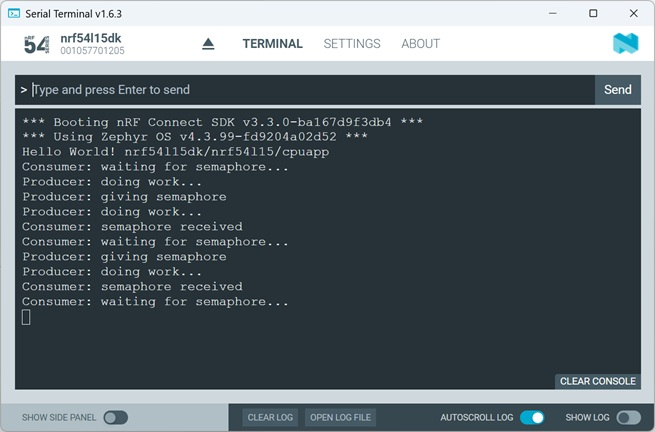

# Zephyr Kernel Services - Thread Synchronization using Semaphores

## Introduction

This hands-on show step by step how to add and use a semaphore in a Zephyr project. A semaphore is a synchronization mechanism that allows threads to coordinate access to shared resources or to signal events between each other. In Zephyr, semaphores are implemented with the <code>k_sem</code> API. The hands-on starts with the default _hello_world_ example and gradually extends it.

## Required Hardware/Software
- Development kit 
[nRF54LM20DK](https://www.nordicsemi.com/Products/Development-hardware/nRF54LM20-DK),
[nRF54L15DK](https://www.nordicsemi.com/Products/Development-hardware/nRF54L15-DK), 
[nRF52840DK](https://www.nordicsemi.com/Products/Development-hardware/nRF52840-DK), 
[nRF52833DK](https://www.nordicsemi.com/Products/Development-hardware/nRF52833-DK), or 
[nRF52DK](https://www.nordicsemi.com/Products/Development-hardware/nrf52-dk) 
- Micro USB Cable (Note that the cable is not included in the previous mentioned development kits.)
- install the _nRF Connect SDK_ v3.3.0 and _Visual Studio Code_. The installation process is described [here](https://academy.nordicsemi.com/courses/nrf-connect-sdk-fundamentals/lessons/lesson-1-nrf-connect-sdk-introduction/topic/exercise-1-1/).

## Hands-on step-by-step description 

### Create your own Project based on _hello_world_ Example

1) Create a new project based on Zephyr's _hello_world_ example (./zephyr/samples/hello_world). 

2) The Zephyr _hello_world_ example does not include the __zephyr/kernel.h__ header file. We add this include in the main.c file:

   _main.c_ 

       #include <zephyr/kernel.h>

### Adding Semaphore

3) Now we add the semaphore. Inster the following line after the #define statements.

   _main.c_ 

       K_SEM_DEFINE(my_sem,  /* Name of the semaphore */
                    0,       /* Semaphore starts unavailable */
                    1);      /* Maximum semaphore count */

> __Note:__ Because the initial count is <code>0</code>, any thread calling <code>k_sem_take()</code> will block until another thread releases the semaphores. This configuration behaves like a binary semaphore.

### Create Producer and Consumer Threads

4) First, we extend the project so it can run multiple threads. 

   _main.c_ 

       #define STACKSIZE 1024
       #define PRIORITY 5

       void producer_thread(void);
       void consumer_thread(void);

       K_THREAD_DEFINE(producer_id, STACKSIZE,
                       producer_thread, NULL, NULL, NULL,
                       PRIORITY, 0, 0);

       K_THREAD_DEFINE(consumer_id, STACKSIZE,
                       consumer_thread, NULL, NULL, NULL,
                       PRIORITY, 0, 0);

#### Crerate the Producer Thread

5) Now we add the producer thread implmentation. 

   _main.c_ 

       void producer_thread(void)
       {
           while (1) {
               printk("Producer: doing work...\n");
               k_sleep(K_SECONDS(2));
               printk("Producer: giving semaphore\n");
               k_sem_give(&my_sem);
           }
       }

> __Note:__ The <code>k_sem_give(&my_sem);</code> increases the semaphore count. If another thread is waiting on the semaphore, that thread becomes ready to run. This is the signaling mechanism. 

#### Create the Consumber Thread

6) Now add the consumter thread.

   _main.c_ 

       void consumer_thread(void)
       {
           while (1) {
              printk("Consumer: waiting for semaphore...\n");
              k_sem_take(&my_sem, K_FOREVER);
              printk("Consumer: semaphore received\n");
           }
       }

> __Note:__ The <code>k_sem_take(&my_sem, K_FOREVER);</code> function tries to take the semaphore. If the semaphore count is zero:
> - The thread blocks
> - The scheduler pauses the thread
> - CPU time is given to other threads
>
> <code>K_FOREVER</code> means: Wait indefinitely until the semaphore becomes available.

## Testing

7) Build the project and download to a development kit.
8) Check the output in Serial Terminal. 

   
