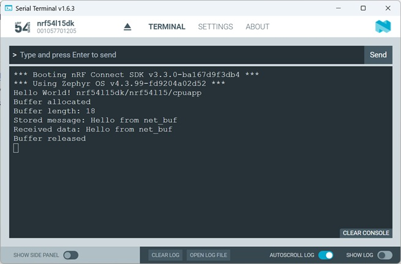

# Zephyr OS Services: Network Buffer

## Introduction

Zephyr provides a flexible buffer system called <code>net_buf</code>. A <code>net_buf</code> is dynamically allocated from a memory pool, reference counted, designed for metworking stacks and efficient for packet handling. Typical use cases are Bluetooth packets, TCP/IP packets, UART frame handling, sensor protocl messages, and other. 

## Required Hardware/Software
- Development kit 
[nRF54LM20DK](https://www.nordicsemi.com/Products/Development-hardware/nRF54LM20-DK),
[nRF54L15DK](https://www.nordicsemi.com/Products/Development-hardware/nRF54L15-DK), 
[nRF52840DK](https://www.nordicsemi.com/Products/Development-hardware/nRF52840-DK), 
[nRF52833DK](https://www.nordicsemi.com/Products/Development-hardware/nRF52833-DK), or 
[nRF52DK](https://www.nordicsemi.com/Products/Development-hardware/nrf52-dk), (nRF54L15DK)
- Micro USB Cable (Note that the cable is not included in the previous mentioned development kits.)
- install the _nRF Connect SDK_ v3.3.0 and _Visual Studio Code_. The installation process is described [here](https://academy.nordicsemi.com/courses/nrf-connect-sdk-fundamentals/lessons/lesson-1-nrf-connect-sdk-introduction/topic/exercise-1-1/).

## Hands-on step-by-step description 

### Let's start with hello_world Project

1) Make a copy of Zephyr's _hello_word_ project.
2) Include the Zephyr kernel.h header file.

   __main.c__

       #include <zephyr/kernel.h>

### Add Network Buffer Support

3) Let's add the Network Buffer software module.

   __prj.conf__

       # Network Buffer Support
       CONFIG_NET_BUF=y

4) Now we include Zephyr network buffer support. First, start with the header file.

   __main.c__

       #include <zephyr/net_buf.h>

5) Create a Buffer Pool

   __main.c__

       /*
        * Create a pool with:
        * - 4 buffers
        * - each buffer can hold 128 bytes
        */
       NET_BUF_POOL_DEFINE(my_buf_pool,  /* Pool name */
                           4,            /* Number of buffers */
                           128,          /* Payload size per buffer */
                           4,            /* Optional user metadata */
                           NULL);        /* Cleanup callback */

6) Now we allocate a buffer from the pool.

   __main.c__ => main() function

           /* Allocate a buffer from the pool */
           struct net_buf *buf;   

           buf = net_buf_alloc(&my_buf_pool, K_NO_WAIT);
           if (!buf) {
               printk("Buffer allocation failed\n");
               return 0;
           }
           printk("Buffer allocated\n");

### Add and Read Data via Network Buffer

7) Now we store payload data inside the buffer.

   __main.c__ => main() function

           /* Add Data to Network Buffer */
           const char *message = "Hello from net_buf";

           net_buf_add_mem(buf, message, strlen(message));
           printk("Buffer length: %d\n", buf->len);
           printk("Stored message: %s\n", buf->data);

8) Now we read data from the buffer.

   __main.c__ => main() function

           /* Read data from the buffer */
           char rx_data[64];

           memcpy(rx_data, buf->data, buf->len);
           printk("Received data: %s\n", rx_data);

### Release Network Buffer

9) Allocated buffers must be released again.

   __main.c__ => main() function
   
           /*
            * Release the buffer back to the pool
            */
           net_buf_unref(buf);
           printk("Buffer released\n");

## Testing

10) Build the project and download it to your development kit.

11) Check the output in the Serial Terminal.

   
