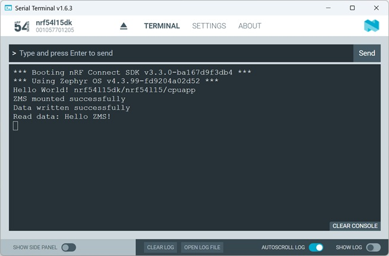
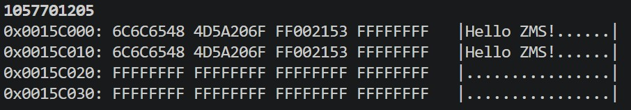

# Zephyr OS Services: Storage - Zephyr Memory Storage (ZMS)

## Introduction

Zephyr Memory Storage (ZMS) is a lightweight flash-based sstorage backend insdie Zephyr. It is designed for example persistent settings, configuration storage, calibration parameters, runtime parameters, small databases, and device state information. ZMS internally handles flash sector management, wear leveling, record allocation, and data integrity. 

ZMS works similarly to NVS, but with a newer architecture optimized for Zephyr.

Further information about ZMS can be found [here](https://docs.nordicsemi.com/bundle/ncs-latest/page/zephyr/services/storage/zms/zms.html).

## Required Hardware/Software

- Development kit 
[nRF54LM20DK](https://www.nordicsemi.com/Products/Development-hardware/nRF54LM20-DK),
[nRF54L15DK](https://www.nordicsemi.com/Products/Development-hardware/nRF54L15-DK), 
[nRF52840DK](https://www.nordicsemi.com/Products/Development-hardware/nRF52840-DK), 
[nRF52833DK](https://www.nordicsemi.com/Products/Development-hardware/nRF52833-DK), or 
[nRF52DK](https://www.nordicsemi.com/Products/Development-hardware/nrf52-dk) 
- install the _nRF Connect SDK_ v3.3.0 and _Visual Studio Code_.

## Hands-on step-by-step description

### Let's start with hello_world Project

1) Make a copy of Zephyr's _hello_word_ project.
2) Include the Zephyr kernel.h header file.

   __main.c__

       #include <zephyr/kernel.h>

### Disable Partition Manager

3) Partition Manager is deprecated in _nRF Connect SDK v3.3.0_. Because of this, we disable Partition Manager.

      __sysbuild.conf__

       SB_CONFIG_PARTITION_MANAGER=n

### Enable Flash and ZMS Support

4) Enable Flash support.

   __prj.conf__

       # Enable Flash support
       CONFIG_FLASH=y
       CONFIG_FLASH_MAP=y
       CONFIG_FLASH_PAGE_LAYOUT=y
       CONFIG_MPU_ALLOW_FLASH_WRITE=y
   
6) Enable ZMS support.

   __prj.conf__

       # Enable ZMS support
       CONFIG_ZMS=y

### Include Header Files for Storage (ZMS, Flash)

7) Inside __main.c__ we first include the necessary Zephyr header files.
   
   __main.c__

       #include <zephyr/fs/zms.h>
       #include <zephyr/drivers/flash.h>
       #include <zephyr/storage/flash_map.h>

### Define a Flash Area

8) ZMS needs a flahs area where it stores data. We use one of the available fixed flash partitions. The <code>storage_paritition</code> exists in the nRF54L15DK board DTS configuration.

   __main.c__   

       #define ZMS_PARTITION FIXED_PARTITION_ID(storage_partition)

### Create a ZMS Filesystem Instance

9) This structure represents the ZMS filesystem.

   __main.c__   

       static struct zms_fs fs;

### Initialize ZMS

10) Before using ZMS, the filesystem must be configured. 

   __main.c__   

        fs.flash_device = FIXED_PARTITION_DEVICE(storage_partition);
        fs.offset = FIXED_PARTITION_OFFSET(storage_partition);
        fs.sector_size = 4096;
        fs.sector_count = 4;

11) And then we initialize the file system.

   __main.c__   
    
        int rc = zms_mount(&fs);
        if (rc < 0) {
            printk("Failed to mount ZMS: %d\n", rc);
            return 0;
        }
        printk("ZMS mounted successfully\n");

### Write and Read Data

12) We now store a string in flash memory.

   __main.c__   

        /* Write Data */
        const char write_data[] = "Hello ZMS!";
        
        rc = zms_write(&fs,          /* file system */
                       1,            /* key ID */
                       write_data,   /* data pointer */
                       strlen(write_data) + 1);  /* data size */  
        if (rc < 0) {
            printk("Failed to write data: %d\n", rc);
            return 0;
        }
        printk("Data written successfully\n");

13) And now we read data.

   __main.c__   

        /* Read Data */
        char read_buffer[64];
        memset(read_buffer, 0, sizeof(read_buffer));
        
        rc = zms_read(&fs, 
                      1, 
                      read_buffer, 
                      sizeof(read_buffer));
        if (rc < 0) {
            printk("Failed to read data: %d\n", rc);
            return 0;
        }
        printk("Read data: %s\n", read_buffer);
        
   
## Testing

14) Build the project and download it to your development kit.

15) Check the output in the Serial Terminal.

   

16) Let's check if the test string was written into the storage_partition. First, find the start of the storage partition. Check here either __zephyr.dts__ file in the _Output files_ directory or open board DTS file. For the nRF54L15DK we can find the following:

    __nrf54l15dk_nrf54l15_cpuapp.dts__ points to __nRF54L15_cpuapp_parittion.dtsi__ with following definition: 

<code>      storage_partition: partition@15c000 { </code>

<code>          label = "storage"; </code>

<code>          reg = <0x15c000 DT_SIZE_K(36)>; </code>

<code>      }; </code>

   So, we are interested in seeing content of address 0x15C000 and following addresses. 

   Let's check the content by using __nrfutil__. Click on _Open terminal_ in "Welcome" section of __nrf Connect__. Then enter following command in the command line terminal:

    nrfutil device read --address 0x15C000 --bytes 64

   You should see following (note that code execution was started twice here):

   
