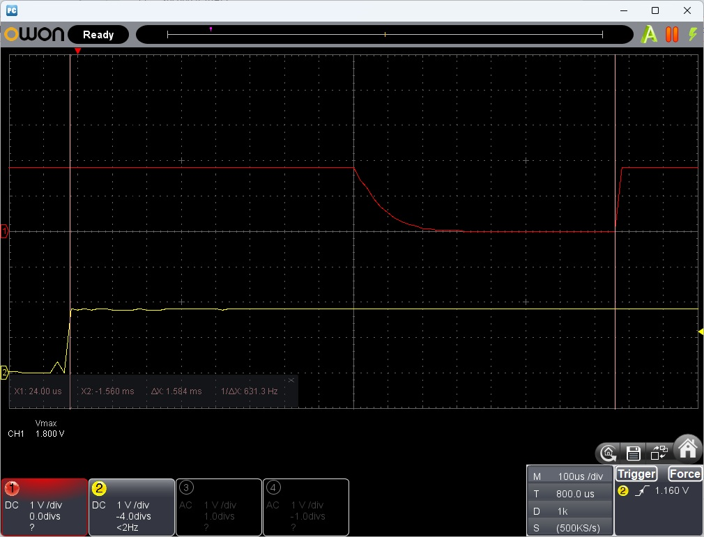
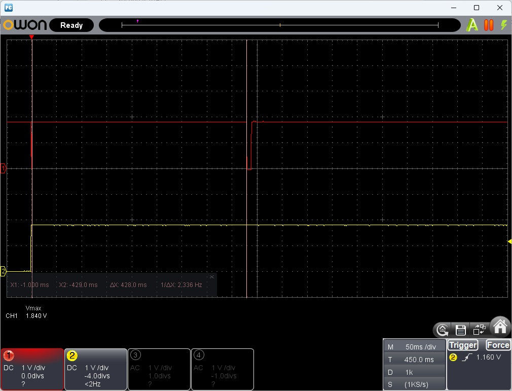
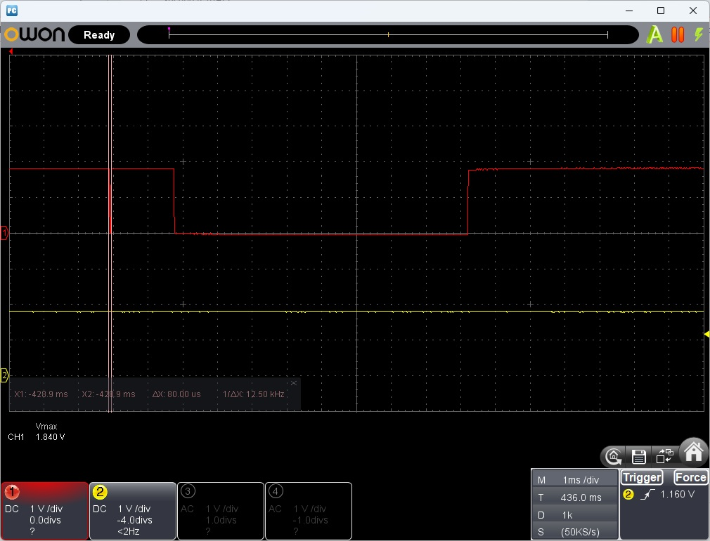
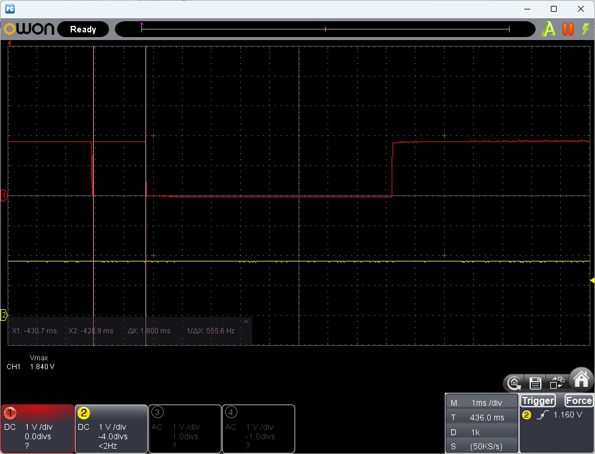
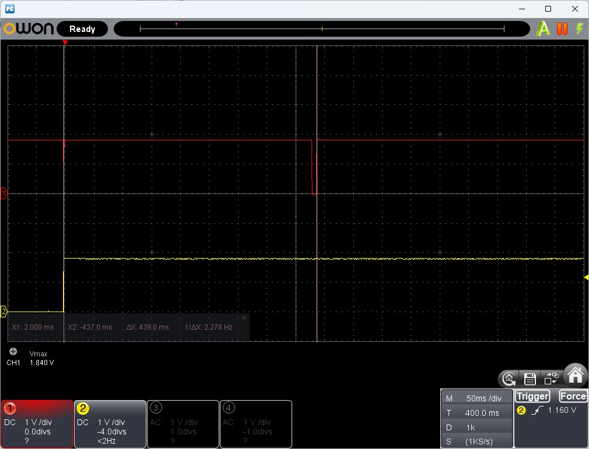

# Debugging: Start-up Time - Profile each Boot Stage using GPIO

## Introduction

It is sometimes interesting to understand where time is spent during the start-up of a Zephyr application. The actual application starts in the `main()` function. However, quite a lot happens before that. Here, we look at one way of measuring the time it takes for Zephyr to boot through the EARLY, PRE_KERNEL_1, PRE_KERNEL_2 and POST_KERNEL states, and finally into `main()`. 


## Required Hardware/Software
- Development kit 
[nRF54LM20DK](https://www.nordicsemi.com/Products/Development-hardware/nRF54LM20-DK),
[nRF54L15DK](https://www.nordicsemi.com/Products/Development-hardware/nRF54L15-DK), 
[nRF52840DK](https://www.nordicsemi.com/Products/Development-hardware/nRF52840-DK), 
[nRF52833DK](https://www.nordicsemi.com/Products/Development-hardware/nRF52833-DK), or 
[nRF52DK](https://www.nordicsemi.com/Products/Development-hardware/nrf52-dk)
- Micro USB Cable (Note that the cable is not included in the previous mentioned development kits.)
- install the _nRF Connect SDK_ v3.4.0 and _Visual Studio Code_. The installation process is described [here](https://academy.nordicsemi.com/courses/nrf-connect-sdk-fundamentals/lessons/lesson-1-nrf-connect-sdk-introduction/topic/exercise-1-1/).

## Hands-on step-by-step description 

### Create a new Project

1) Make a copy of the Zephyr sample _hello world_. 

### Profiling Boot Stages with GPIO Toggles

#### Step 1: Define the GPIO Pin in a DTS overlay. 

2) Create your application's _.overlay_ file to declare a debug GPIO pin.

   <sup>nrf54l15dk_nrf54l15_cpuapp.overlay</sup>
   
   ```
   / {
       user_dbg_pin: user-dbg-pin {
           compatible = "nordic,gpio-pins";
           gpios = <&gpio2 9 GPIO_ACTIVE_HIGH>;
           status = "okay";
       };
   };

   &gpio2 {
       status = "okay";
   };
   ```

#### Step 2: Include the pin in your application code

3) Use the GPIO DeviceTree API to access and drive the pin.

   <sup>main.c</sup>
   
   ```c
   #include <zephyr/drivers/gpio.h>

   static const struct gpio_dt_spec pin_dbg = GPIO_DT_SPEC_GET_OR(DT_NODELABEL(user_dbg_pin), gpios, {0});
   ```

#### Step 3: Place Markers at Each Boot Stage Using <code>SYS_INIT</code>

4) Register init functions at each boot level to toggle the pin, as shown in the boot time investigation example.

  <sup>main.c</sup>

   ```c
   int early_marker(void) {
       gpio_pin_configure_dt(&pin_dbg, GPIO_OUTPUT_ACTIVE);
       gpio_pin_set_dt(&pin_dbg, 1);
       return 0;
   }
   SYS_INIT(early_marker, EARLY, 0);

   int prek1_marker(void) {
       gpio_pin_set(&pin_dbg, 2, 1);
       return 0;
   }
   SYS_INIT(prek1_marker, PRE_KERNEL_1, 0);

   int prek2_marker(void) {
       gpio_pin_set(&pin_dbg, 2, 0);
       return 0;
   }
   SYS_INIT(prek2_marker, PRE_KERNEL_2, 0);
  
   int postk_marker(void) {
       gpio_pin_set(&pin_dbg, 2, 1);
       return 0;
   }
   SYS_INIT(postk_marker, POST_KERNEL, 0);
   
   int main(void) {
       gpio_pin_set(&pin_dbg, 2, 0);
       /* ... */
   }   
   ```

> __NOTE:__
> - No extra Kconfig option is needed — the GPIO driver is enabled via the DTS overlay (status = "okay"). 
> - Observe the resulting square wave on a logic analyzer or oscilloscope to measure the time spent in each boot stage.
> - To inspect the full initialization sequence order, you can also run west build -t initlevels or used the _nRF Connect_ Extension __Core overview | Initialization levels__. 


## Testing

3) Build the projecet (-> pristine build!) and flash it on your dev kit.
4) Use a scope and check the RESET input and Debug pin. Here is an example for Zephyr*s _hello world_ sample.

   Here are the measurement results for the _hello world_ project:

   | Desciption | Measured Time      |
   |------------|-----------|
   | rising edge on RESET pin => <code>EARLY</code> | ~ 1.58 ms |
   | <code>EARLY</code> => <code>PRE_KERNEL_1</code> | ~ 428 ms |
   | <code>PRE_KERNEL_1</code> => <code>PRE_KERNEL_2</code> | ~ 80 us |
   | <code>PRE_KERNEL_2</code> => <code>POST_KERNEL</code> | ~ 1.8 ms |
   | <code>POST_KERNEL</code> => <code>main()</code> | ~ 8.46 ms |
   | TOTAL: rising edge on RESET pin => <code>main()</code> | ~ 439 ms |
   
   And here are the scope screen shots:   
   - rising edge on RESET pin => <code>EARLY</code>:
     
   - <code>EARLY</code> => <code>PRE_KERNEL_1</code>: 
     
   - <code>PRE_KERNEL_1</code> => <code>PRE_KERNEL_2</code>:
     
   - <code>PRE_KERNEL_2</code> => <code>POST_KERNEL</code>: 
     
   - <code>POST_KERNEL</code> => <code>main()</code>:
     
   - TOTAL: rising edge on RESET pin => <code>main()</code>
     
  
