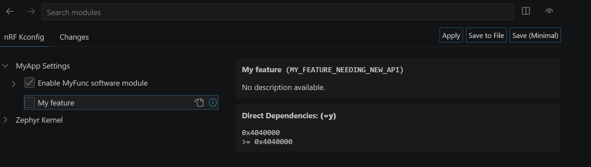
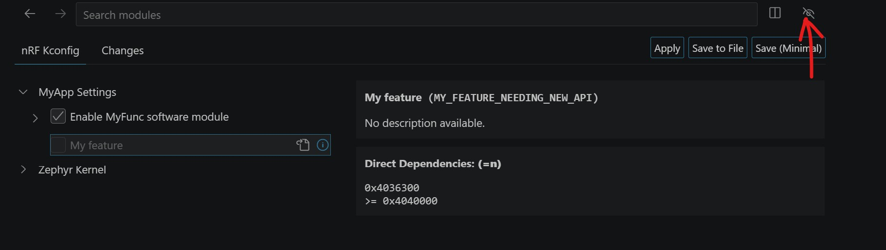

# Defining own KCONFIG symbols that depends on Zephyr Version

## Introduction

How do you proceed to define a custom Kconfig file depending on the Zephyr version? This hands-on guide describes the options.


## Required Hardware/Software

- Micro USB Cable (Note that the cable is not included in the previous mentioned development kits.)
- install the _nRF Connect SDK_ v3.4.0 and _Visual Studio Code_. The installation process is described [here](https://academy.nordicsemi.com/courses/nrf-connect-sdk-fundamentals/lessons/lesson-1-nrf-connect-sdk-introduction/topic/exercise-1-1/).
> __NOTE:__ No Development kit required for this hands-on!

## Hands-on step-by-step description 

### Create a new Project

1) Create a new project based on the "[Defining own KCONFIG symbols](../DEV_kconfig_UserDefined/)" hands-on project.

### Define new CONFIG symbols

2) Let’s define our own KCONFIG symbol, <code>CONFIG_MY_FEATURE</code>. However, the KCONFIG should be selectable depending on the Zephyr version. In our example, we check whether Zephyr version 4.4.0 or later is being used, and then allow the <code>CONFIG_MY_FEATURE</code> symbol to be used.

   Add the following definition to the MyApp section.:
   
     <sup>_Kconfig_</sup>
  
          config MY_FEATURE
  	            bool "My feature"
                depends on $(KERNELVERSION) >= 0x04040000

> __Note:__ However, another question that arises is whether to skip the calls to KCONFIG and perform the queries directly in the C code. For example:
>
>  ```c
>  #include <zephyr/version.h> 
> 
>  #if KERNEL_VERSION_NUMBER >= ZEPHYR_VERSION(4, 4, 0)
>     /* using newer functionality from Zephyr 4.4.0 or later */ 
>  #else 
>     /* using old functionality from older Zephyr versions */
>  #endif


## Testing

3) Create two build configurations, one using _nRF Connect SDK_ v3.3.0 and the other one _nRF Connect SDK_ v3.4.0. Build both projects.
       
4) We do not need to download the code to a dev kit. Instead we use the _nRF KCONFIG GUI_ tool to check the new KCONFIG symbol for both builds.

   Open _nRF KCONFIG GUI_ tool and search for <code>CONFIG_MY_FEATURE</code>.

   You should see that in the NCS v3.4.0 build the symbol is available, because NCS v3.4.0 is based on Zephyr V4.4.0.

   

   Check the same with NCS v3.3.0. Here you have to enable the hidden items. Then you see that it is greyed out, because NCS v3.4.0 is based on Zephyr Version 4.3.99.

   

  > __Note:__ The text in the _Direct Dependencies_ section mentions 0x4036300. The "63" wihtin this hex number translates into decimal 99. 
