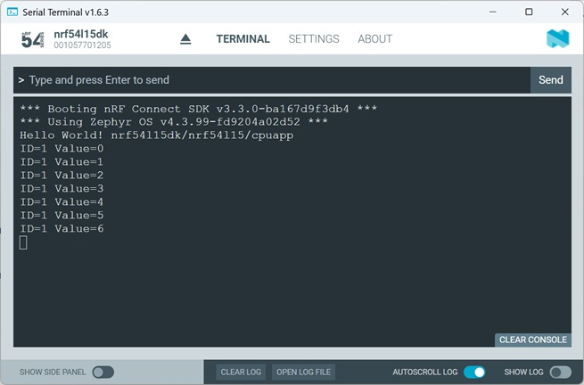

# Zephyr Kernel Services: Data Passing - Message Queue

## Introduction

A Zephyr Message Queue (k_msgq) is a kernel object used for Thread-to-Thread communication. It lets one Thread safely send fixed-size messages to another Thread without sharing variables directly. The Queue stores copies of messages in FIFO order.

In this hands-on we build an example, which uses a Producer Thread to send sensor values and a Consumer Thread that receivces and prints them. 

Detailed description can be found [here](https://docs.nordicsemi.com/bundle/ncs-latest/page/zephyr/kernel/services/data_passing/message_queues.html).

## Required Hardware/Software for Hands-on
- Development kit 
[nRF54LM20DK](https://www.nordicsemi.com/Products/Development-hardware/nRF54LM20-DK),
[nRF54L15DK](https://www.nordicsemi.com/Products/Development-hardware/nRF54L15-DK), 
[nRF52840DK](https://www.nordicsemi.com/Products/Development-hardware/nRF52840-DK), 
[nRF52833DK](https://www.nordicsemi.com/Products/Development-hardware/nRF52833-DK), or 
[nRF52DK](https://www.nordicsemi.com/Products/Development-hardware/nrf52-dk) 
- Micro USB Cable (Note that the cable is not included in the previous mentioned development kits.)
- install the _nRF Connect SDK_ v3.4.0 and _Visual Studio Code_. 

## Hands-on step-by-step description 

### Create a new Project

1) Create a new project based on the Zephyr hello_world example (/zephyr/samples/hello_world)

2) Include the Zephyr Kernel header file. This gives access to mailbox APIs, thread APIs, timing functions and printk().

	_src/main.c_   

       #include <zephyr/kernel.h>

### Define the Message Type (Sensor data)

3) Create a struct representing one message.

	_src/main.c_   

       struct sensor_msg {
           int id;
           int value;
       };

  > __Note:__ A Message Queue stores __fixed-size items__. So, every message in the Queue has the same size. Each Queue element will be one <code>sensor_msg</code>. 

### Create the Message Queue

4) Let's add this definition globally. This macro creates the Message Queue object, initializes it automatically and makes it ready before <code>main()</code> starts. 

	_src/main.c_   
   
       K_MSGQ_DEFINE(sensor_msgq,                /* Queue name */
                     sizeof(struct sensor_msg),  /* Size of each meassage */
                     10,                         /* Maximum messages */
                     4);                         /* Memory alignment */

  > __Note:__ Zephyr allocates:
> 
> buffer size = message_size * max_messages
> 
> So in our example:
>
> _assuming two ints = 8 bytes:_ buffer size = 8 bytes * 10 = 80 bytes    
> 
> The Kernel also creates metadata, like read pointer, write pointer, wait lists, and synchronization objects. 

### Create Producer and Consumer Threads

5) Add Thread stacks and Thread objects.

	_src/main.c_   

       K_THREAD_STACK_DEFINE(prod_stack, 1024);
       K_THREAD_STACK_DEFINE(cons_stack, 1024);

       struct k_thread prod_thread;
       struct k_thread cons_thread;

#### Create the Producer Thread

6) This Thread sends messages. 

	_src/main.c_   
 
       void producer(void *a, void *b, void *c)
       {
           struct sensor_msg msg;
           int counter = 0;

           while (1) {
               msg.id = 1;
               msg.value = counter++;

               k_msgq_put(&sensor_msgq,  /* Queue object */
                          &msg,          /* Pointer to message */
                          K_FOREVER);    /* How long to wait if full */

               k_sleep(K_SECONDS(1));
           }
       }

> __Note:__ What happens internally during PUT:
> - Kernal checks if Queue has space:
> 
>    If yes: message copied into Queue buffer and write index advances
>   
>    If no: Thread blocks (because here we use <code>K_FOREVER</code>
> - Message is copied
> - Waiting receiver wakes up

#### Create Consumer Thread

7) Now receive the message.

	_src/main.c_   

       void consumer(void *a, void *b, void *c)
       {
           struct sensor_msg msg;

           while (1) {
               k_msgq_get(&sensor_msgq,  
                          &msg,
                          K_FOREVER);

               printk("ID=%d Value=%d\n",
                      msg.id,
                      msg.value);
           }
       }

### Start the Threads

7) Let's start both Threads inside <code>main()</code> function. 

	_src/main.c_ => inside <code>int main(void)</code> function   

           k_thread_create(&prod_thread,
                           prod_stack,
                           K_THREAD_STACK_SIZEOF(prod_stack),
                           producer,
                           NULL, NULL, NULL,
                           5, 0, K_NO_WAIT);

           k_thread_create(&cons_thread,
                           cons_stack,
                           K_THREAD_STACK_SIZEOF(cons_stack),
                           consumer,
                           NULL, NULL, NULL,
                           5, 0, K_NO_WAIT);

## Testing

8) Build the project and download to a development kit.
9) Check the output in Serial Terminal. 

   
