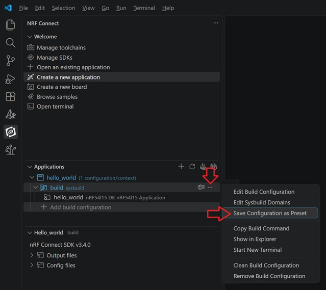
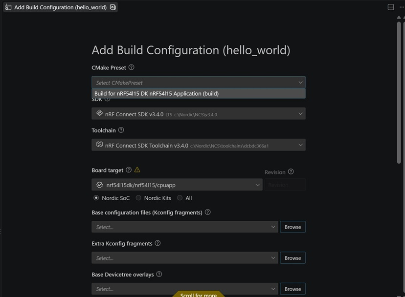

# Save and Load Build Configuration 

CMake presets provide a standardised, cross-platform and text-based method (using JSON) for defining build configurations, toolchain paths and cache variables independently of any specific IDE. 

The [_nRF Connect Extension Pack_](https://nrfconnect.github.io/vscode-nrf-connect/index.html) supports pre-filling build configurations using a project's CMakePresets.json file. When you select __Add build configuration__ in the _nRF Connect_ panel, you can import settings defined in your presets. 

## Save Configuration Settings

In the nRF Connect extension, click the three dots in the build row. The "Save Configuration as Preset" option appears in the context menu. When you click this option, a CMakePresets.json file is generated in the project directory. 

## Load Configuration Settings

It is important that the CMakePresets.json file exists in the project directory. As soon as you click "Add build configuration," a selection of CMake presets will appear in the window that opens. 

