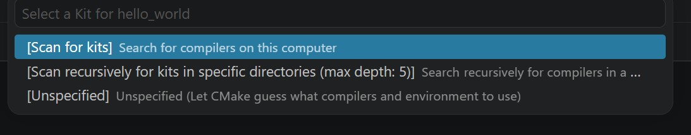

# Troubleshooting

## Mouse cursor disappears in VS Code

see following link:

[https://camerondwyer.com/2017/09/19/how-to-fix-mouse-cursor-disappearing-in-visual-studio-visual-studio-code](https://camerondwyer.com/2017/09/19/how-to-fix-mouse-cursor-disappearing-in-visual-studio-visual-studio-code/)

## "Select a Kit for ..." pop up

If the following screen appears, the information below may help you to disable this pop-up.

 

This prompt typically comes from the CMake Tools extension in VS Code (not the nRF Connect extension itself). You can disable it by adding the following to your VS Code __settings.json__:

    "cmake.configureOnOpen": false
    
